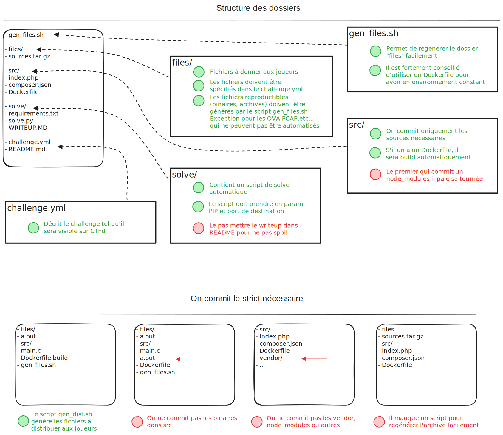
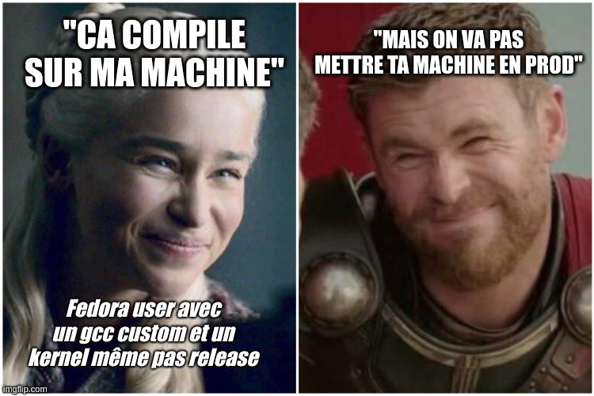
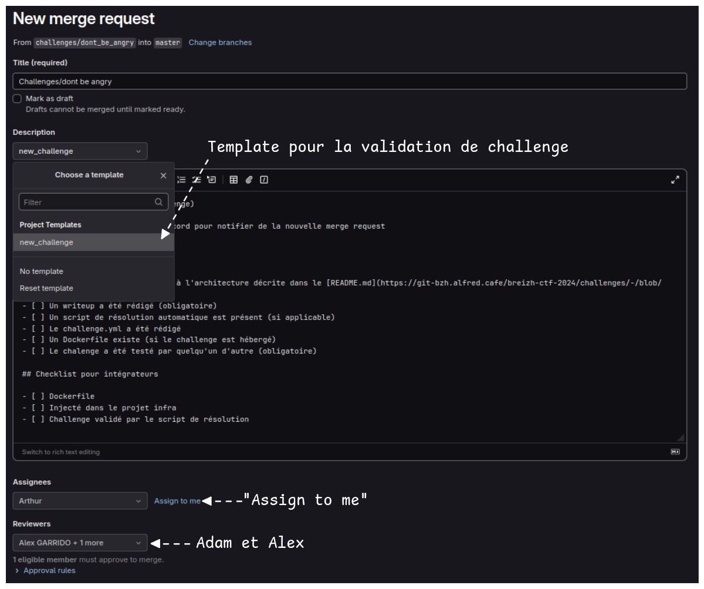

# Guide de développement d'un challenge

## Consignes générales pour la création de challenges

- Pas de challenges avec nombre de tentatives limités
- Pas de flag en plusieurs parties (les gens qui font de la fofo on vous attend)
- Pour les challenges en plusieurs étapes : la totalité des étapes seront ouvertes passé une
  certaine heure pour éviter que les joueurs soient bloqués
- La méthode de scoring est dégressive (entre 500 et 100pts) en fonction du nombre de résolutions
- Dans la mesure où il y aura 600 personnes sur la même IP publique, il faut limiter au maximum les
  interactions avec des services sur internet. On risque des bans IP discord, overpassturbo, captcha
  google, etc ...
- Au même titre que le point précédent, n'utilisez pas de CDN pour les challenges web (pas de CDN
  cloudflare pour ajouter JQuery par exemple)
- Afin de prévenir des débordements pour les épreuves OSINT, n'utilisez pas (dans la mesure du
  possible) de domaine légitime. Cela vaut aussi pour les recherches pouvant menez à du p0rn.

👉 En cas de doutes, on peut toujours en discuter avec Kaluche

## Arborescence du dépôt

Les challenges sont triés par catégorie. Un sous-dossier par catégorie, puis un sous-dossier
par challenge.

Les noms de dossier doivent respecter la RFC 1035, ce qui signifie que les dossiers doivent :

- Faire moins de 50 caractères
- Contenir uniquement des caractères alphanumériques minuscules ou des tirets
- Commencer par un caractère alphanumérique
- Terminer par un caractère alphanumérique



- Le `README.md` doit décrire brièvement le challenge : auteur, description, difficulté, …
- Le fichier `challenge.yml` reprend les informations du README.md, mais dans un format lisible par
les outils tels que ctfcli. Vous trouvez un exemple complet dans [_exemple/exemple-tcp]

- Le dossier `src` contient toutes les sources du challenge. Vous êtes libre de faire ce que vous voulez à partir du moment que ça reste clean.
  - Si votre challenge doit être hébergé, vous pouvez créer un `Dockerfile`. Il sera automatiquement 
    build par la pipeline sous le format
    `registry-bzh.alfred.cafe/breizh-ctf-2025/challenges/nom-challenge:latest`. Pour d'informations
    sur la création de Dockerfile dans la section *Dockerfile*

> :warning: Attention
>
> De manière générale, ne stockez aucuns binaires sortis de nul-part dans le dossier `src`.
> S'ils sont fournis aux joueurs, alors ils doivent être stockés dans le dossier `files` et un script `gen_files.sh` doit être fourni pour compiler ces binaires de manière reproductible. Plus d'infos dans la section *Génération de fichiers*
>
> 
>
> *"Histoire vraie"*

## Dockerfile

Pour construire vos Dockerfile, vous pouvez utiliser les
[images de base](https://git-bzh.alfred.cafe/breizh-ctf-2025/challenge/docker) pour construire vos 
images.

Par exemple, l'image `tcp` permet de créer facilement des challenges de pwn, ou plus globalement,
n'importe quel challenge dont la communication s'effectue en TCP.

L'image `uwgi` est une image clef en main pour héberger une application flask ou django.

Si les images de base ne couvrent pas votre cas, vous pouvez partir de n'importe quelle image
docker. Tentez tout de même de respecter quelques conseils :

- Utilisez des images avec des tags fixes : `FROM nginx:1.27` au lieu
  de `FROM nginx:latest`
- Utilisez des images officielles, évitez les images docker avec 10 stars qui n'ont
  pas été mise à jour depuis un an
- Si possible, utilisez plusieurs stages docker pour réduire la taille
- Privilégiez les images Debian plutôt qu’alpine. Elles sont légèrement plus lourdes,
  mais on réduit la probabilité d'avoir des emmerdes avec la musl-libc utilisée dans alpine.

## Génération de fichiers

Lorsque vous devez fournir des fichiers aux joueurs comme des archives de code sources ou
des binaires compilés, il est important que n'importe quel orga soient en mesure de le recompiler
de manière reproductible. C'est le rôle du script `gen_files.sh` qui se chargera de re-générer
ces fichiers automatiquement en cas de besoin.

> Pour fichiers dont la génération ne peut pas être automatisée comme les PCAP ou les OVA,
> le README doit contenir au moins une description de ce qui a été fait pour générer ce fichier.

```text
.
└── nom-categorie
    ├── nom-challenge
    │   ├── files
    │   │       └── challenge
    │   ├── gen_files.sh <-- Build le binaire "challenge" en utilisant le Dockerfile
    │   └── src
    │       └── build.Dockerfile <-- Dockerfile de build
            └── main.c
```

Par exemple :

```Dockerfile
# Dockerfile.build

FROM debian:bookworm

RUN apt-get update && apt-get install -y build-essential

COPY main.c /

RUN gcc -o /challenge /main.c
```

Et le fichier `gen_files.sh` associé :

```bash
# On build l'image docker qui sert à compiler le binaire
docker build -t my_challenge -f Dockerfile.build ./src
# On lance un conteneur temporaire
docker run -d --name my_challenge my_challenge:latest
# On extrait le binaire pour le copier dans files
docker cp my_challenge:/challenge ./files/
# On supprime le conteneur
docker rm my_challenge
# On suprime l'image docker
docker rmi my_challenge
```

## Comment travailler sur Git

Personne n'a le droit de commit sur la branche `main` (GitLab vous bloquera
de toute façon), vous devez travailler sur une branche séparée sur laquelle vous
pouvez faire ce que vous voulez tant que vous ne touchez pas aux fichiers des autres.

### Un mot concernant les gros fichiers

Git n'est pas du tout optimisé pour stocker de gros fichiers. Commit un gros fichier sur sa branche
implique de chaque personne qui clone le projet va se retrouver avec tout un historique de gros
fichiers (même s'ils ont été supprimés). C'est pourquoi tout fichier de plus de 8 Mo doit être commit
en utilisant git LFS.

Tout d'abord, pour pouvoir travailler avec des fichiers LFS, il faut installer le paquet `git-lfs`
et l'activer sur le dépôt git :

```bash
sudo apt update
sudo apt install git-lfs
# Dans le dépôt du breizh ctf :
git lfs install
```

Puis, lorsque vous devez tracker un fichier en utilisant LFS plutôt que git :

```bash
cd forensique/mon-challenge
git lfs track files/gros-fichier.ova
```

Un fichier `.gitattributes` va être créé. Il liste tous les fichiers qui doivent être trackés par
lFS. Au moment de commit ce gros fichier, git LFS va automatiquement prendre le relai pour upload
le gros fichier :

```bash
git add .
git commit -m "Ajout de l'OVA pour les joueurs"
git push # Ca peut prendre un peu de temps en fonction de la taille du fichier
```

### Faire valider son challenge

Lors que le challenge est prêt, vous pouvez créer une
[merge request](https://git-bzh.alfred.cafe/breizh-ctf-2025/challenge/challenges/-/merge_requests). Au moment de créer la merge request, vous pouvez sélectionner le template `new_challenge`.



Une fois que la merge request est créée, vous pouvez cocher votre checklist et prévenir sur discord qu'il y un challenge à intégrer
