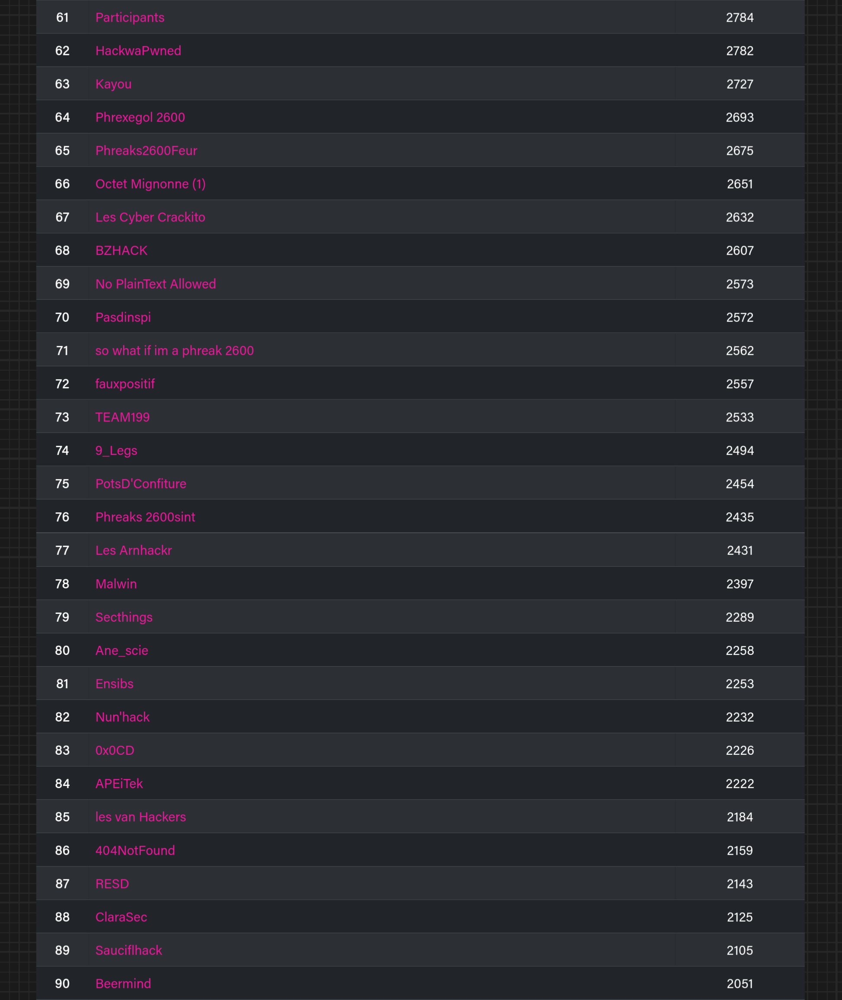

    
    <h1>Breizh CTF 2025</h1>

<h2 align="center":>Pool (par ordre alphabétique)</h2>

### Main

- [BDI](https://www.bdi.fr/fr/accueil/) (Organisateur)
- [Kaluche](https://x.com/kaluche_) (Co-fondateur, lead pool technique)
- [SaxX](https://x.com/_SaxX_) (Co-fondateur)

### Chall makers

- Al-oxos
- [Daeras](https://x.com/0xDaeras)
- [Drahoxx](https://x.com/50mgDrahoxx)
- [Endeavxor](https://endeavxor.re)
- [K.L.M](https://x.com/clemhate2)
- NineLine
- [Mika](https://x.com/bWlrYQ)
- Caillourocher
- [ribt](https://github.com/ribt)
- [Shaym](https://x.com/0xShaym)
- [skilo](https://skilo.sh)
- Tek
- ThéoR

### Infra makers

- [Ionniz](https://x.com/_Ionniz_)
- [La Brosse Adam](https://x.com/adam_le_bon)
- ShAdE
- Slinky
- Sp4rky
- Zeecka

<h2 align="center">Scoreboard final</h2>

