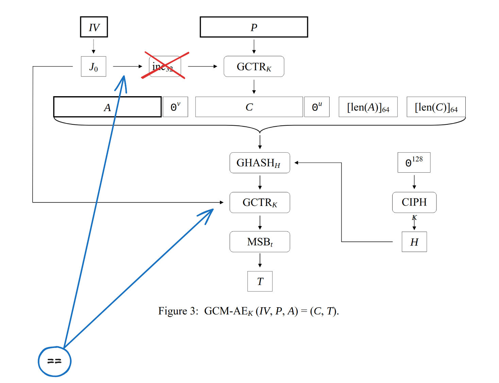

# BreizhCTF 2025 | Write-up : AutHentification 2 [Crypto]

Ce challenge est le même que le précédent, à un détail près : le tag est maintenant vérifié.

---

Rappelons le contexte : 

1. Les cookies sont du JSON chiffré et authentifié contenant deux valeurs : "username" et "role".
2. L'objectif est de forger un cookie admin, i.e., chiffrer et authentifier la charge utile : `{ "username": "toto", "role": "super_admin"}`.
3. Le chiffrement intègre est assuré par une implémentation python d'AES-GCM 128 avec un IV constant et nul.
4. Par couple de (clé, IV), nous avons un oracle de chiffrement sur une unique charge utile JSON.

Avec ces éléments de contexte, nous déduisons rapidement que :

- Le chiffrement est très facile à contourner, cf. challenge `AutHentification (ou pas...)`.
- Pour l'authentification : impossible d'utiliser la `Forbidden Attack` (cf. point numéro 4 ci-dessus).

L'énoncé et le header du fichier `gcm.py` disent clairement que l'implémentation a été faite par le stagiaire, cherchons une erreur d'implémentation. Le code étant assez long, nous allons utiliser une approche par diffing. Nous allons comparer les fonctions une par une avec les spécifications cités dans le commentaire en en-tête du fichier `gcm.py` : [NIST Special Publication 800-38D](https://nvlpubs.nist.gov/nistpubs/Legacy/SP/nistspecialpublication800-38d.pdf).

---

Après avoir comparé — algorithme par algorithme — le code python aux spécifications, nous nous rendons compte que, dans l'algorithme 5, à la ligne 4, il manque une incrémentation :

```python
# Algorithm 5: GCM-AD_K
def decrypt(self, C, T, A=b""):
    assert len(T) == BLOCK_LEN
    J = self.iv + b"\x00"*(CTR_LEN-1) + b"\x01"
    P = self.gctr(J, C) # Ici, sur le J.

    TT = self.build_tag(C, A, J)
    
    if TT != T:
        return (P, False)

    return (P, True)
```

Cela peut paraître anodin à première vue, mais, en regardant de plus près le schéma ci-dessous, nous nous rendons compte que les nonces des deux `GCTR_K` (celui servant à assurer la confidentialité et celui servant à assurer l'authentification) sont alors identiques.



Nous en déduisons : (l'ensemble des opérations suivantes a lieu dans $\mathbb{F}_2^{128}/f$, avec $f = 1 + \alpha + \alpha^2 + \alpha^7 + \alpha^{128}$)

$$T = K_s + \text{GHASH}(A \text{ || } C \text{ || } \text{len}A \text{ || } \text{len}C)$$

Avec $K_s$ le keystream (nous le connaissons, c'est le même que celui assurant la confidentialité), $A$ et $C$ les AAD et le chiffré (que nous considérerons chacun de la taille d'un bloc).

De plus, d'après la définition de GHASH :

$$T = K_s + AH^4 + CH^3 + \text{len}AH^2 + \text{len}CH^1$$

Nous connaissons $K_s$, il suffit de le soustraire puis de résoudre cette équation pour $H$.
Une fois $H$ retrouvé il devient trivial de forger un tag valide. Une solution complète est implémentée dans le fichier `solve.sage`.
