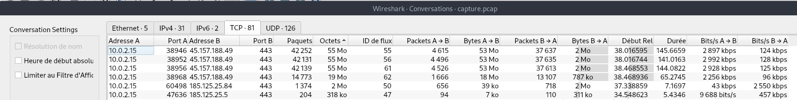

# Writeup Exfiltration

## Découvertes

Le fichier `capture.pcap` est une capture Wireshark et le fichier `sslkey.log` contient les clés des sessions TLS (HTTPS).

Dans Wireshark on ouvre la capture et on charge le fichier de log (Éditer > Préférences > Protocols > TLS > (Pre)-Master-Secret log filename).

En faisant Statistiques > Conversation > TCP. En triant par taille décroissante, on voit 3 uploads de 55 Mo et un 4e de 18 Mo vers la même IP :



On peut filtrer sur le 1er flux. On scroll tout en bas pour voir la version HTTP en clair. Les headers indiquent un POST vers l'URL `https://ul-fpwka456.swisstransfer.com/api/uploadChunk/5152a233-dbc9-4651-b653-dbbdb6ed6b56/86fe7749-4c48-4813-8671-df655d69a902/1/0`.

Si on regarde le 2e flux on peut voir un POST vers une URL très similaire, le `1/0` à la fin est simplement remplacé par `0/0`. Et dans les données envoyées on reconnaît les magic bytes d'un fichier zip et la chaîne de caractères `Videos/COSTA RICA.mp4` qui ressemble à nom de fichier.


On applique un filtre Wireshark pour voir tous les uploads similaires : `http.request.method == "POST" && http.request.uri contains "/api/uploadChunk"`.

On revoit 4 uploads :


On notera que le premier dans le temps est `3/0`, la donnée correspondant au début du fichier arrive dans le 2e paquet. Il faudra remettre les paquets dans l'ordre.

## Résolution

On peut essaye de copier à la main les 55 Mo de données brut dans chaque paquet mais cela fera vraisemblablement crasher Wireshark ou pourra amener à des données incomplètes.

La solution que j'ai choisie est d'utiliser [ce sript Python](https://github.com/lbirchler/tls-decryption) pour créer un pcap embarquant les secrets TLS (commande : `python3 tls-decryption/decrypt.py capture.pcap sslkey.log`). On peut ensuite utiliser `tshark` pour extraire les données correspondant à chaque upload :


```
$ tshark -r dsb-capture.pcap -T fields -e data -Y 'http.request.method == "POST" && http.request.uri == "/api/uploadChunk/5152a233-dbc9-4651-b653-dbbdb6ed6b56/86fe7749-4c48-4813-8671-df655d69a902/0/0"' > 0.hex

$ tshark -r dsb-capture.pcap -T fields -e data -Y 'http.request.method == "POST" && http.request.uri == "/api/uploadChunk/5152a233-dbc9-4651-b653-dbbdb6ed6b56/86fe7749-4c48-4813-8671-df655d69a902/1/0"' > 1.hex

$ tshark -r dsb-capture.pcap -T fields -e data -Y 'http.request.method == "POST" && http.request.uri == "/api/uploadChunk/5152a233-dbc9-4651-b653-dbbdb6ed6b56/86fe7749-4c48-4813-8671-df655d69a902/2/0"' > 2.hex

$ tshark -r dsb-capture.pcap -T fields -e data -Y 'http.request.method == "POST" && http.request.uri == "/api/uploadChunk/5152a233-dbc9-4651-b653-dbbdb6ed6b56/86fe7749-4c48-4813-8671-df655d69a902/3/1"' > 3.hex
```

On peut désormais tout concaténer et interpréter les données hexadécimal pour retrouver le fichier initial :

```
$ cat *.hex > file.hex

$ xxd -r -ps file.hex final.zip

$ file final.zip
final: Zip archive data, at least v2.0 to extract, compression method=deflate
```

Le zip contient une belle vidéo et le flag dans un docx : 


