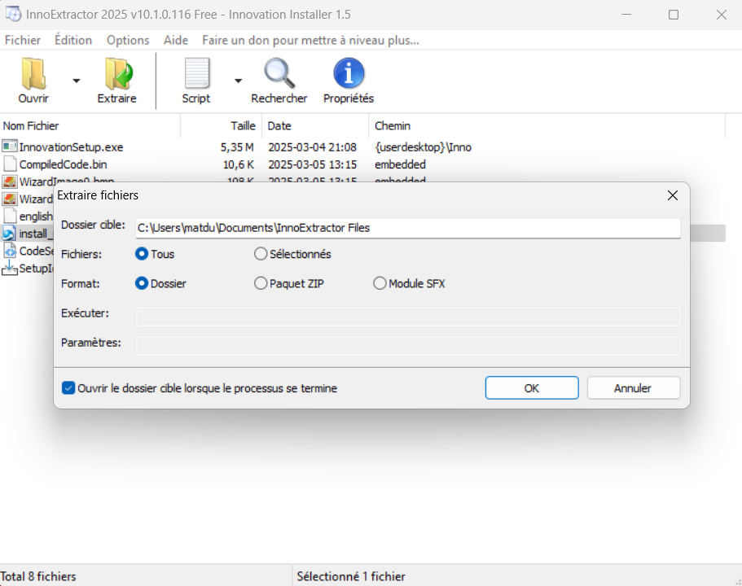

# Innovation

```jsx
$ strings Innovation.exe | grep -i "Inno Setup"
Inno Setup Setup Data (6.4.0.1)
Inno Setup Messages (6.4.0) (u)
<description>Inno Setup</description>
Inno Setup Setup Data (6.4.0.1)
```



```jsx
┌──(shaym)-[innovation/solve/InnoExtractor Files]
└─$ tree
.
├── CodeSection.txt
├── embedded
│   ├── CompiledCode.bin
│   ├── english.isl
│   ├── WizardImage0.bmp
│   └── WizardSmallImage0.bmp
├── install_script.iss
├── SetupIcon.ico
└── {userdesktop}
    └── Inno
        └── InnovationSetup.exe
```

```jsx
$ cat embedded/CompiledCode.bin

���_`�fce8820000006089e531c0648b50308b520c8b52148b72280fb74a2631ffac3c617c022c20c1cf0d01c7e2f252578b52108b4a3c8b4c1178e34801d1518b592001d38b4918e33a498b348b01d631ffacc1cf0d01c738e075f6037df83b7d2475e4588b582401d3668b0c4b8b581c01d38b048b01d0894424245b5b61595a51ffe05f5f5a8b12eb8d5d6a018d85b20000005068318b6f87ffd5bbe01d2a0a68a695bd9dffd53c067c0a80fbe07505bb4713726f6a0053ffd5433a5c55736572735c757365725c4465736b746f705c496e6e6f5c496e6e6f766174696f6e53657475702e657865203038336433363933323335653437383864376431343266373965663934643538666463366238356332306330323333366136386430616634666434303837386420366632643535626661633838643362626638333239643539343239363762636300

OPayload successfully executed from process_id=[%d], thread_id=[%d]/hThread=[%d]`
        %`���_

              `%�`
                                        `````
```


```jsx
Loaded 292 bytes from file D:\Projet\breizh\labo\innovation\code.sc
Detected straight hex encoding input format converting...
Initialization Complete..
Max Steps: 2000000
Using base offset: 0x401000

401099  WinExec(C:\Users\user\Desktop\Inno\InnovationSetup.exe 083d3693235e4788d7d142f79ef94d58fdc6b85c20c02336a68d0af4fd40878d 6f2d55bfac88d3bbf8329d5942967bcc)
4010a5  GetVersion()
4010b8  ExitThread(0)

Stepcount 553732
```


```jsx
63b52d76c9657edc201856742d73d6ab3632860cd68b08ad5023fafc19d7ed47
```


```jsx
084000a7fdd163fee0572af6a57ce3d989509a37ed08ac2aa5806d8109a80b3e2a
```

