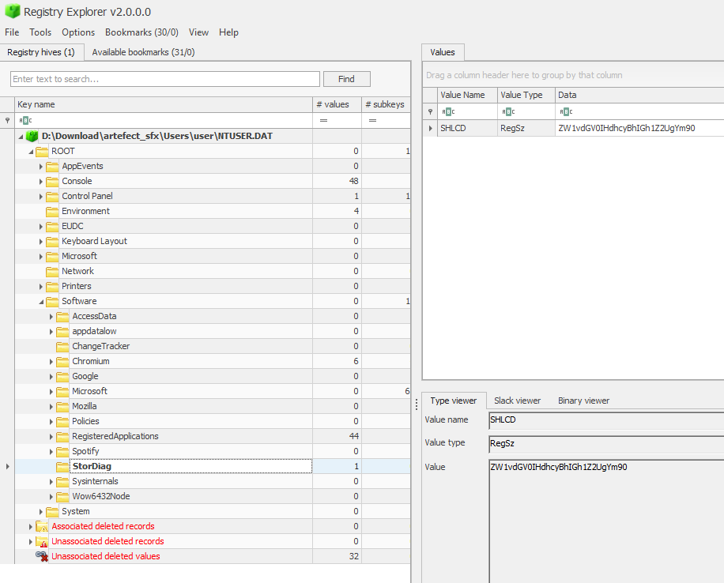

# Strange old package WU

Pour ce chall on dispose d’une arborescence Windows semi complète mais qui suffit largement 

```jsx
┌──(shaym㉿LAPTOP)-[/mnt/d/Download/filesystem_extract]
└─$ ls
System32 Users
```

En regardant dans le dossier Log, on peut voir que Sysmon était activé sur la machine. On peut donc commencer à investiguer 

```jsx
$ ls System32/winevt/Logs/ | grep -i sysmon
Microsoft-Windows-Sysmon%4Operational.evtx
```

En se basant sur l’énoncé et les outils d’analyse de logs comme Chainsaw et Hayabusa on peut remarquer un exécutable suspect dans le dossier téléchargement.

```jsx
Event:
  EventData:
    Contents: '-'
    CreationUtcTime: 2025-02-17 21:38:12.324
    Hash: SHA1=886B4DC38C4D2B65027CD6003224E94BC3E072A3,MD5=EBDA7C4891EFC7393AD49CBD496813C4,SHA256=12ACA483B10420A5B9ACEFFF66EB6618C2BD132907F4A236EB91223ACC1DCB40,IMPHASH=9D36299141DAB99FCB6BA060F8918CAE
    Image: C:\Program Files (x86)\Microsoft\Edge\Application\msedge.exe
    ProcessGuid: 50600C91-AC4A-67B3-5C10-000000000500
    ProcessId: 11076
    RuleName: '-'
    TargetFilename: C:\Users\user\Downloads\stordiag.exe
```

On cherche ensuite les actions faites par l’exécutable `stordiag.exe` 

```jsx
Event:
  EventData:
    CreationUtcTime: 2025-02-17 21:38:53.975
    Image: C:\Users\user\Downloads\stordiag.exe
    ProcessGuid: 50600C91-AC6D-67B3-6A10-000000000500
    ProcessId: 9200
    RuleName: '-'
    TargetFilename: C:\Users\user\AppData\Local\Temp\7zS0F3BF694\init.bat
```

On remarque que `stordiag.exe` va lancer un script nommé `init.bat` 

```jsx
Event:
  EventData:
    CommandLine: C:\WINDOWS\system32\cmd.exe /c ""C:\Users\user\AppData\Local\Temp\7zS0F3BF694\init.bat" dhcyBhIGh1ZW1vdGV0IHZ2UgYm90=="
    Company: Microsoft Corporation
    CurrentDirectory: C:\Users\user\AppData\Local\Temp\7zS0F3BF694\
    Description: Windows Command Processor
    FileVersion: 10.0.26100.3037 (WinBuild.160101.0800)
    Hashes: SHA1=0A028C4F9D40C026296756392F9CCCEB140CE5FC,MD5=ACB66CCB42309485BFABAEB451BEA7A2,SHA256=7B8EA863842198D3D7AF42CE50522E48A8EC0408686D1FB61F936A3DD705560B,IMPHASH=BE5FE55C893B88990C7EF4473D901CAF
    Image: C:\Windows\SysWOW64\cmd.exe
    IntegrityLevel: High
    LogonGuid: 50600C91-28E2-67B3-7ECE-120500000000
    LogonId: '0x512ce7e'
    OriginalFileName: Cmd.Exe
    ParentCommandLine: '"C:\Users\user\Downloads\stordiag.exe" '
    ParentImage: C:\Users\user\Downloads\stordiag.exe
    ParentProcessGuid: 50600C91-AC6D-67B3-6A10-000000000500
    ParentProcessId: 9200
    ParentUser: DESKTOP-3INIT56\user
    ProcessGuid: 50600C91-AC6E-67B3-6B10-000000000500
    ProcessId: 5596
```

Le script `init.bat` va se lancer avec l’argument `dhcyBhIGh1ZW1vdGV0IHZ2UgYm90` depuis un dossier temporaire situé dans le %TEMP% de l’utilisateur courant.

```jsx
Event:
  EventData:
    CommandLine: reg  add "HKCU\Software\StorDiag" /v SHLCD /t REG_SZ /d "ZW1vdGV0IHdhcyBhIGh1Z2UgYm90" /f
    Company: Microsoft Corporation
    CurrentDirectory: C:\Users\user\AppData\Local\Temp\7zS0F3BF694\
    Description: Registry Console Tool
    FileVersion: 10.0.26100.1882 (WinBuild.160101.0800)
    Hashes: SHA1=69A3B34171B2C67634BA817E9EB078C029E04AE5,MD5=5463489622EB68D6407C5760360E4C15,SHA256=291234BEB09EA8C1A8CAFD6F92EA14ADAF0DFFDCDADAFE823ECFB7C96E39DC53,IMPHASH=84150390DAEDD6936B30827BE712548C
    Image: C:\Windows\SysWOW64\reg.exe
    IntegrityLevel: High
    LogonGuid: 50600C91-28E2-67B3-7ECE-120500000000
    LogonId: '0x512ce7e'
    OriginalFileName: reg.exe
    ParentCommandLine: C:\WINDOWS\system32\cmd.exe /c ""C:\Users\user\AppData\Local\Temp\7zS0F3BF694\init.bat" dhcyBhIGh1ZW1vdGV0IHZ2UgYm90=="
    ParentImage: C:\Windows\SysWOW64\cmd.exe
    ParentProcessGuid: 50600C91-AC6E-67B3-6B10-000000000500
    ParentProcessId: 5596
```

Le script `init.bat` va traiter la chaine de caractères passée en argument plus tôt pour ensuite créer une clé de registre dans le chemin suivant `HKCU\Software\StorDiag` contenant le résultat `ZW1vdGV0IHdhcyBhIGh1Z2UgYm90`. 

À savoir que la HKCU est stockée à la racine du dossier User dans le fichier appelé `C:\Users\user\NTUSER.DAT`



Le script `init.bat` va également lancer un deuxième binaire `stordiag.exe` présent dans le dossier temporaire. Effectivement, `stordiag.exe` est un [LolBAS](https://lolbas-project.github.io/lolbas/Binaries/Stordiag/) connu

```jsx
Event:
  EventData:
    CommandLine: stordiag.exe  -collectStorageBreakdown -driverdiag -out "C:\Users\user\AppData\Local\Temp\StorDiag_Logs"
    Company: '-'
    CurrentDirectory: C:\Users\user\AppData\Local\Temp\7zS0F3BF694\
    Description: '-'
    FileVersion: '-'
    Hashes: SHA1=6D8EC82643087CD389C99AA18A4F2E64C306B773,MD5=94D58229CE007E99B5BC2FF21FF4982A,SHA256=2E663F6EF3E87E81C8D7D1C9A142277C3053C2F5F4EF0D85217572B4DCC9C26A,IMPHASH=8E3CF043265AAE50E81D42BF4BC291D4
    Image: C:\Users\user\AppData\Local\Temp\7zS0F3BF694\stordiag.exe
    IntegrityLevel: High
    LogonGuid: 50600C91-28E2-67B3-7ECE-120500000000
    LogonId: '0x512ce7e'
    OriginalFileName: '-'
    ParentCommandLine: C:\WINDOWS\system32\cmd.exe /c ""C:\Users\user\AppData\Local\Temp\7zS0F3BF694\init.bat" dhcyBhIGh1ZW1vdGV0IHZ2UgYm90=="
    ParentImage: C:\Windows\SysWOW64\cmd.exe
    ParentProcessGuid: 50600C91-AC6E-67B3-6B10-000000000500
    ParentProcessId: 5596
    ParentUser: DESKTOP-3INIT56\user
    ProcessGuid: 50600C91-AC6F-67B3-6E10-000000000500
    ProcessId: 6288
```

En regardant la doc, on voit que `stordiag.exe` est capable d’exécuter des binaires appelés`schtasks.exe`ou `powershell.exe` s’ils sont au même niveau que `stordiag.exe`. 

```jsx
Event:
  EventData:
    CommandLine: schtasks.exe /query /xml /tn Microsoft\Windows\Defrag\ScheduledDefrag
    Company: '-'
    CurrentDirectory: C:\Users\user\AppData\Local\Temp\7zS0F3BF694\
    Description: '-'
    FileVersion: '-'
    Hashes: SHA1=AD63D192AD5DD7E8BC2AA7EAB6CE2B1634834A27,MD5=002BB6BAD19B7739DCE92BC636460A51,SHA256=B68367FA7CE88AFDA1E1B6546EDE67B72EF08BD8010DAFC29276FED3C4AFF701,IMPHASH=BDAC21DF30650238CCEEC211505D654E
    Image: C:\Users\user\AppData\Local\Temp\7zS0F3BF694\schtasks.exe
    IntegrityLevel: High
    LogonGuid: 50600C91-28E2-67B3-7ECE-120500000000
    LogonId: '0x512ce7e'
    OriginalFileName: '-'
    ParentCommandLine: stordiag.exe  -collectStorageBreakdown -driverdiag -out "C:\Users\user\AppData\Local\Temp\StorDiag_Logs"
    ParentImage: C:\Users\user\AppData\Local\Temp\7zS0F3BF694\stordiag.exe
    ParentProcessGuid: 50600C91-AC6F-67B3-6E10-000000000500
    ParentProcessId: 6288
    ParentUser: DESKTOP-3INIT56\user
    ProcessGuid: 50600C91-ADC1-67B3-0811-000000000500
    ProcessId: 12788
```

On trouve bien dans les logs un exécutable `schtasks.exe` dans le dossier temporaire au même niveau que `stordiag.exe` 

```jsx
Event:
  EventData:
    CommandLine: '"C:\Program Files\7-Zip\7z.exe" x subst.exe -pZW1vdGV0IHdhcyBhIGh1Z2UgYm90 -o.'
    Company: Igor Pavlov
    CurrentDirectory: C:\Users\user\AppData\Local\Temp\7zS0F3BF694\
    Description: 7-Zip Console
    FileVersion: '24.09'
    Hashes: SHA1=DB96D4B476005A684F4A10480C722B3D89DDE8A5,MD5=B6D5860F368B28CAA9DD14A51666A5CD,SHA256=E2CA3EC168AE9C0B4115CD4FE220145EA9B2DC4B6FC79D765E91F415B34D00DE,IMPHASH=C9F19638C1640C54CAB9BD55C830AAED
    Image: C:\Program Files\7-Zip\7z.exe
    IntegrityLevel: High
    LogonGuid: 50600C91-28E2-67B3-7ECE-120500000000
    LogonId: '0x512ce7e'
    OriginalFileName: 7z.exe
    ParentCommandLine: schtasks.exe /query /xml /tn Microsoft\Windows\Defrag\ScheduledDefrag
    ParentImage: C:\Users\user\AppData\Local\Temp\7zS0F3BF694\schtasks.exe
    ParentProcessGuid: 50600C91-ADC1-67B3-0811-000000000500
    ParentProcessId: 12788
    ParentUser: DESKTOP-3INIT56\user
    ProcessGuid: 50600C91-ADC2-67B3-0A11-000000000500
    ProcessId: 696
    Product: 7-Zip
```

Le binaire `schtasks.exe` va utiliser 7zip pour extraire le contenu de l’exécutable `subst.exe` dans le dossier courant, soit `C:\Users\user\AppData\Local\Temp\7zS0F3BF694\` à l’aide de la valeur de la clé de registre vu plus haut. Valeur qui semble être le mot de passe de `subst.exe`.

On peut également remarquer que le binaire d’origine `stordiag.exe` va créer un exécutable `whiper.exe` qui va s’occuper de supprimer `stordiag.exe` des téléchargements.

```jsx
Event:
  EventData:
    CreationUtcTime: 2025-02-17 21:38:54.076
    Image: C:\Users\user\Downloads\stordiag.exe
    ProcessGuid: 50600C91-AC6D-67B3-6A10-000000000500
    ProcessId: 9200
    RuleName: '-'
    TargetFilename: C:\Users\user\AppData\Local\Temp\7zS0F3BF694\whiper.exe
    User: DESKTOP-3INIT56\user
    UtcTime: 2025-02-17 21:38:54.076
```

Malheureusement, les informations que l’on peut obtenir grâce aux logs s’arrête ici. Aucune information sur le contenu de `subst.exe` n’est présente.

On peut toutefois reconstruire une killchain semblable à la suivante :


Pour la suite du challenge, on a pu identifier à plusieurs reprises que le payload initial `stordiag.exe` avait été téléchargé depuis internet, à l’aide de `Edge` puis placé dans le dossier `Downloads`

Il est possible, lorsque nous avons le filesystem et surtout le contenu du cache Edge, de récupérer un élément supprimé.

Pour notre chall on a le path vers le cache edge suivant, que l’on peut analyser à l’aide de l’outil [ChromeCacheView](https://www.nirsoft.net/utils/chrome_cache_view.html) :

```jsx
.\filesystem_extract\Users\user\AppData\Local\Microsoft\Edge\User Data\Default\Cache
```


Pour extraire un élément :

- **Fais un clic droit > "Copy Selected Cache Files To..."**.
- Choisis un dossier de destination (Default : .\chromecacheview\CacheFiles)

On peut ensuite commencer l’analyse du binaire, qui n’en est pas vraiment…

```jsx
$ sha256sum stordiag.exe
12aca483b10420a5b9acefff66eb6618c2bd132907f4a236eb91223acc1dcb40  stordiag.exe

$ file stordiag.exe
stordiag.exe: PE32 executable (GUI) Intel 80386, for MS Windows, 5 sections
```

À première vue, il semble que `stordiag.exe` soit un PE, mais un coup de binwalk dessus et on se rend compte que pas vraiment.

```jsx
$ binwalk stordiag.exe

DECIMAL       HEXADECIMAL     DESCRIPTION
--------------------------------------------------------------------------------
0             0x0             Microsoft executable, portable (PE)
129183        0x1F89F         7-zip archive data, version 0.4
```

Il s’agit en fait d’un format de fichier appelé [SFX](https://fr.wikipedia.org/wiki/Auto-extractible) (*self-extracting archive*) qui a été utilisé principalement par [Emotet](https://thehackernews.com/2022/10/emotet-botnet-distributing-self.html) qui dispose d’en-tête de PE.

Pour l’ouvrir, on peut utiliser 7zip :

```jsx
$ 7za e stordiag.exe

7-Zip (a) 24.06 (x64) : Copyright (c) 1999-2024 Igor Pavlov : 2024-05-26
 64-bit locale=en_US.UTF-8 Threads:8 OPEN_MAX:1024

Scanning the drive for archives:
1 file, 1637850 bytes (1600 KiB)

Extracting archive: stordiag.exe
--
Path = stordiag.exe
Type = 7z
Offset = 129183
Physical Size = 1508667
Headers Size = 310
Method = LZMA2:12m BCJ
Solid = +
Blocks = 2

Everything is Ok

Files: 6
Size:       11788879
Compressed: 1637850
```

Et on obtient les fichiers suivants :

```jsx
$ ls
init.bat  schtasks.exe  StorageUsage.dll  stordiag.exe  subst.exe  whiper.exe
```

On sait que d’après les logs la commande `"C:\Program Files\7-Zip\7z.exe" x subst.exe -pZW1vdGV0IHdhcyBhIGh1Z2UgYm90 -o.` a été utilisé. 

Donc autant faire pareille :

```jsx
$ 7za x subst.exe -pZW1vdGV0IHdhcyBhIGh1Z2UgYm90 -o.

7-Zip (a) 24.06 (x64) : Copyright (c) 1999-2024 Igor Pavlov : 2024-05-26
 64-bit locale=en_US.UTF-8 Threads:8 OPEN_MAX:1024

Scanning the drive for archives:
1 file, 215968 bytes (211 KiB)

Extracting archive: subst.exe
--
Path = subst.exe
Type = 7z
Offset = 215552
Physical Size = 416
Headers Size = 208
Method = LZMA2:12 7zAES
Solid = -
Blocks = 1

Everything is Ok

Size:       228
Compressed: 215968

$ cat requirement.txt
requests
numpy
pandas
matplotlib
scikit-learn
flask
pytest
beautifulsoup4
SQLAlchemy
pyodbc
BZHCTF{Is_this_file_format_still_used_today?!}
seaborn
lxml
Flask-RESTful
pytest-cov
gunicorn
cryptography
celery
schedule
Pillow
pyjwt
```

Et voilà le flag ! 😄