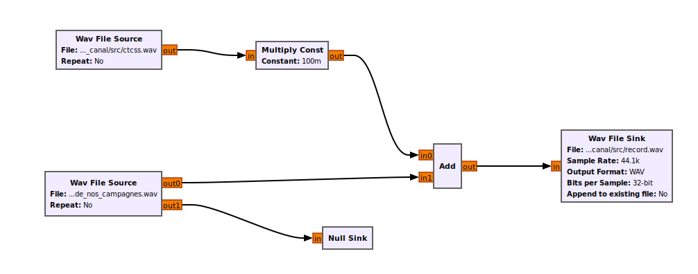

# Changement de canal

## Énoncé

>  Un collègue a découvert comment fonctionnait le [dispositif CTCSS](https://fr.wikipedia.org/wiki/CTCSS) qui permet à plusieurs utilisateurs de partager une même fréquence radio sans s'interférer, en créant artificiellement des canaux. Il a décidé d'utiliser ce mécanisme pour communiquer discrètement avec ses amis. Il a créé un dispositif qui joue une musique en changeant de canal toutes les trois secondes. Une émission sur le canal 1 désigne la transmission la lettre `A`, le canal 2 pour la lettre `B`, etc. jusqu'au canal 26 pour la lettre `Z`. Une pause sans canal entre deux lettres correspond à un espace (représenté par un `_` dans le flag).
>
> ​    Vous avez allumé votre talkie-walkie et entendu la musique envoyée par son dispositif. Retrouvez le message caché.
>
> ​    Le flag est en majuscules au format `BZHCTF{MESSAGE_EN_PLUSIEURS_MOTS}`.

## Création du challenge

Le programme [gen_signal.py](gen_signal.py) permet de créer un signal `ctcss.wav` avec une sinusoïde changeant de fréquence toutes les 3 secondes, la fréquence correspondant à la lettre du message à cacher.

*L'hymne de nos campagnes* a été téléchargée depuis [YouTube](https://www.youtube.com/watch?v=srb0lAK5wbA) et convertie en wav.

Le diagramme suivant permet d'additionner les deux signaux sur GnuRadio Companion :

Le fichier `record.wav` est enfin converti en MP3 pour être distribué plus facilement.