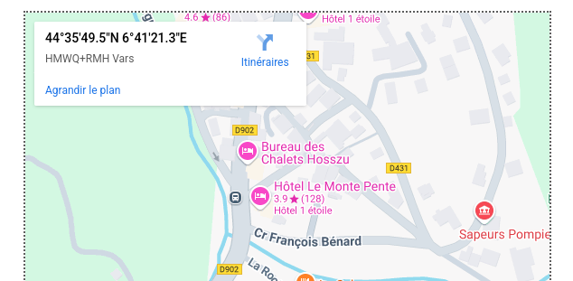

# Writeup

Une image ? Cherchons dans les metadata les informations de géolocalisation !

https://jimpl.com/results/YNJzekpuGqvgVFEzeUezeNCu?target=exif

On retrouve les coordonnées : `44°35'49.5"N 6°41'21.3"E` 
Mais nous devons trouver le nom de la station. 
Soit on est smart et on fait le lien directement sur le site avec les coordonnées : Vars.

Soit on cherche sur notre moteur de recherche favori "Station de ski Sainte Marie" et nous voilà sur le site internet de la station Vars : https://www.vars.com/hiver/vars-et-ses-villages/sainte-marie/

Le domaine ferme le 6 avril prochain, il ne faut pas tarder à réserver les prochaines vacances !!

 
