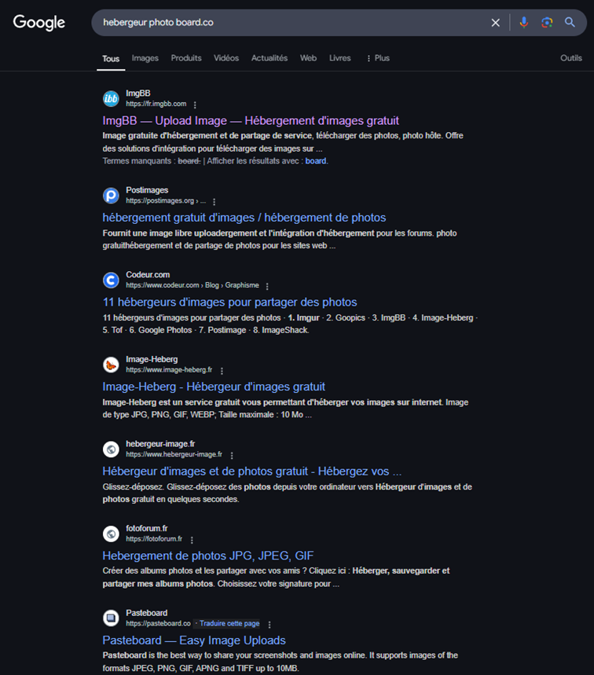
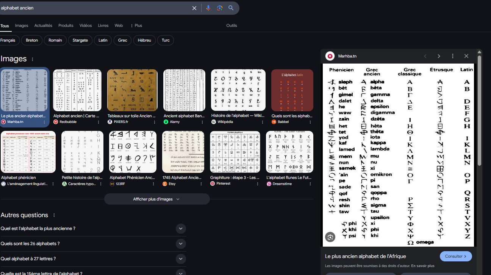

# Challenge 4 : La langue à son chat

**Moyen**

Description :

> Les informations s’accumulent sur Eduardo, et il semble qu’il était persuadé que quelqu’un était à ses trousses. Le contact qu’il a rencontré hier soir lui a probablement donné des informations sur le sujet. En interrogeant les employés du lieu de la rencontre, l'un d’entre eux a trouvé une serviette gribouillée sur la table quand ils sont partis, qu’il s'apprêtait à brûler. Il dit aussi les avoir entendus converser d’un développeur de virus, mais il n’en sait pas plus.

## Write-up

On commence avec deux informations importantes :

- Le suspect semble être un ancien informaticien
- Un lien écrit sur une serviette à moitié brulé.

On se rend compte que le lien semble être un partage de fichier .jpg .
En effectuant une recherche google on découvre un site nommé pasteboard.co

En tapant maintenant le lien complet : https://pasteboard.co/vw52e7KOiK3G.jpg
On arrive sur cette page :

En zoomant sur la photo on découvre une inscription sur le mur

Celle-ci peut ressembler à une langue ancienne on cherche donc des langues anciennes pouvant correspondre à ces symboles.
En effectuant une recherche on se rend compte que les symboles correspondent à l’alphabet phénicien.

En effectuant une traduction entre le phénicien et l’alphabet latin l’inscription nous donne Abakorich.
Maintenant on utilise la seconde information de l’énoncé : c’est un ancien informaticien.
Comme tout bon informaticien il a un compte github.
On fait donc une recherche sur le site et on tombe sur un profil 

On voit qu’il a un README.md

Il y dit que son prénom est le même que celui du père d’un Président né à Kalynovka

En faisant une recherche sur wikipédia, on découvre la ville de Kalinovka
Cette dernière est la ville de naissance de Nikita Krouchtchev, dirigeant de l’URSS entre 1953 et 1964

En recherchant sur sa page wikipédia on découvre que son père s’appelait Sergueï

Le flag est donc `BZHCTF{Serguei_Abakorich}`
