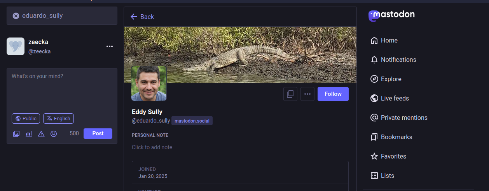
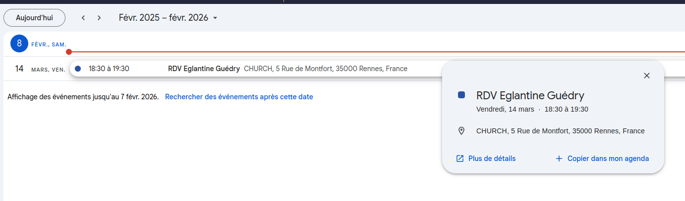

# WriteUP

En lisant les notes on relève deux premières pistes: un Mammouth avec un pseudo, et un numéro de téléphone en +444.

Une recherche "Mammouth" "Réseau sociaux" nous met sur la piste de [Mastodon](https://joinmastodon.org/fr).

On commence donc par retrouver `eduardo_sully` sur Mastodon (on prendra en premier lieu le serveur par défault `mastodon.social`)

> Note : Mastodon nécessite la création d'un compte.

https://mastodon.social/@eduardo_sully

La description du profil permet de rebondire sur sa [chaine Youtube](https://www.youtube.com/channel/UCJvDHjl4KCtbFo6OTAH6lAw).

On recupère deux vidéos, un nouveau pseudo "EduardoOSullivan" et une identité plus complète: "Eduardo O'Sullivan" avec l'email eduardoosully@gmail.com

Une recherche sur [Epios](https://epieos.com/?q=eduardoosully%40gmail.com&t=email) nous permet de récupérer de plus amples informations:

- id : 106175275639793634124
- Contributions maps : https://www.google.com/maps/contrib/106175275639793634124
- Google Calendar public : https://calendar.google.com/calendar/u/0/embed?src=eduardoosully@gmail.com
- Web Archive google plus : https://web.archive.org/web/*/plus.google.com/106175275639793634124*

On peut voir que l'utilisateur a un Google Calendar public:

> RDV Eglantine Guédry
> CHURCH
> 5 Rue de Montfort, 35000 Rennes, France

Le flag est donc `BZHCTF{Eglantine_Guédry_Church}`.