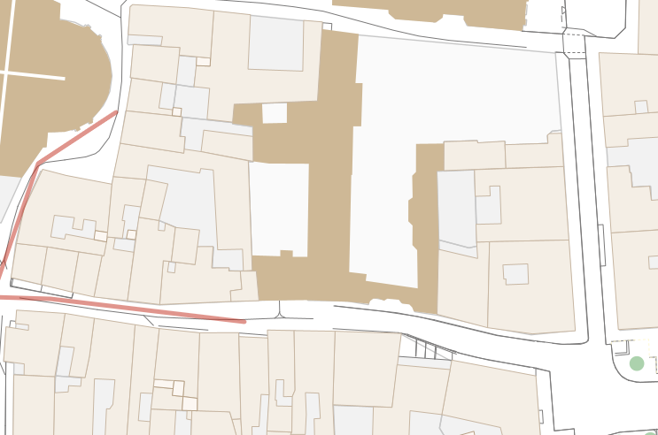

# Challenge 6 : Une escapade odorante
## Difficile
### Description : 

Les recherches continuent, notamment sur le lien entre Eduardo et son poursuivant, et sur des événements qui auraient eu lieu la nuit dernière. Florian vous donne une nouvelle piste à travers un pseudo qu’Eduardo utilisait : SullyLovesPlants.
Qu’est écrit sur la devanture du bâtiment devant lequel nous avons perdu le contact d’Eduardo ?

En réalisant une recherche sur le pseudo SullyLovesPlants on découvre un compte reddit portant ce nom 

En fouillant son profil, outre un post qui a buzzé (me demandez pas pourquoi, Eduardo est influenceur plantes maintenant), on se rend compte qu'il s'interesse à une application nommée Pl@ntNet

On trouve une version web de Pl@ntNet

En recherchant dans les contributions "SullyLovesPlants" on ne trouve rien, par contre en recherchant dans les groupes un groupe se nomme ainsi

En regardant la description du groupe on trouve un nouveau pseudo @PlantsLover35

Le arobase placé avant le pseudo fait penser à twitter

Un compte twitter existe bel et bien avec ce pseudo

Mais rien ne semble étrange en regardant ce dernier
Toutefois, un post pourrait avoir été supprimé. On regarde donc sur les sites archivant les pages webs.
On découvre une archive sur archive.today (archive.ph)

Dans cette archive on se rend compte qu'un post est présent alors qu'il ne l'est pas sur la version actuelle.
Ce post est un lien vers un google drive et plus précisement un audio.

on écoute désormais cet audio

La retranscription de cette audio donne ceci : 

- Bon je vais enregistrer ça au cas où je disparaisse, on pourra me retrouver.
- Je sors du Church à l’instant et j’ai vu l’homme qui me cherche, il me suit. Faut que je trouve un moyen de m’échapper.
- Normalement y’a toujours du monde rue du Chapitre, le jour où j’ai besoin d’aide elle est vide.
- Bon je vais rentrer là.
*Rentre dans les égouts*
- Je dois le perdre dans ce dédale mais pas me perdre.
- Commençons par aller à gauche.
- Ok à droite.
- Gauche maintenant.
*Bruit de rivière au dessus*
- Droite encore.
- Je reconnais la forme des rues : La Motte Piquet, Redon, pas Voltaire, à droite !
*Cours puis bruit de rivière*
- Tout droit, puis premier croisement, deuxième croisement, troisième croisement, je passe. 
- Maintenant à droite.
- Encore à droite, putain c’est un cul de sac, demi tour.
- Droite et encore droite.
- Plus le temps de réfléchir je cours, je l’entends arriver derrière moi.
- La rivière est toute proche, je l'entend juste à droite de moi.
*Bruit d’une écluse/barrage*
- Aller à gauche m’éloigne du centre et d’une potentielle aide, donc à droite.
*Bruit de rivière au dessus*
- Je vois de la lumière au loin
- Un croisement, un second, la sortie est juste avant le virage
- Enfin dehors !
- NOOOOOOON
“

Eduardo nous dit dans un premier temps qu'il sort du Church et qu'il est suivi

Il nous dit ensuite être rue du Chapitre

On entend ensuite un bruit de bouche d'égout, il semble donc qu'Eduardo soit rentré dans les égouts de Rennes.

On cherche donc une carte des égouts de Rennes

On découvre sur le site https://data.rennesmetropole.fr/explore/dataset/reseaux_structurants_eaux_usees/map/?location=13,48.11402,-1.6616&basemap=0a029a une carte des égouts qui va nous servir pour retracer le chemin d'Eduardo dans ce dédale.

On voit qu'il y a une entrée des égouts rue du chapitre, l'itinéraire comme donc ici.

Il dit aller ensuite à gauche

Il va maintenant à droite

Puis à nouveau à gauche

On entend un bruit de rivière indiquant qu'il passe sous la Vilaine puis prend à droite

il indique ensuite reconnaitre la forme des rues, il passe la rue Motte Picquet, la rue Redon mais pas la rue Voltaire il tourne donc à droite au croisement entre la rue Redon et la rue Voltaire.

On l'entend désormais courir et à nouveau un bruit de rivière cela indique qu'il a retraversé la Vilaine.

Il dit ensuite passer 3 croisements avant de bifurquer sur la droite

Il va ensuite à droite

C'est un cul de sac, il fait donc demi-tour et retourne à droit

Il prend à nouveau à droite

Il explique longer la rivière, on entend le son d'une écluse puis il dit aller à droite

Juste après son virage à droite en entend la rivière au dessus de lui, il retraverse donc la rivière

Il dit traversé deux croisements puis on l'entend ressortir avant le virage.

Il se fait attrapé à la sortie des égouts. En cherchant sur StreetView l'endroit auquel il a pu sortir on se rend compte qu'il est sorti juste avant le croisement entre la rue Legraverend et la rue Saint-Malo

A cette endroit on découvre une bouche d'égout devant un batiment sur lequel y a écrit : Le Solidor

Flag : BZHCTF{Le_Solidor}

