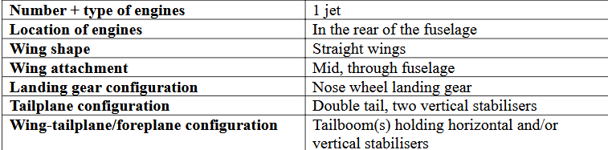
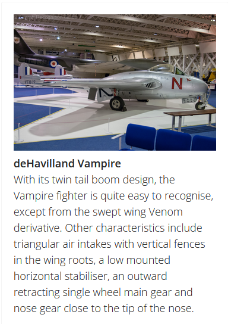
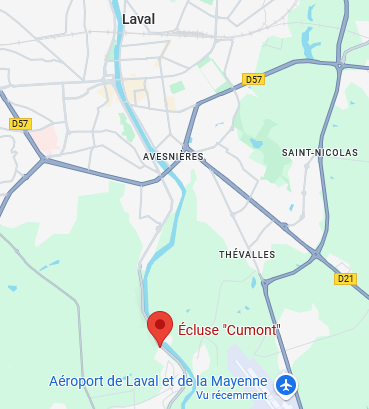

Le PDF nous donne les caractéristiques de l'avion volé :

En les entrant toutes dans cet outil : https://www.aircraftrecognitionguide.com/identify-aircraft/identify-by-airplane-characteristics, on obtient un seul avion correspondant :

Le deHavilland Vampire, ou DH.100 de son vrai nom.
Reste à en trouver un en vente. En cherchant "dh100 sale" sur google, [un seul modèle ressort](https://www.planecheck.com/?ent=da&id=59530&cor=y), et le prix correspond à celui du rapport de police (55000€).
En utilisant son immatriculation (F-AZHX), on le retrouve sur différents sites, donc [celui-ci](https://www.pictaero.com/fr/pictures/picture,346285), où le numéro de série est précisé : 624.
Il est vendu à l'aéroport LFOV, de Laval. En regardant sur Maps, il y a effectivement une rivière qui passe à côté : la Mayenne.
La prison de Laval est en centre ville, également à côté de la Mayenne. Entre les deux, une seule écluse : celle de Cumont.

D'où le flag : BZHCTF{DH.100_624_Cumont}