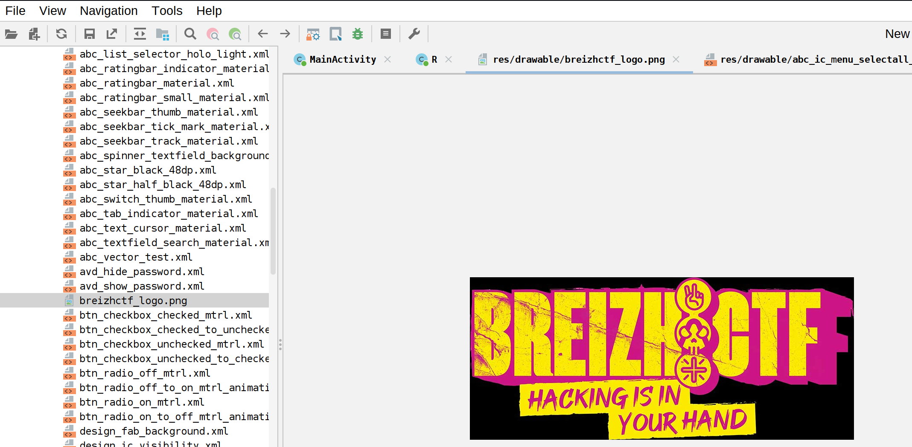

# Finisteg

Le fichier fourni est un APK (une application android). On peut utiliser l'outil JADX afin de l'analyser.

```java
package com.example.finisteg;

/* loaded from: classes3.dex */
public class MainActivity extends AppCompatActivity {
    /* JADX INFO: Access modifiers changed from: protected */
    @Override // androidx.fragment.app.FragmentActivity, androidx.activity.ComponentActivity, androidx.core.app.ComponentActivity, android.app.Activity
    public void onCreate(Bundle savedInstanceState) {
        super.onCreate(savedInstanceState);
        setContentView(R.layout.activity_main);
        Button checkButton = (Button) findViewById(R.id.check_button);
        final EditText flagInput = (EditText) findViewById(R.id.flagInput);
        BitmapFactory.Options o = new BitmapFactory.Options();
        o.inScaled = false;
        final Bitmap bm = BitmapFactory.decodeResource(getResources(), R.drawable.breizhctf_logo, o);
        checkButton.setOnClickListener(new View.OnClickListener() { // from class: com.example.finisteg.MainActivity.1
            @Override // android.view.View.OnClickListener
            public void onClick(View v) {
                String userFlag = flagInput.getText().toString();
                String ex = MainActivity.this.decodeBase64(MainActivity.this.extractTextFromImage(bm));
                Log.d("FLAG", ex + " vs " + userFlag);
                if (ex.equals(userFlag)) {
                    Toast.makeText(MainActivity.this, "Flag Correct!", 1).show();
                } else {
                    Toast.makeText(MainActivity.this, "Flag Incorrect!", 1).show();
                }
            }
        });
    }

    /* JADX INFO: Access modifiers changed from: private */
    public String extractTextFromImage(Bitmap bitmap) {
        int value;
        int i;
        int width = bitmap.getWidth();
        int height = bitmap.getHeight();
        StringBuilder binaryText = new StringBuilder();
        int[] channels = {0, 1, 2};
        for (int y = 0; y < height; y++) {
            for (int x = 0; x < width; x++) {
                int pixel = bitmap.getPixel(x, y);
                int channel = channels[binaryText.length() % 3];
                if (channel == 0) {
                    i = pixel >> 16;
                } else if (channel == 1) {
                    i = pixel >> 8;
                } else {
                    value = pixel & 255;
                    binaryText.append(value & 1);
                    if (binaryText.length() % 8 != 0 && binaryText.substring(binaryText.length() - 8).equals("00000000")) {
                        return binaryToString(binaryText.substring(0, binaryText.length() - 8));
                    }
                }
                value = i & 255;
                binaryText.append(value & 1);
                if (binaryText.length() % 8 != 0) {
                }
            }
        }
        return "Aucun texte trouvé";
    }
}
```

On voit ici qu'une image est chargée depuis les ressources de l'application puis la fonction `extractTextFromImage`, prend cette image en paramètre et est executée :

```java
final Bitmap bm = BitmapFactory.decodeResource(getResources(), R.drawable.breizhctf_logo, o);
...
String ex = MainActivity.this.decodeBase64(MainActivity.this.extractTextFromImage(bm));
```

Si l'utilisateur entre la chaine de caractères calculée à partir de l'image, alors le flag est accepté :

```java
if (ex.equals(userFlag)) {
    Toast.makeText(MainActivity.this, "Flag Correct!", 1).show();
}
```

Le plan est donc le suivant :
1. Extraire l'image de l'APK
2. Faire passer l'image dans `extractTextFromImage`
3. Enjoy notre flag :)


1. Extraire l'image de l'APK

On a vu que l'image venait de `R.drawable.breizhctf_logo`, ainsi on peut se rendre dans `Ressources/res/drawable/breizhctf_logo.png`



On fait clique droit sur l'image, save. Et hop, notre image est sauvegardée.


2. Faire passer l'image dans `extractTextFromImage`

Vu qu'on est en CTF et qu'on a pas le temps de faire les choses proprement, on demande à chatGPT de convertir la fonction `extractTextFromImage` en python.

> https://chatgpt.com/share/67cb935b-1fbc-800e-93a9-2f6080b7ca14

On aurait aussi pû utiliser frida et analyser la mémoire de l'application avant d'entrer notre input ou encore copier/coller la fonction et la transpiller avec java. Mais bon, vive python :)

`python3 solve.py breizhctf_logo.png`

> BZHCTF{4PK_4ND_5tEG4N0_T0_5t4rT}


~ Keep pwning -- Drahoxx