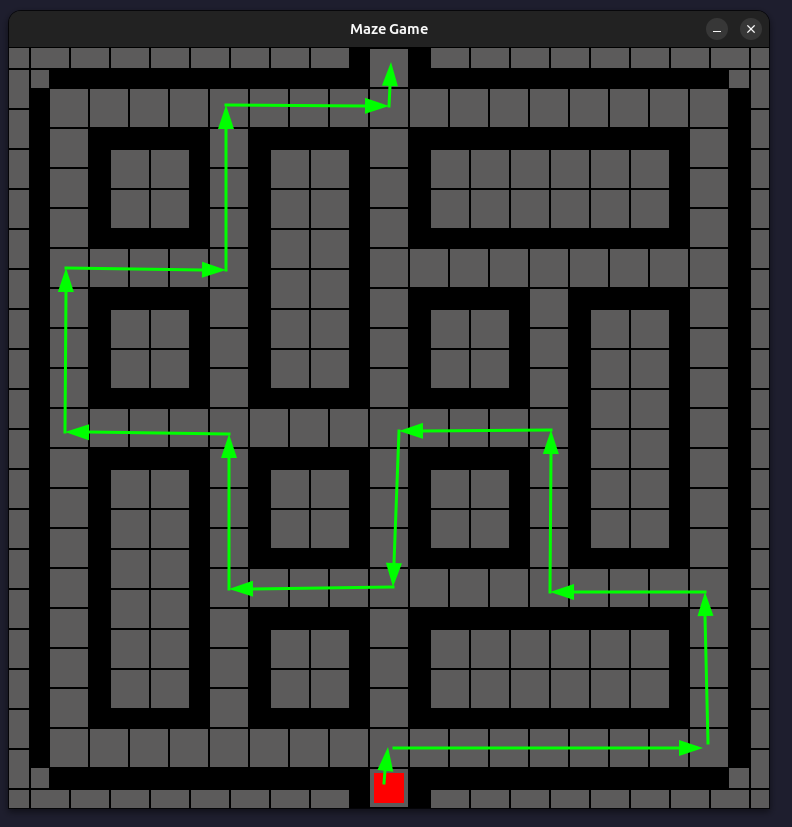

# WriteUp

En effectuant un `strings` sur le binaire, on s'appercois de plusieurs références à python :

```bash
strings game
```
```
...
pydoc_data)
pydoc_data.topics)
pygame)
pygame.colordict)
pygame.cursors)
pygame.fastevent)
pygame.ftfont)
pygame.macosx)
pygame.pkgdata)
pygame.sndarray)
pygame.sprite)
pygame.surfarray)
pygame.sysfont)
pygame.threads)
pygame.version)
...
pydata

```

On suppose donc la compilation du binaire avec PyInstaller, qu'on peut unpack avec [pyinstxtractor](https://raw.githubusercontent.com/extremecoders-re/pyinstxtractor/master/pyinstxtractor.py).

```bash
python3 pyinstxtractor.py game
```
```
[+] Processing game
[+] Pyinstaller version: 2.1+
[+] Python version: 3.8
[+] Length of package: 1691119 bytes
[+] Found 11 files in CArchive
[+] Beginning extraction...please standby
[+] Possible entry point: pyiboot01_bootstrap.pyc
[+] Possible entry point: pyi_rth_pkgres.pyc
[+] Possible entry point: pyi_rth_inspect.pyc
[+] Possible entry point: pyi_rth_pkgutil.pyc
[+] Possible entry point: game.pyc
[!] Warning: This script is running in a different Python version than the one used to build the executable.
[!] Please run this script in Python 3.8 to prevent extraction errors during unmarshalling
[!] Skipping pyz extraction
[+] Successfully extracted pyinstaller archive: game
```

En possessions des différents bytescodes python, on execute [decompyle3](https://pypi.org/project/decompyle3/) pour récupérer le fichier source.

```bash
decompyle3 game_extracted/game.pyc > game.py
```

```python
# decompyle3 version 3.9.2
# Python bytecode version base 3.8.0 (3413)
# Decompiled from: Python 3.12.3 (main, Jan 17 2025, 18:03:48) [GCC 13.3.0]
# Embedded file name: game.py
import pygame, hashlib
from Crypto.Cipher import AES
pygame.init()
GRID_SIZE = 19
CELL_SIZE = 40
WIDTH = GRID_SIZE * CELL_SIZE
HEIGHT = GRID_SIZE * CELL_SIZE
WHITE = (255, 255, 255)
BLACK = (0, 0, 0)
RED = (255, 0, 0)
colors = {'wall':BLACK, 
 'path':(92, 91, 91)}
maze = [
 [0,0,0,0,0,0,0,0,0,1,0,0,0,0,0,0,0,0,0],
 [0,1,1,1,1,1,1,1,1,1,1,1,1,1,1,1,1,1,0],
 [0,1,0,0,0,1,0,0,0,1,0,0,0,0,0,0,0,1,0],
 [0,1,0,0,0,1,0,0,0,1,0,0,0,0,0,0,0,1,0],
 [0,1,0,0,0,1,0,0,0,1,0,0,0,0,0,0,0,1,0],
 [0,1,1,1,1,1,0,0,0,1,1,1,1,1,1,1,1,1,0],
 [0,1,0,0,0,1,0,0,0,1,0,0,0,1,0,0,0,1,0],
 [0,1,0,0,0,1,0,0,0,1,0,0,0,1,0,0,0,1,0],
 [0,1,0,0,0,1,0,0,0,1,0,0,0,1,0,0,0,1,0],
 [0,1,1,1,1,1,1,1,1,1,1,1,1,1,0,0,0,1,0],
 [0,1,0,0,0,1,0,0,0,1,0,0,0,1,0,0,0,1,0],
 [0,1,0,0,0,1,0,0,0,1,0,0,0,1,0,0,0,1,0],
 [0,1,0,0,0,1,0,0,0,1,0,0,0,1,0,0,0,1,0],
 [0,1,0,0,0,1,1,1,1,1,1,1,1,1,1,1,1,1,0],
 [0,1,0,0,0,1,0,0,0,1,0,0,0,0,0,0,0,1,0],
 [0,1,0,0,0,1,0,0,0,1,0,0,0,0,0,0,0,1,0],
 [0,1,0,0,0,1,0,0,0,1,0,0,0,0,0,0,0,1,0],
 [0,1,1,1,1,1,1,1,1,1,1,1,1,1,1,1,1,1,0],
 [0,0,0,0,0,0,0,0,0,1,0,0,0,0,0,0,0,0,0]]
path = [9,8,9,6,7,4,7,6,1,0,1,6,7,4,7,6,9,8,11,10,13,12,15,14,9,8,11,10,5,4,5,2,3,0,3,2,5,4,7,6,1,0,3,2,29,28,31,30,1,0,1,30,31,28,29,26,27,24]
player_size = 30
player_x, player_y = GRID_SIZE // 2, GRID_SIZE - 1
player_color = RED
move_speed = 0.2
lost = False
screen = pygame.display.set_mode((WIDTH, HEIGHT))
pygame.display.set_caption("Maze Game")

def draw_maze():
    for row in range(GRID_SIZE):
        for col in range(GRID_SIZE):
            if maze[row][col] == 1:
                color = colors["path"]
                pygame.draw.rect(screen, color, (col * CELL_SIZE, row * CELL_SIZE, CELL_SIZE, CELL_SIZE))
                pygame.draw.rect(screen, (0, 0, 0), (col * CELL_SIZE, row * CELL_SIZE, CELL_SIZE, CELL_SIZE), 1)
            else:
                color = colors["path"]
                pygame.draw.rect(screen, color, (col * CELL_SIZE, row * CELL_SIZE, CELL_SIZE, CELL_SIZE))
                pygame.draw.line(screen, BLACK, (
                 col * CELL_SIZE, row * CELL_SIZE + CELL_SIZE // 2), (
                 (col + 1) * CELL_SIZE, row * CELL_SIZE + CELL_SIZE // 2), 2)
                pygame.draw.line(screen, BLACK, (
                 col * CELL_SIZE + CELL_SIZE // 2, row * CELL_SIZE), (
                 col * CELL_SIZE + CELL_SIZE // 2, (row + 1) * CELL_SIZE), 2)
                if col > 0:
                    if maze[row][col - 1] == 1:
                        pygame.draw.rect(screen, BLACK, (col * CELL_SIZE, row * CELL_SIZE, CELL_SIZE // 2, CELL_SIZE))
                    if col < GRID_SIZE - 1:
                        if maze[row][col + 1] == 1:
                            pygame.draw.rect(screen, BLACK, (col * CELL_SIZE + CELL_SIZE // 2, row * CELL_SIZE, CELL_SIZE // 2, CELL_SIZE))
                    if row > 0:
                        if maze[row - 1][col] == 1:
                            pygame.draw.rect(screen, BLACK, (col * CELL_SIZE, row * CELL_SIZE, CELL_SIZE, CELL_SIZE // 2))
                if row < GRID_SIZE - 1:
                    if maze[row + 1][col] == 1:
                        pygame.draw.rect(screen, BLACK, (col * CELL_SIZE, row * CELL_SIZE + CELL_SIZE // 2, CELL_SIZE, CELL_SIZE // 2))


def draw_player():
    global player_x
    global player_y
    pygame.draw.rect(screen, player_color, (player_x * CELL_SIZE + (CELL_SIZE - player_size) // 2,
     player_y * CELL_SIZE + (CELL_SIZE - player_size) // 2,
     player_size, player_size))


def decrypt_flag(key):
    ciphertext = b'\x15zde\xff\x1a\x93\x04\x04\xa9\xe0\x15\xf8\xa99\xe1\x98\xc5L\xcd-\xbeF\xf5O\x03_GdL\x8c\x03\x99O5'
    nonce = b'\x85\xdc\xd8\x18CI\x92\n'
    cipher = AES.new(key, (AES.MODE_CTR), nonce=nonce)
    flag = cipher.decrypt(ciphertext)
    return flag


def draw_victory_message(seen_array):
    font = pygame.font.Font(None, 36)
    text = font.render(decrypt_flag(bytes.fromhex(hashlib.sha3_256("".join((str(x) for x in seen_array)).encode()).hexdigest())), True, (0,
                                                                                                                                         255,
                                                                                                                                         0))
    text_rect = text.get_rect(center=(WIDTH // 2, HEIGHT // 2))
    screen.blit(text, text_rect)


def check_path(player_x, player_y, path, seen_array):
    global lost
    if (
     player_x, player_y) not in seen_array:
        seen_array.append((player_x, player_y))
        if path:
            if player_x ^ player_y != path.pop():
                lost = True


def main():
    global lost
    global player_x
    global player_y
    clock = pygame.time.Clock()
    running = True
    cur_path = path.copy()
    seen_array = []
    move_delay = 0
    while running:
        for event in pygame.event.get():
            if event.type == pygame.QUIT:
                running = False
            keys = pygame.key.get_pressed()

        if move_delay > 0:
            move_delay -= 1
        if move_delay == 0:
            if keys[pygame.K_LEFT] and player_x > 0:
                if maze[player_y][player_x - 1] == 1:
                    player_x -= 1
                    move_delay = move_speed * 30
                    check_path(player_x, player_y, cur_path, seen_array)
                if keys[pygame.K_RIGHT] and player_x < GRID_SIZE - 1:
                    if maze[player_y][player_x + 1] == 1:
                        player_x += 1
                        move_delay = move_speed * 30
                        check_path(player_x, player_y, cur_path, seen_array)
                    if keys[pygame.K_UP] and player_y > 0:
                        if maze[player_y - 1][player_x] == 1:
                            player_y -= 1
                            move_delay = move_speed * 30
                            check_path(player_x, player_y, cur_path, seen_array)
                        if keys[pygame.K_DOWN]:
                            if player_y < GRID_SIZE - 1:
                                if maze[player_y + 1][player_x] == 1:
                                    player_y += 1
                                    move_delay = move_speed * 30
                                    check_path(player_x, player_y, cur_path, seen_array)
        screen.fill(WHITE)
        draw_maze()
        if player_x == GRID_SIZE // 2 and player_y == 0 and maze[player_y][player_x] == 1:
            if lost == True:
                player_x, player_y = GRID_SIZE // 2, GRID_SIZE - 1
                lost = False
                cur_path = path.copy()
                seen_array = []
            else:
                draw_victory_message(seen_array)
        else:
            draw_player()
        pygame.display.flip()
        clock.tick(30)

    pygame.quit()


if __name__ == "__main__":
    main()

# okay decompiling game_extracted/game.pyc
```

Certains ajustements sont nécessaire pour reproduire un jeu cohérent, notamment sur l'indentation des conditions.

En analysant le code python on se rend compte que la fonction qui affiche le flag nécessite une clé générée par le chemin choisi dans le labyrinthe. Elle est elle générée par la fonction de contrainte `check_path`, associé d'une constante `path`.

```python
path = [9,8,9,6,7,4,7,6,1,0,1,6,7,4,7,6,9,8,11,10,13,12,15,14,9,8,11,10,5,4,5,2,3,0,3,2,5,4,7,6,1,0,3,2,29,28,31,30,1,0,1,30,31,28,29,26,27,24]

def check_path(player_x, player_y, path, seen_array):
    global lost
    if (player_x, player_y) not in seen_array:
        seen_array.append((player_x, player_y))
        if path:
            if player_x ^ player_y != path.pop():
                lost = True
```

En se basant sur le code existant, on peut essayer de parcourir le labyrinth en profondeur en vérifiant cette contrainte à chaque mouvement. 

On arrive donc au code suivant, nous donnant la suite de directions à suivre :

```python
maze = [
    [0, 0, 0, 0, 0, 0, 0, 0, 0, 1, 0, 0, 0, 0, 0, 0, 0, 0, 0],
    [0, 1, 1, 1, 1, 1, 1, 1, 1, 1, 1, 1, 1, 1, 1, 1, 1, 1, 0],
    [0, 1, 0, 0, 0, 1, 0, 0, 0, 1, 0, 0, 0, 0, 0, 0, 0, 1, 0],
    [0, 1, 0, 0, 0, 1, 0, 0, 0, 1, 0, 0, 0, 0, 0, 0, 0, 1, 0],
    [0, 1, 0, 0, 0, 1, 0, 0, 0, 1, 0, 0, 0, 0, 0, 0, 0, 1, 0],
    [0, 1, 1, 1, 1, 1, 0, 0, 0, 1, 1, 1, 1, 1, 1, 1, 1, 1, 0],
    [0, 1, 0, 0, 0, 1, 0, 0, 0, 1, 0, 0, 0, 1, 0, 0, 0, 1, 0],
    [0, 1, 0, 0, 0, 1, 0, 0, 0, 1, 0, 0, 0, 1, 0, 0, 0, 1, 0],
    [0, 1, 0, 0, 0, 1, 0, 0, 0, 1, 0, 0, 0, 1, 0, 0, 0, 1, 0],
    [0, 1, 1, 1, 1, 1, 1, 1, 1, 1, 1, 1, 1, 1, 0, 0, 0, 1, 0],
    [0, 1, 0, 0, 0, 1, 0, 0, 0, 1, 0, 0, 0, 1, 0, 0, 0, 1, 0],
    [0, 1, 0, 0, 0, 1, 0, 0, 0, 1, 0, 0, 0, 1, 0, 0, 0, 1, 0],
    [0, 1, 0, 0, 0, 1, 0, 0, 0, 1, 0, 0, 0, 1, 0, 0, 0, 1, 0],
    [0, 1, 0, 0, 0, 1, 1, 1, 1, 1, 1, 1, 1, 1, 1, 1, 1, 1, 0],
    [0, 1, 0, 0, 0, 1, 0, 0, 0, 1, 0, 0, 0, 0, 0, 0, 0, 1, 0],
    [0, 1, 0, 0, 0, 1, 0, 0, 0, 1, 0, 0, 0, 0, 0, 0, 0, 1, 0],
    [0, 1, 0, 0, 0, 1, 0, 0, 0, 1, 0, 0, 0, 0, 0, 0, 0, 1, 0],
    [0, 1, 1, 1, 1, 1, 1, 1, 1, 1, 1, 1, 1, 1, 1, 1, 1, 1, 0],
    [0, 0, 0, 0, 0, 0, 0, 0, 0, 1, 0, 0, 0, 0, 0, 0, 0, 0, 0],
]
start_x, start_y = int(len(maze[0])/2), len(maze)-1
end_x, end_y = int(len(maze[0])/2), 0

original_path = [9, 8, 9, 6, 7, 4, 7, 6, 1, 0, 1, 6, 7, 4, 7, 6, 9, 8, 11, 10, 13, 12, 15, 14, 9, 8, 11, 10, 5, 4, 5, 2, 3, 0, 3, 2, 5, 4, 7, 6, 1, 0, 3, 2, 29, 28, 31, 30, 1, 0, 1, 30, 31, 28, 29, 26, 27, 24]

def check_path(player_x, player_y, path, seen_array):
    if (player_x, player_y) not in seen_array:
        seen_array.append((player_x, player_y))
        if path:
            if player_x ^ player_y != path.pop():
                return False
        return True
    return False


def get_availables_moves(player_x, player_y):
    moves = []
    if player_y > 0 and maze[player_y - 1][player_x] == 1:
        moves.append("Top")
    if player_y + 1 < len(maze) and maze[player_y + 1][player_x] == 1:
        moves.append("Bottom")
    if player_x > 0 and maze[player_y][player_x - 1] == 1:
        moves.append("Left")
    if player_x + 1 < len(maze[0]) and maze[player_y][player_x + 1] == 1:
        moves.append("Right")
    return moves


def get_good_moves(player_x, player_y, path, seen_array=[], directions=[]):
    moves = get_availables_moves(player_x, player_y)
    print(f"({player_x}:{player_y}), availables : {moves}")

    for move in moves:
        new_player_x, new_player_y = player_x, player_y
        if move == "Top":
            new_player_y -= 1
        if move == "Bottom":
            new_player_y += 1
        if move == "Left":
            new_player_x -= 1
        if move == "Right":
            new_player_x += 1

        cur_path = path.copy()
        cur_seen_array = seen_array.copy()

        if check_path(new_player_x, new_player_y, cur_path, cur_seen_array):
            print(f"({new_player_x};{new_player_y}) good move")

            if (new_player_x, new_player_y) not in cur_seen_array:
                cur_seen_array.append((new_player_x, new_player_y))

            if new_player_x == end_x and new_player_y == end_y:
                print("[+] Found path")
                print(directions)
                exit()
            get_good_moves(
                new_player_x,
                new_player_y,
                cur_path,
                cur_seen_array,
                directions + [move],
            )


get_good_moves(start_x, start_y, original_path)
```


```
...
(5:2), availables : ['Top', 'Bottom']
(5;1) good move
(5:1), availables : ['Bottom', 'Left', 'Right']
(6;1) good move
(6:1), availables : ['Left', 'Right']
(7;1) good move
(7:1), availables : ['Left', 'Right']
(8;1) good move
(8:1), availables : ['Left', 'Right']
(9;1) good move
(9:1), availables : ['Top', 'Bottom', 'Left', 'Right']
(9;0) good move
[+] Found path
['Top', 'Right', 'Right', 'Right', 'Right', 'Right', 'Right', 'Right', 'Right', 'Top', 'Top', 'Top', 'Top', 'Left', 'Left', 'Left', 'Left', 'Top', 'Top', 'Top', 'Top', 'Left', 'Left', 'Left', 'Left', 'Bottom', 'Bottom', 'Bottom', 'Bottom', 'Left', 'Left', 'Left', 'Left', 'Top', 'Top', 'Top', 'Top', 'Left', 'Left', 'Left', 'Left', 'Top', 'Top', 'Top', 'Top', 'Right', 'Right', 'Right', 'Right', 'Top', 'Top', 'Top', 'Top', 'Right', 'Right', 'Right', 'Right']
```

> Note: la longeure de la variable path nous donne également une indication sur le chemin à prendre !



Flag: `BZHCTF{N0t_4lL_wHo_W4nD3R_4r3_L05t}`