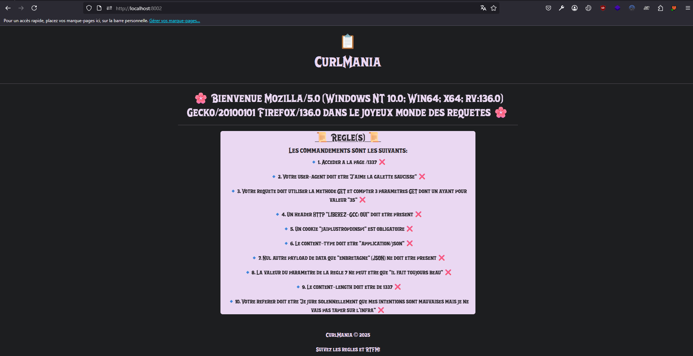
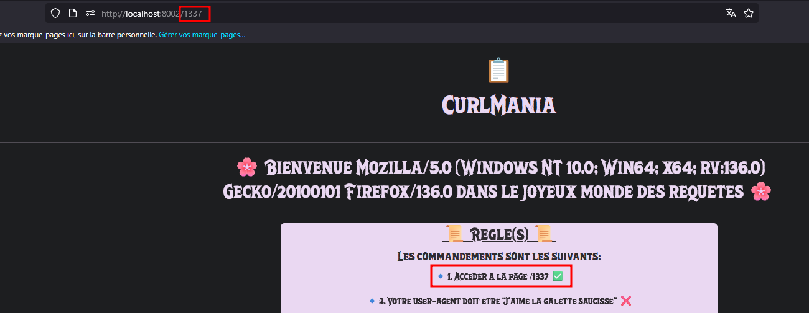
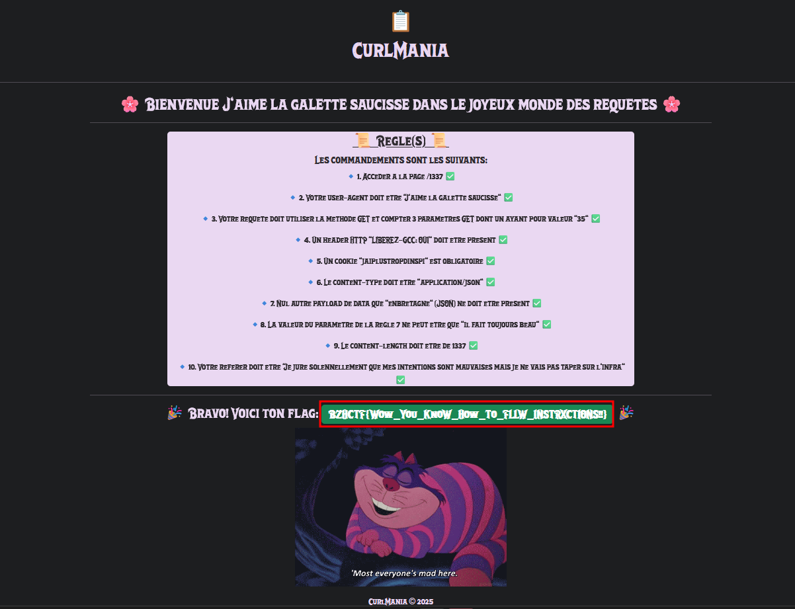

# CurlMania

**Auteur :** [Mika](https://x.com/bWlrYQ)  
**Énoncé :**  
  
Vous n'avez qu'une seule chose à faire, suivre les instructions...  
**Difficulé :** Très Facile
**Code Source :** Non

> Résumé : Ce challenge consistait en une suite de règles à suivre lors de la construction d'une requête HTTP pour obtenir le flag de validation.

## Découverte du challenge



La page principale énonce les règles nécessaires à suivre, la première règle est d'accéder à la page `/1337`. Si l'on se rend sur cette page, on obtient bien la validation de la première règle :



## Résolution

Afin de résoudre le challenge, il est possible de construire la requête curl suivante : 

```
curl --path-as-is -i -s -k -X $'GET' \
    -H $'Host: localhost:8002' -H $'User-Agent: J\'aime la galette saucisse' -H $'LIBEREZ-GCC: OUI' -H $'Content-Type: application/json' -H $'Referer: Je jure solennellement que mes intentions sont mauvaises mais je ne vais pas taper sur l\'infra' -H $'Content-Length: 1337' \
    -b $'jaiplustropdinspi=0' \
    --data-binary $'{\"enbretagne\":                                                                                                                                                                                                                                                                                                                                                                                                                                                                                                                                                                                                                                                                                                                                                                                                                                                                                                                                                                                                                                                                                                                                                                                                                                                                                                                                                   \"il fait toujours beau\"}' \
    $'http://localhost:8002/1337?param1=35&param2=0&param3=0'
```

Ou d'utiliser cette requête dans Burp :
```
GET /1337?param1=35&param2=0&param3=0 HTTP/1.1
Host: localhost:8002
User-Agent: J'aime la galette saucisse
LIBEREZ-GCC: OUI
Cookie: jaiplustropdinspi=0;
Content-Type: application/json
Referer: Je jure solennellement que mes intentions sont mauvaises mais je ne vais pas taper sur l'infra
Content-Length: 1337

{"enbretagne":                                                                                                                                                                                                                                                                                                                                                                                                                                                                                                                                                                                                                                                                                                                                                                                                                                                                                                                                                                                                                                                                                                                                                                                                                                                                                                                                                   "il fait toujours beau"}
```

La seule difficulté résidait dans la longueur du content-type qui peut être gérée avec des espaces au niveau de la data en JSON.

